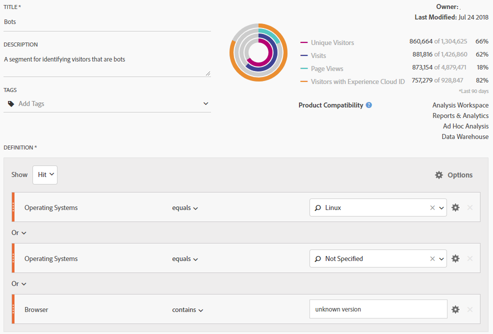
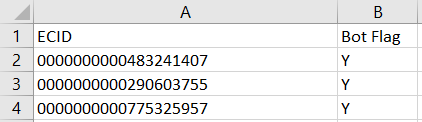
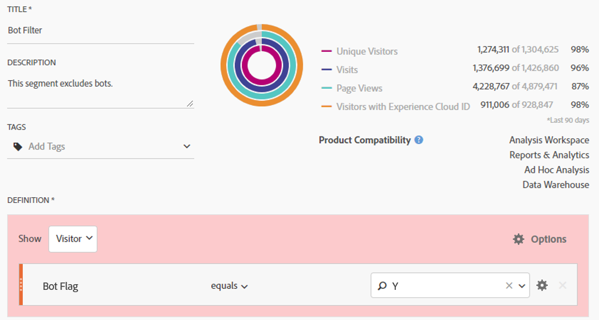
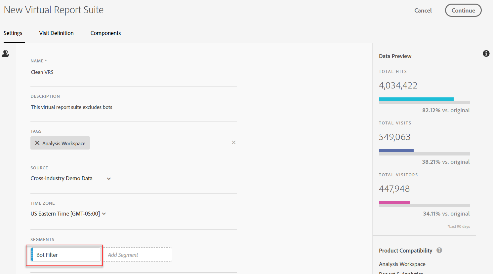

# Borttagning av bot i Adobe Analytics

I Adobe Analytics finns det flera alternativ för att ta bort robottrafik från rapportering:

## Använd punktregler

Både standardfiltermetoder och anpassade filtermetoder för robotar stöds i **[!UICONTROL Analytics]** > **[!UICONTROL Admin]** > **[!UICONTROL Report Suites]** > **[!UICONTROL Edit Settings]** > **[!UICONTROL General]** > **[!UICONTROL Bot Rules]**:

| Regeltyp | Beskrivning |
|--- |--- |
| Standard IAB-robotregler | Om du väljer **[!UICONTROL Enable IAB Bot Filtering Rules]** används [IAB:s](https://www.iab.com/) (International Advertising Bureau&#39;s) International Spiders &amp; Bots List för att ta bort robottrafiken. De flesta kunder väljer det här alternativet till ett minimum. |
| Anpassade robotregler | Du kan definiera och lägga till anpassade robotregler baserat på användaragenter, IP-adresser eller IP-intervall. |

Mer information finns i [Översikt över punktregler](/help/admin/admin/bot-removal/bot-rules.md).

## Använd plugin-programmet [!UICONTROL websiteBot] för att identifiera objekt

Med plugin-programmet [!UICONTROL websiteBot] kan du dynamiskt identifiera om besökarna är favoriter. Ni kan använda dessa data för att öka noggrannheten i alla typer av rapporter, vilket ger er ett bättre sätt att mäta legitim webbplatstrafik.

Denna plug-in utför två kontroller:

* Först avgörs om enheten är en stationär eller mobil enhet som använder variabeln navigator.UserAgent. Mobila enheter ignoreras.
* Om det är en stationär enhet läggs en händelseavlyssnare till för musrörelser.

Mer information finns i [Adobe Analytics Implementeringshandbok](https://experienceleague.adobe.com/docs/analytics/implementation/vars/plugins/websitebot.html).

## Använda en kombination av Adobe-verktyg

Eftersom botar dessutom morfar snabbt erbjuder Adobe flera andra kraftfulla funktioner som, när de kombineras korrekt och regelbundet, kan bidra till att avlägsna dessa fiender för datakvalitet. De här funktionerna är: Experience Cloud ID-tjänst, segmentering, Data warehouse, kundattribut och virtuella rapportsviter. Här är en översikt över hur du kan använda dessa verktyg.

### Steg 1: Överför besökarnas Experience Cloud-ID till ett nytt deklarerat ID

Börja med att skapa ett nytt deklarerat ID i [People Core Service](https://experienceleague.adobe.com/docs/core-services/interface/audiences/audience-library.html). Skicka besökarens Experience Cloud-ID till detta nya deklarerade ID, som kan göras snabbt och enkelt med [taggar i Adobe Experience Platform](https://experienceleague.adobe.com/docs/experience-platform/tags/extensions/adobe/id-service/overview.html?lang=en). Låt oss använda namnet &quot;ECID&quot; för det deklarerade ID:t.


Så här kan detta ID hämtas via dataelement. Fyll i ditt Experience Cloud OrgID i dataelementet korrekt.

```return Visitor.getInstance("REPLACE_WITH_YOUR_ECORG_ID@AdobeOrg").getExperienceCloudVisitorID();```

När dataelementet har konfigurerats följer du [dessa instruktioner](https://experienceleague.adobe.com/docs/experience-platform/tags/extensions/adobe/id-service/overview.html?lang=en) för att skicka deklarerade ID:n till ECID-verktyget med hjälp av taggar i Adobe Experience Platform.

### Steg 2: Använd segmentering för att identifiera bottnar

Nu när besökarens ECID skickas till ett deklarerat ID kan du använda [segmentering i Analysis Workspace](https://experienceleague.adobe.com/docs/analytics/analyze/analysis-workspace/components/t-freeform-project-segment.html) för att identifiera besökare som beter sig som botar. Boter definieras ofta av sitt beteende: Enskilda besök, ovanliga användaragenter, okänd information om enhet/webbläsare, inga hänvisningar, nya besökare, ovanliga landningssidor osv. Använd kraften i Workspace-detaljgranskning och segmentering för att identifiera de robotar som har undgått IAB-filtrering och era regler för rapportrutins robotar. Här är till exempel en skärmbild av ett segment som du kan använda:



### Steg 3: Exportera alla [!DNL Experience Cloud IDs] från segmentet via Data warehouse

Nu när du har identifierat bottarna med hjälp av segment är nästa steg att använda Data warehouse för att extrahera alla Experience Cloud-ID:n som är kopplade till det här segmentet. På den här skärmbilden visas hur du bör konfigurera din [Data warehouse](/help/export/data-warehouse/data-warehouse.md)-begäran:


Kom ihåg att använda Experience Cloud Visitor-ID som dimension och tillämpa segmentet &#39;Bts&#39;.

### Steg 4: Skicka tillbaka listan till Adobe som kundattribut

När Data warehouse-rapporten kommer har du en lista över ECID som måste filtreras från historiska data. Kopiera och klistra in dessa ECID:n i en tom .CSV-fil med bara två kolumner, ECID och Bot Flag.

* **ECID**: Kontrollera att den här kolumnrubriken matchar namnet som du gav det nya deklarerade ID:t ovan.
* **Punktflagga**: Lägg till &#39;Bot Flag&#39; som en schemdimension för kundattribut.

Använd den här .CSV-filen som import av kundattribut och prenumerera sedan dina rapportsviter på kundattributet enligt beskrivningen i det här [blogginlägget](https://theblog.adobe.com/link-digital-behavior-customers).



### Steg 5: Skapa ett segment som utnyttjar det nya kundattributet

När datauppsättningen har bearbetats och integrerats i Analysis Workspace skapar du ett segment till som utnyttjar din nya&quot;Bot Flag&quot;-kundattributdimension och en [!UICONTROL Exclude]-behållare:



### Steg 6: Använd det här segmentet som Virtual Report Suite-filter

Skapa slutligen en [Virtual Report Suite](/help/components/vrs/vrs-about.md) som använder det här segmentet för att filtrera bort identifierade objekt:



Den här nysegmenterade virtuella rapportsviten kommer nu att resultera i en renare uppsättning data med identifierade bottar borttagna.

### Steg 7: Upprepa steg 2, 3 och 4 regelbundet

Ställ in minst en månatlig påminnelse för att identifiera och filtrera nya robotar, kanske före en vanlig schemalagd analys.
