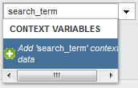

# Kopiera en kontextdatavariabel till en eVar

Bearbetningsregler används för att flytta värden från kontextdatavariabler till props och eVars. Utan bearbetningsregler är kontextdatavariabler meningslösa och fyller inte i några rapporter i Analytics.

The [!UICONTROL Context Variables] listan innehåller alla variabler som har skickats till rapportsviten under de senaste 30 dagarna. Om du känner till namnet på kontextdatavariabeln men inte har skickat den till den aktuella rapportsviten kan du lägga till ett värde genom att skriva variabelnamnet och klicka på **[!UICONTROL Add variable name context data]**:

I följande exempel används `search_term` kontextdatavariabel och placerar dess värde i `eVar3`:

Exemplet ovan fungerar bra när det bara finns ett fåtal eVars att fylla i. Om din organisation har hundratals sammanhangsberoende datavariabler som alla behöver sina egna eVar, kan du använda villkorssatser. Dussintals villkorssatser får plats i en enda bearbetningsregel, vilket gör att organisationen kan fylla i alla eVars-variabler i en rapportserie utan att behöva köra upp till gränsen på 150 regler.

I följande exempel fylls `prop7` med kontextdatavariabeln `testhierarchy`, men bara om `testhierarchy` är inställt:

Mer information om hur du implementerar kontextdatavariabler finns i [Sammanhangsdatavariabler](/help/implement/vars/page-vars/contextdata.md) i Implementeringshandboken.
