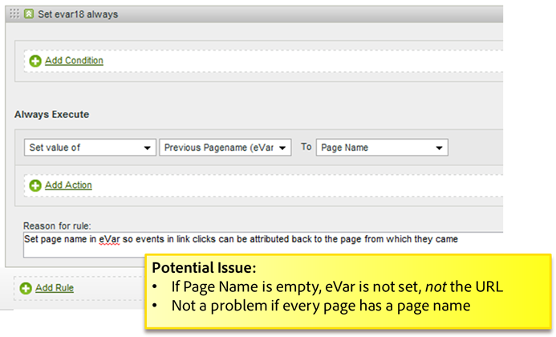

# Tips och tricks för regler

Det här avsnittet innehåller riktlinjer för testning av bearbetningsregler och en lista över vanliga misstag som ska undvikas.

## Testbearbetningsregler {#section_F092D2FECDE24082AE9FC6F8BE87F29F}

Det här avsnittet innehåller riktlinjer som kan hjälpa dig att testa bearbetningsregler innan de distribueras till produktion.

**Testregler som läser sökvillkor**

Om du vill se villkor som baseras på en sökning, t.ex. om prop1 innehåller &quot;news&quot;, går du till prop 1-rapporten och söker efter &quot;news&quot; och ser om det finns några träffar du inte förväntade dig.

**Testregler som läser variabler**

Skapa en tom HTML-sida på skrivbordet, inkludera s_code från webbplatsen och ange `s.account` variabel till en dev-rapportsserie. Om dina regler baseras på en referent, refererande domän och så vidare, kan du ta några exempel på URL:er från rapporten med live-referenter och ange `s.referrer` variabel med ett av dessa värden och läser in sidan. Om regeln baseras på sidans URL-värde kan du också ange `s.pageURL`. Samma process kan användas för alla variabler.

**Använda en Dev Report Suite**

Vi rekommenderar att du konfigurerar bearbetningsregler för en utvecklarrapportsserie för att vara säker på att de fungerar som de ska. Om det är möjligt rekommenderar vi att du kopierar reglerna till en liten produktionsrapportsserie innan du börjar använda den i stor omfattning.

## Kontrollera om det finns tomma värden {#section_EE84A5525E26415787930723B0CAAE0F}

När du skapar en regel bör du tänka på skiftläget när ett värde är tomt. Om du inte lägger till ett villkor som söker efter ett tomt värde kan du oavsiktligt skriva över variabler med tomma värden.

Det är också viktigt att ta hänsyn till bearbetningsordningen. I följande exempel visas att den anpassade eVar Föregående sidnamn ställs in på URL-adressen om det inte finns något sidnamn. URL:en placeras emellertid i sidnamnet när bearbetningsreglerna har tillämpats, så i det här fallet är sidnamnet tomt om det inte har angetts på sidan.

## Undvik att skriva över värden {#section_49FCCA31E31A433EA2EF5EAF91443DAF}

I följande exempel används två kontextdatavariabler på webbplatsen för att hämta söktermer: search_keyword och search_term. Baserat på konfigurationen skrivs värdet search_keyword alltid över, även om search_term är tom.

Den här regeln bör konfigureras om så att varje kontextdatavariabel testas efter ett värde innan den interna söktermen fylls i, och om det finns ett användningsexempel för att sammanfoga båda värdena kan det vara lämpligt att behålla båda.

## Koda sökvillkor till UTF-8 eller Unicode {#section_3BBBE1FB8FEA48589362452DE51DB575}

Söktermer som hämtas från en frågesträng måste kodas korrekt, annars matchas de inte av bearbetningsregler.

## Börjar med, Innehåller och slutar med {#section_80CE853244FC435B844A09EA51868D8D}

Välj rätt matchande villkor för att hitta det mest restriktiva villkoret som matchar korrekt. Du kan söka efter värden i en rapport innan du skapar en regel för att se till att det inte finns några oönskade matchningar. Du bör till exempel söka i Prop2-rapporten efter alla platser där villkoret matchar innan du aktiverar den här regeln.

## Hur bearbetningsregler tillämpas vid kopiering av träffar med VISTA

Om du har en VISTA-regel konfigurerad att kopiera träffar till en annan rapportsvit, skickas dessa träffar via eventuella bearbetningsregler som definieras i den andra rapportsviten.

Om du har definierat bearbetningsregler för den ursprungliga rapportsviten kan dessa regler tillämpas eller inte baserat på hur VISTA-regeln konfigurerades av Engineering Services. Om du vill veta mer kan du fråga din implementeringsspecialist om VISTA-regeln kopierar värdena för&quot;före&quot; eller&quot;efter&quot; till den extra rapportsviten. Om värdet &quot;pre&quot; kopieras, tillämpas inte bearbetningsregler som definierats i den ursprungliga rapportsviten. Om värdet &quot;post&quot; kopieras tillämpas bearbetningsreglerna innan träffen kopieras.
