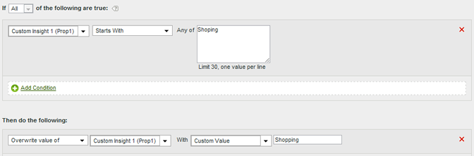

# Användningsfall för bearbetningsregler

Programmen för hur du kan använda bearbetningsregler i din organisation är omfattande. I följande avsnitt beskrivs några vanliga sätt som du kan använda dem på.

+++Kopiera en kontextdatavariabel till en eVar

Bearbetningsregler används för att flytta värden från [kontextdatavariabler](/help/implement/vars/page-vars/contextdata.md) till [Props](/help/components/dimensions/prop.md) och [eVars](/help/components/dimensions/evar.md). Utan bearbetningsregler är kontextdatavariabler meningslösa och fyller inte i några rapporter i Analytics.

Listan [!UICONTROL Context Variables] innehåller alla variabler som har skickats till rapportsviten de senaste 30 dagarna. Om du känner till namnet på kontextdatavariabeln men inte har skickat den till den aktuella rapportsviten kan du lägga till den manuellt:

I följande exempel används kontextdatavariabeln `search_term` och dess värde placeras i eVar3:

| Regeluppsättning | Värde |
| Villkor | `search_term` (kontextdata) har angetts |
| Åtgärd | [!UICONTROL Overwrite value of] eVar3 med `search_term` (kontextdata) |

Exemplet ovan fungerar bra när det bara finns ett fåtal eVars att fylla i. Om din organisation har hundratals sammanhangsberoende datavariabler som alla behöver sina egna eVar, kan du använda villkorssatser. Dussintals villkorssatser får plats i en enda bearbetningsregel, vilket gör att organisationen kan fylla i alla eVars-variabler i en rapportserie utan att behöva köra upp till gränsen på 150 regler.

I följande exempel fylls flera variabler i med varierande kontextdatavariabler. En åtgärd innehåller även en villkorssats:

| Regeluppsättning | Värde |
| Åtgärd | [!UICONTROL Overwrite value of] eVar55 med `spa.billing_customer_name` (kontextdata) |
| Åtgärd | [!UICONTROL Overwrite value of] Prop7 med `testhierarchy` (kontextdata), om `testhierarchy` (kontextdata) är inställt |
| Åtgärd | [!UICONTROL Overwrite value of] eVar8 med `spa.ims_org` (kontextdata) |

+++

+++Ange en händelse med hjälp av en kontextdatavariabel

Bearbetningsregler kan utlösa händelser baserade på [kontextdatavariabler](/help/implement/vars/page-vars/contextdata.md).

Listan [!UICONTROL Context Variables] innehåller alla variabler som har skickats till rapportsviten de senaste 30 dagarna. Om du känner till namnet på kontextdatavariabeln men inte har skickat den till den aktuella rapportsviten kan du lägga till den manuellt:

Följande regeldefinition ställer in en händelse för varje träff som innehåller en specifik kontextdatavariabel:

| Regeluppsättning | Värde |
| --- | --- |
| Villkor | `search_term` (kontextdata) har angetts |
| Åtgärd | [!UICONTROL Set event] Event1 till [!UICONTROL Custom Value] `1` |

+++

+++Fylla i en variabel med en frågesträngsparameter

Du kan fylla i en variabel med hjälp av en frågesträngsparameter. I de flesta fall bör du vanligtvis justera implementeringen för att få fram önskat frågesträngsvärde. Om du inte enkelt kan anpassa implementeringen för att samla in data är bearbetningsreglerna ett lämpligt alternativ. Om ett typfel eller liknande problem förhindrar att värdet fylls i kan du fylla i variabeln med bearbetningsregler.

Kontrollera alltid om ett värde är tomt eller innehåller det förväntade värdet innan du skriver över det.

| Regeluppsättning | Värde |
| --- | --- |
| Villkor | Ingen kampanj har angetts |
| Åtgärd | [!UICONTROL Overwrite value of] Kampanj med [!UICONTROL Query String Parameter] `cpid` |

| Regeluppsättning | Värde |
| --- | --- |
| Villkor | [!UICONTROL Query String Parameter] `q` [!UICONTROL Is Set] |
| Åtgärd | [!UICONTROL Overwrite value of] Interna söktermer med [!UICONTROL Query String Parameter] `q` |

+++

+++Villkorliga inställningar för alla händelser

Händelser kan anges baserat på villkor som finns i bearbetningsregler. Du kan till exempel utlösa en händelse när sidnamnet är lika med&quot;Produktöversikt&quot;.

| Regeluppsättning | Värde |
| --- | --- |
| Villkor | Om [!UICONTROL Page Name] är lika med&quot;Produktöversikt&quot; |
| Åtgärd | [!UICONTROL Set event] [!UICONTROL Product Views] Till [!UICONTROL Custom Value] `1` |

+++

+++Lägg till en underkategori genom att sammanfoga kategori och sidnamn

Du kan använda alternativet för sammanfogning för att fylla i värden genom att kombinera andra värden.

| Regeluppsättning | Värde |
| --- | --- |
| Villkor | Ingen (kör alltid) |
| Åtgärd | [!UICONTROL Overwrite value of] eVar1 med [!UICONTROL Concatenated Value] kategori + sidnamn |

+++

+++Rensa värden i en rapport

Du kan matcha värden mot felstavningar som samlats in och uppdatera dem så att de visas korrekt i rapporter.

Adobe rekommenderar att du använder det mest restriktiva matchningsalternativet för att undvika oönskade överskrivningar. Du kan köra en rapport om variabeln och söka efter möjliga regelvillkor som du vill använda. Strängjämförelser är inte skiftlägeskänsliga.

| Regeluppsättning | Värde |
| --- | --- |
| Villkor | Om prop1 [!UICONTROL Starts With] [!DNL Shoping] |
| Åtgärd | [!UICONTROL Overwrite value of] Prop1 med [!UICONTROL Custom Value] [!DNL Shopping] |

+++

+++Ta bort en händelse från en träff

Du kan ta bort eller ignorera en specifik händelse från en träff med bearbetningsregler utan att ändra implementeringen. Om du ställer in händelsen på det anpassade värdet `0` räknas inte händelsen.

| Regeluppsättning | Värde |
| Villkor | Ingen (kör alltid) |
| Åtgärd | [!UICONTROL Set event] Event1 till [!UICONTROL Custom value] `0` |

+++
