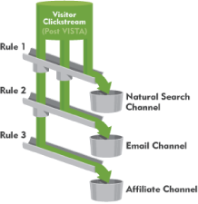

# Bearbetningsregler för marknadsföringskanaler

Bearbetningsreglerna för marknadsföringskanaler avgör om en besökare når upp till de kriterier som tilldelats en kanal genom att bearbeta varje träff en besökare gör på din webbplats. Reglerna bearbetas i den ordning som du anger, och när en regel uppfylls avbryts bearbetningen av de återstående reglerna.

**[!UICONTROL Analytics]** > **[!UICONTROL Admin]** > **[!UICONTROL Report Suites]** > **[!UICONTROL Edit Settings]** > **[!UICONTROL Marketing Channels]** > **[!UICONTROL Marketing Channel Processing Rules]**.

Ytterligare information om bearbetning:

* Data som samlas in med dessa regler är permanenta. Regler som har ändrats efter datainsamling är inte retroaktiva. Adobe rekommenderar att du granskar och tar hänsyn till alla omständigheter innan du sparar [!UICONTROL Marketing Channel Processing Rules] för att minska risken för att data samlas in i felaktiga kanaler.
* Ni kan konfigurera upp till 25 separata marknadsföringskanaler.
* Regler kan komma åt variabler som har angetts av VISTA, men de kan inte komma åt data som har tagits bort av VISTA.
* Två marknadsföringskanaler får aldrig någon kredit för samma event (som köp eller klick). På så sätt skiljer sig marknadsföringskanalerna från eVars (där två eVars kan få krediter för samma händelse).
* Om det finns en lucka i reglerna kan du se [Ingen kanal identifierad.](/help/components/c-marketing-channels/c-faq.md)

## Förutsättningar

* Granska den konceptuella informationen i [Komma igång med marknadsföringskanaler](/help/components/c-marketing-channels/c-getting-started-mchannel.md).
* Skapa en eller flera kanaler så att du kan tilldela regler till dem. Se [Lägg till marknadsföringskanaler](/help/admin/admin/c-manage-report-suites/c-edit-report-suites/marketing-channels/c-channels.md).
* Granska de bästa sätten att använda [!UICONTROL Marketing Channels] med [!UICONTROL Attribution].

## Skapa regler för bearbetning av marknadsföringskanal

Skapa regler för bearbetning av marknadsföringskanaler, som avgör om en besökarträff uppfyller kriterierna som tilldelats en kanal.

1. Klicka på **[!UICONTROL Analytics]** > **[!UICONTROL Admin]** > **[!UICONTROL Report Suites]**.
2. Välj en rapportsvit.

   Om din rapportsvit inte har definierade kanaler [!UICONTROL Marketing Channels: Auto Setup] visas.

   Se [Kör den automatiska installationen](/help/components/c-marketing-channels/c-getting-started-mchannel.md).

3. Klicka på **[!UICONTROL Edit Settings]** > **[!UICONTROL Marketing Channels]** > **[!UICONTROL Marketing Channel Processing Rules]**. Om du har kört den automatiska konfigurationen har en uppsättning kanaler och regler definierats automatiskt åt dig.

   

4. Om du vill lägga till en regel väljer du i dialogrutan **[!UICONTROL Add New Rule Set]** -menyn. Om du väljer en kanal får du en regelmall och om du väljer Egen börjar du från en tom skiva. Med båda alternativen kan du ändra regeluppsättningen efter behov.

   

5. Om du vill fortsätta skapa regler klickar du på **[!UICONTROL Add New Rule SetRule]**.
6. Om du vill prioritera regler drar och släpper du dem till önskad plats.
7. Klicka **[!UICONTROL Save.]**

### Ange värdet för marknadsföringskanalen

**[!UICONTROL Set the channel's value]** definierar detaljdimensionen för marknadsföringskanalen som är tillgänglig för den kanalen.

### Regelkriterier

Den här referenstabellen definierar de fält, alternativ och träffattribut som du kan använda för att definiera regler för bearbetning av marknadsföringskanaler.

>[!NOTE]
>
>Alla textfält som du definierar, till exempel frågesträngsparametrar eller listor med värden som ska matchas mot, utvärderas som **skiftlägesokänslig** värden. Om du till exempel har en regel där frågesträngsparametern `cmp = abc123`, alla versaler och gemener i båda `cmp` och `abc123` matcha.

| Term | Definition |
|--- |--- |
| Alla | Aktiverar endast den här kanalen när alla villkor i regeln är uppfyllda. |
| Alla | Aktiverar den här kanalen när något av villkoren i regeln är sant. Det här alternativet är bara tillgängligt om det finns fler än ett villkor i regeln. |
| AMO-ID | Den primära spårningskod som används av Advertising Cloud- och Advertising Analytics-integreringar. När en av dessa integreringar är aktiverad kan spårningskod-prefixet användas för att identifiera Advertising Cloud-specifika kanaler. Använd&quot;AMO ID&quot; börjar med&quot;AL&quot; för sökning,&quot;AC&quot; för visning eller&quot;AO&quot; för sociala medier. När AMO-ID används i marknadsföringskanaler kan värdena för klickning/kostnad/intryck tillskrivas rätt kanal (om de inte är konfigurerade går dessa värden till Direct eller None). |
| AMO ED ID | Den sekundära spårningskod som används av Advertising Cloud. Huvudsyftet med spårningskoden är att den ska fungera som nyckel för att skicka data tillbaka till Ad Cloud. Den kan dock även användas för att identifiera ClickThrottings jämfört med ViewThrotts om du vill se dessa som två separata marknadsföringskanaler. Detta kan du göra genom att ange marknadsföringskanallogiken för&quot;AMO EF ID&quot; slutar med `:d` för Display ClickThaves eller &quot;AMO EF ID&quot; slutar med `:i` för VisaÖvergångar. Om du inte vill dela upp Visning i två kanaler använder du AMO ID-dimensionen i stället. |
| Konverteringsvariabler | Består av eVars som är aktiverade för den här rapportsviten och gäller bara när dessa variabler ställs in via Adobe-koden på sidan. |
| Finns | Det finns flera tillgängliga markeringar, bland annat:<ul><li>**Finns inte**: Anger att träffattributet inte finns i begäran. Om användaren till exempel skriver en URL eller klickar på ett bokmärke i en hänvisande domän finns inte det refererande domänattributet.</li><li>**Är tom**: Anger att ett träffattribut finns, vanligtvis en eVar- eller frågesträngsparameter, men det finns inget värde som är associerat med träffattributet.</li><li>**Innehåller inte**: Du kan till exempel ange att en hänvisande domän inte innehåller ett visst värde (till skillnad från att använda markeringen &quot;Innehåller&quot;).</li></ul> |
| Identifiera kanalen som | Associerar regeln med en marknadsföringskanal som du har lagt till på sidan för Marketing Channel Manager. |
| Matchar regler för betald sökidentifiering | En betald sökning upptäcktes av Adobe. Betalda sökningar är när företag betalar en avgift för sökmotorn för att visa sin webbplats. Betalda sökningar visas vanligtvis högst upp eller till höger i sökresultaten. |
| Matchar reglerna för identifiering av naturlig sökning | En obetald sökning upptäcktes av Adobe. |
| Referenten matchar interna URL-filter | Ett besök vars sid-URL matchar ett internt URL-filter, enligt definition för rapportsviten i Admin Tools. |
| Referenten matchar inte interna URL-filter | Den refererande URL:en matchar inte ett internt URL-filter, som definierats för rapportsviten i Admin Tools. Du kan använda den här inställningen med sidans URL och Exists för att ställa in en regel för att spara alla, så att inga besök hamnar i rapportens avsnitt Ingen kanal identifierad. |
| Ignorera träffar som matchar interna URL-filter | (För referenter) Spårar bara träffar som kommer från externt refererade platser. Vanligtvis låter du den här inställningen vara aktiverad om du inte vill inkludera intern trafik. |
| Är första sidan av besök | Den första sidan av ett besök som Adobe rapporterar. |
| Sida | The [Sida](/help/components/dimensions/page.md) dimension. |
| Siddomän | Domänen för den sida där besökaren hamnar, till exempel `products.example.com`. |
| Siddomän och sökväg | Domänen och sökvägen, till exempel `products.example.com/mens/pants/overview.html` . |
| Sidrotdomän (TLD+1) | Rotdomänen för den sida där besökaren pekar, till exempel example.co.uk . |
| Sidans URL | URL-adressen till en webbsida på webbplatsen. |
| Refererande domän | The [Refererande domän](/help/components/dimensions/referring-domain.md) dimension |
| Frågesträngsparameter | Använd en enskild frågesträngsparameter. Du kan bara ange en frågesträngsparameter per kriterium. Om du vill lägga till ytterligare frågesträngsparametrar använder du `ANY` som operatorn och lägg sedan till frågesträngsparametrar i regeln. |
| Referent | Webbsidans plats (fullständig URL) som besökarna var på innan de kom till webbplatsen. Det finns en referent utanför den definierade domänen. |
| Refererande domän och sökväg | En sammanfogning av den refererande domänen och URL-sökvägen. Exempel:    `www.example.com/products/id/12345` eller `ad.example.com/foo` |
| Refererande parameter | En frågesträngsparameter på referensens URL. Om dina besökare till exempel kommer från `example.com/?page=12345&cat=1`, så är page och cat de refererande parametrarna. |
| Refererande rotdomän | Referensens rotdomän. Det finns en referent utanför den definierade domänen. |
| Sökmotor | En sökmotor som Google eller Yahoo! som förde besökare till er webbplats. |
| Sök nyckelord | Ett ord som används för att utföra en sökning med en sökmotor. |
| Sökmotor + nyckelord | En sammanfogning av söknyckelordet och sökmotorn för att unikt identifiera sökmotorn. Om du t.ex. söker efter ordet dator identifieras sökmotorn och nyckelordet enligt följande: `Search Tracking Code = "<search_type>:<search engine>:<search keyword>" where    search_type = "n" or "p", search_engine = "Google", and search_keyword = "computer"`**Obs!** n = naturlig; p = betald |
| Ställ in kanalens värde på | Anger [Information om marknadsföringskanal](/help/components/dimensions/marketing-detail.md) dimension. Du bestämmer vilket värde som är bäst i regelsammanhang. Exempel är banners-ID, söknyckelord eller e-postkampanj. |

## Regelordning och definitioner för marknadsföringskanal {#channel-rules}

Kanalreglerna bearbetas i den ordning som du anger. Adobe rekommenderar att du placerar betalda eller hanterade kanaler först (som betald sökning, naturlig sökning, visning eller e-post) så att de får kredit via organiska kanaler (som till exempel direkta, interna och refererande domäner).

Nedan visas den rekommenderade ordningen för kanalregler och exempeldefinitioner:

### Betalsökning {#paid-search}

Betalsökning är ett ord eller en fras som du betalar en sökmotor för placering i sökresultat. Den här kanalen definieras vanligtvis baserat på frågesträngsparametrar (se Exempel på visningskanal) eller regler för betalsökningsidentifiering.

#### Påvisande av betald sökning

Marknadskanalen använder inställningar som konfigurerats på [!UICONTROL Paid Search Detection] sida. ( **[!UICONTROL Admin]** > **[!UICONTROL Report Suites]** > **[!UICONTROL Edit Settings]** > **[!UICONTROL General]** > **[!UICONTROL Paid Search Detection]**). Mål-URL:en matchar den befintliga regeln för avkänning av betald sökning för den sökmotorn.

För marknadsföringskanalregeln gäller följande: [!UICONTROL Paid Search] inställningarna är följande:

Se [Betalsökningsidentifiering](../general/paid-search-detection/paid-search-detection.md) för mer information.

### Naturlig sökning {#natural-search}

Naturlig sökning är när besökarna hittar din webbplats via en sökmotor, och sökmotorn rankade din webbplats utan att du betalade för listan.

Adobe bestämmer söktrafiken baserat på en intern sökning av sökmotorer. Om en referent matchar villkoren för en sökmotor avgör den om den är betald eller naturlig med [Betalsökningsidentifiering](../general/paid-search-detection/paid-search-detection.md) regler som du har konfigurerat. En träff betraktas som naturlig sökning när den inte matchar några regler för betald sökningsidentifiering.

För marknadsföringskanalregeln är de naturliga sökinställningarna följande:

### Visa {#display}

Den här regeln identifierar besökare som kommer från banderollannonser. Den identifieras av en frågesträngsparameter i mål-URL, i det här fallet *`Ad_01`*. Frågesträngsparametern och de värden den söker efter utvärderas som skiftlägeskänsliga värden.

### E-post {#email}

Den här regeln identifierar besökare från e-postkampanjer. Den identifieras av en frågesträngsparameter i mål-URL, i det här fallet *`eml`*:

### Filialer {#afilliates}

Den här regeln identifierar besökare som kommer från en angiven uppsättning referensdomäner. I regeln listas domänerna för filialer som du vill spåra enligt följande:

### Andra kampanjer {#other-campaigns}

Ett bra tillvägagångssätt är att inkludera en&quot;annan kampanjkanal&quot; som följer alla regler för betalda kanaler. Den här kanalen fungerar som en&quot;catch-all&quot; för okategoriserad betald trafik.

### Sociala nätverk {#social-networks}

Den här regeln identifierar besökare som kommer från ett socialt nätverk, som Facebook. Kanalen byter ofta namn till Organic Social. Inställningarna kan vara följande:

### Intern kanal (Sessionsuppdatering) {#internal}

Den här regeln används av besökare där den refererande URL:en matchar inställningen för interna URL-filter i Admin Console, vilket innebär att besökaren kom från webbplatsen för att påbörja sitt besök. Den här kanalen byter ofta namn till Sessionsuppdatering.

Se [Orsaker till internt (sessionsuppdatering)](https://experienceleague.adobe.com/docs/analytics/components/marketing-channels/c-faq.html#internal) om du vill ha mer information om varför den här kanalen används.

### Direkt {#direct}

Den här regeln identifierar besökare som inte har någon hänvisande domän, vilket inkluderar besökare som kommer direkt till platsen, till exempel från en Favoriter-länk eller genom att klistra in en länk i webbläsaren. Den här kanalen byter ofta namn till Direct Typed/Bookmarked.

### Refererande domänkanal {#referring-domains}

Kanalen Refererande domäner identifierar besökare som har en refererande domän. Tillsammans fungerar domänkanalerna Internal, Direct och Referring som en catch-all för alla återstående träffar som ännu inte har kategoriserats i en kanal.

