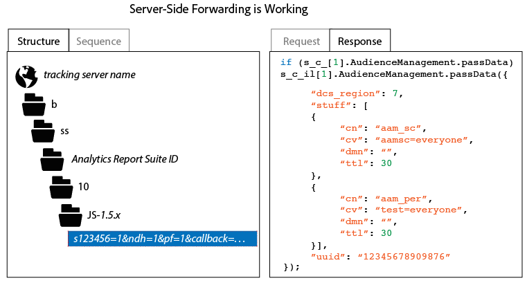

# Så här verifierar du implementeringen av vidarebefordring på serversidan

För att verifiera att vidarebefordran på serversidan är korrekt aktiverad måste du granska HTTP-svaret från Analytics Tracking-begäran. Detta kan du göra med en webbläsares utvecklingsverktyg eller med hjälp av ett proxyverktyg som Charles Web Debugger. Följande instruktioner visar vilka indikatorer som måste finnas för att vidarebefordran på serversidan ska kunna aktiveras korrekt.

Så här kontrollerar du status för vidarebefordran på serversidan:

1. Läs in en testsida som innehåller uppdaterad AppMeasurement-kod.
1. Kontrollera HTTP-svaret från Analytics-spårningsbegäran i webbläsarens felsökningsverktyg eller med proxyprogramvaran (du kan enkelt filtrera detta genom att välja en sökväg som innehåller&quot;b/ss&quot;).
1. Kontrollera HTTP-svaret. Om svaret innehåller Audience Manager-data (som framgår nedan) fungerar vidarebefordran på serversidan.

>[!CAUTION]
>
>Om svaret innehåller nyckelvärdepar `"status":"SUCCESS"` eller en 2 x 2-bild är vidarebefordran på serversidan * inte* korrekt konfigurerat. Kontrollera att identitetstjänsten är korrekt distribuerad, att du har distribuerat modulen App Measurement, att rätt rapportsvit har mappats till rätt IMS-organisation och att vidarebefordran på serversidan har aktiverats i administratörskonsolen för Analytics.

>[!MORELIKETHIS]
>
>* [Charles Web Debugger](https://www.charlesproxy.com/)

