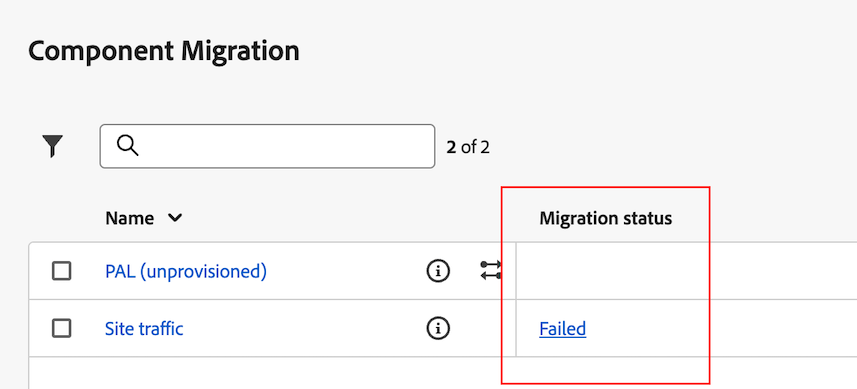

# Migrera komponenter och projekt från Adobe Analytics till Customer Journey Analytics

Adobe Analytics-administratörer kan migrera Adobe Analytics-projekt och tillhörande komponenter till Customer Journey Analytics.

Migreringsprocessen omfattar:

* Återskapande av Adobe Analytics-projekt i Customer Journey Analytics.

* Mappa mått och mätvärden från Adobe Analytics rapporteringsprogram till mått och mätvärden i datavyer i Customer Journey Analytics.

  Vissa dimensioner och mätvärden mappas automatiskt, andra måste du manuellt mappa som en del av migreringsprocessen. Segment migreras också, men de behöver inte mappas som en del av migreringsprocessen.

  Alla migrerade komponenter visas i migreringssammanfattningen när migreringen är klar.

## Förbereda för migrering

Läs mer om hur du migrerar projekt i [Förbereda för att migrera komponenter och projekt från Adobe Analytics till Customer Journey Analytics](/help/admin/admin/component-migration/prepare-component-migration.md).

## Migrera Adobe Analytics-projekt till Customer Journey Analytics

>[!IMPORTANT]
>
>Läs mer om hur du migrerar projekt i [Förbereda för att migrera komponenter och projekt från Adobe Analytics till Customer Journey Analytics](/help/admin/admin/component-migration/prepare-component-migration.md).
>
>Alla dimensioner eller mätvärden som du mappar är permanenta, både för det här projektet och för alla framtida projekt som migreras i hela IMS-organisationen. Alla mappningar du gör kan inte ändras när migreringen har slutförts.

1. I Adobe Analytics väljer du [!UICONTROL **Administratör**] tabbtangenten och sedan välja [!UICONTROL **Alla administratörer**].

1. Under [!UICONTROL **Datakonfiguration och insamling**], markera [!UICONTROL **Komponentmigrering**].

1. Leta reda på det projekt som du vill migrera. Du kan filtrera, sortera och söka i projektlistan.

   Som standard visas endast projekt som delas med dig. Om du vill visa alla projekt i organisationen väljer du **Filter** ikon och sedan expandera [!UICONTROL **Andra filter**] och markera [!UICONTROL **Visa alla**]. (Mer information om filtrering, sortering och sökning i projektlistan finns i [Filtrera, sortera och söka i projektlistan](#filter-sort-and-search-the-list-of-projects).)

1. För musen över projektet som du vill migrera och välj sedan **Migrera** icon .

   eller

   Välj det projekt som du vill migrera och välj sedan [!UICONTROL **Migrera till Customer Journey Analytics**].

   Du kan bara välja ett projekt åt gången för migrering.

   The [!UICONTROL **Migrera project_name till Customer Journey Analytics**] visas.

   <!-- add screenshot -->

1. I [!UICONTROL **Projektägare**] börjar du skriva namnet på den användare som du vill ange som projektägare i Customer Journey Analytics och väljer sedan namnet i listrutan.

   Ägaren som du anger har fullständig behörighet till projektet.

1. I [!UICONTROL **Kartschema för rapportsviter**] väljer du en rapportsvit.

1. I [!UICONTROL **Datavy**] väljer du datavyn i Customer Journey Analytics där du vill att projektet och komponenterna ska migreras.

1. Välj [!UICONTROL **Kartschema**].

1. I [!UICONTROL **Kartschema**] -avsnittet expanderar du [!UICONTROL **Dimensioner**] och [!UICONTROL **Mått**] -avsnitt.

   Vissa mått och mätvärden i Adobe Analytics mappas automatiskt till en dimension eller ett mätvärde i Customer Journey Analytics. Andra måste mappas manuellt.

   **Mappa dimensioner och mätvärden automatiskt**

   >[!NOTE]
   >
   >   Om du använde WebSDK för att importera data till Adobe Experience Platform kan mått och mått inte mappas automatiskt. Mer information finns i [Förutsättningar](/help/admin/admin/component-migration/prepare-component-migration.md#prerequisites) in [Förbereda för att migrera komponenter och projekt från Adobe Analytics till Customer Journey Analytics](/help/admin/admin/component-migration/prepare-component-migration.md).

   Vissa mått och mätvärden i Adobe Analytics mappas automatiskt till en dimension eller ett mätvärde i Customer Journey Analytics. Du kan inte fatta några mappningsbeslut för de här dimensionerna och måtten.

   Till exempel **Besök** i Adobe Analytics mappas automatiskt med **Sessioner** mätvärden i Customer Journey Analytics.

   Du kan välja vilken dimension eller vilket mätvärde som helst för att visa deras associerade ID:n.

   <!-- update screenshot after I can see the Status column -->

   

   **Mappa dimensioner och mått manuellt**

   Vissa mått och mätvärden i Adobe Analytics kan inte automatiskt mappas till en dimension eller ett mätvärde i Customer Journey Analytics.

   När en dimension eller ett mått inte kan mappas automatiskt visas en orange räknare bredvid [!UICONTROL **Dimensioner**] eller [!UICONTROL **Mått**] avsnittsrubrik, som anger antalet dimensioner eller mått som måste mappas manuellt. I tabellen visas en varningsikon  visas bredvid varje dimension eller mätvärde som behöver mappas manuellt.

   Dessutom är [!UICONTROL **Status**] kolumn säger [!UICONTROL **Ej mappad**].

   <!-- update screenshot after I can see the Status column -->

   

1. Om du vill mappa mått och mått manuellt väljer du en dimension eller ett mått som innehåller en varningsikon och sedan i [!UICONTROL **Mappat Customer Journey Analytics-mått**] fält (eller [!UICONTROL **Mappad Customer Journey Analytics-dimension**] om du mappar en dimension), markerar du den dimension eller det mått i Customer Journey Analytics som du vill mappa till den dimension eller det mått som du har valt.

   

   När en dimension eller ett mått har mappats försvinner varningsikonen och [!UICONTROL **Status**] kolumn ändras till [!UICONTROL **Mappat**] med en grön punkt. (Status för [!UICONTROL **Mappat**] med en grå punkt anger att dimensionen eller måttet mappades under en tidigare migrering. Det går inte att uppdatera tidigare mappningar.)

   Upprepa den här processen för varje dimension eller mätvärde som innehåller varningsikonen.

   När alla dimensioner och mått i Adobe Analytics rapportsserie har mappats till en dimension eller ett mått i datavyn i Customer Journey Analytics, visas en grön bock  visas bredvid rapportsvitens namn i [!UICONTROL **Kartschema för rapportsviter**] -avsnitt.

1. (Villkorligt) Om projektet som du migrerar innehåller mer än en rapportsvit väljer du en annan rapportsvit i [!UICONTROL **Kartschema för rapportsviter**] och sedan upprepa steg 6 genom steg 10. <!-- double-check that the step numbers are still correct -->

1. Välj [!UICONTROL **Migrera**].

   >[!WARNING]
   >
   >   Ett varningsmeddelande visas när du har valt [!UICONTROL **Migrera**]. Innan du fortsätter bör du vara medveten om att alla dimensioner och mätvärden som du mappar är permanenta, både för det här projektet och för alla framtida projekt som migreras i hela organisationen. Om du fortsätter går det inte att ändra de mappningar du gör.

   När migreringen är klar [!UICONTROL **Migreringsstatus**] sidan innehåller en sammanfattning av vad som migrerades.

   Om migreringen misslyckas, se [Försök att utföra migreringen igen](#retry-a-failed-migration) för mer information.

## Försök att utföra migreringen igen

Om en migrering misslyckas kan du försöka migrera igen.

Innan du försöker utföra en misslyckad migrering måste du ta bort alla [element som inte stöds](#understand-unsupported-elements-that-cause-errors) från projektet.

>[!NOTE]
>
>Om migreringen fortsätter att misslyckas efter ett nytt försök kontaktar du kundtjänst med projekt-ID:t. Du hittar projekt-ID:t på statussidan för migrering. <!-- when does this page display? How can they get there -->

Så här gör du om en misslyckad migrering:

1. I Adobe Analytics väljer du [!UICONTROL **Administratör**] tabbtangenten och sedan välja [!UICONTROL **Alla administratörer**].

1. Under [!UICONTROL **Datakonfiguration och insamling**], markera [!UICONTROL **Komponentmigrering**].

1. Välj [!UICONTROL **Misslyckades**] i [!UICONTROL **Migreringsstatus**] -kolumnen bredvid projektet som du vill försöka igen.

   

   The [!UICONTROL **Migreringsstatus**] visas.

   Den här sidan visas även omedelbart efter att migreringsstegen som beskrivs i avsnittet har slutförts [Migrera Adobe Analytics-projekt till Customer Journey Analytics](#migrate-adobe-analytics-projects-to-customer-journey-analytics) ovan.

1. Välj [!UICONTROL **Försök migrera igen**].

## Filtrera, sortera och söka i projektlistan

Du kan filtrera, sortera och söka i projektlistan på sidan Komponentmigrering.

### Filtrera listan med projekt

Du kan filtrera efter följande kriterier:

| Filter | Beskrivning |
|---------|----------|
| [!UICONTROL **Status**] | Flyttningens status: <ul><li>[!UICONTROL **Inte startat**]</li><li>[!UICONTROL **Startat**]</li><li>[!UICONTROL **Slutförd**]</li><li>[!UICONTROL **Misslyckades**]</li></ul>. |
| [!UICONTROL **Taggar**] | Markera eventuella taggar i listan med taggar. Endast projekt där de markerade taggarna används visas. |
| [!UICONTROL **Rapportsvit**] | Välj en rapportsvit i listan med rapportsviter. Endast projekt som använder de valda rapportsviterna visas. |
| [!UICONTROL **Ägare**] | Välj en ägare i listan över ägare. Endast projekt som ägs av de användare du väljer visas. |
| [!UICONTROL **Andra filter**] | Följande ytterligare filter är tillgängliga: <ul><li>[!UICONTROL **Min**]: Visar endast projekt där du har angetts som ägare.</li><li>[!UICONTROL **Delas med mig**]: Visar endast projekt som har delats med dig.</li><li>[!UICONTROL **Favoriter**]: Visar endast projekt som har markerats som favoriter. (Du kan markera ett projekt som en favorit på menyn [projektstartsida](/help/analyze/landing.md).)</li><li>[!UICONTROL **Månadsvis**]</li><li>[!UICONTROL **Årsvis**]</li></ul> |

{style="table-layout:auto"}

### Sortera listan med projekt

Du kan sortera projektlistan efter valfri kolumn.

Så här sorterar du listan med projekt:

1. Markera kolumnrubriken för den kolumn som du vill sortera efter.

1. (Valfritt) Markera samma kolumnrubrik igen om du vill kasta om sorteringsordningen.

### Söka efter ett projekt

Du kan söka i listan med projekt på sidan Komponentmigrering för att hitta det projekt som du vill migrera.

1. I sökfältet högst upp på sidan Komponentmigrering börjar du skriva namnet på projektet som du vill migrera.

1. Välj projektet när det visas i listrutan.

<!-- is there going to be a way to customize the columns that are displayed? -->
