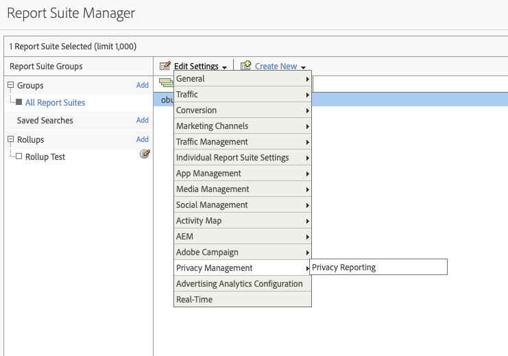

# Variabler för sekretessrapportering

Om du behöver mer hjälp med att hantera sekretessdata finns det en uppsättning reserverade variabler som kan användas tillsammans med specifika kontextdatavariabler.
Dessa variabler för sekretessrapportering utgör ett lättanvänt ramverk för att samla in sekretesstatus för varje analyssession.

## Variabler

* Avanmälan från samtyckeshantering
   * Reserverad variabel: Prop på lista
   * Typ: Kommaavgränsad sträng
   * Innehåller:
      * `contextData.['cm.ssf']=1` visas som SSF
      * `contextData.['opt.dmp']=N` visas som DMP
      * `contextData.['opt.sell']=N` visas som SELL

* Anmälan till samtyckeshantering
   * Reserverad variabel: Prop på lista
   * Typ: Kommaavgränsad sträng
   * Innehåller:
      * `contextData.['opt.dmp']=Y` visas som DMP
      * `contextData.['opt.sell']=Y` visas som SELL

## Rapportering

Du kan aktivera variablerna för sekretessrapportering via en ny sekretessinställning som är tillgänglig på Admin Console för Analytics.

Varje rapportsvit kan konfigureras på följande sätt:
1. Klicka på Reports &amp; Analytics **[!UICONTROL Admin > Report Suites]**.
1. Markera de rapportsviter där du samlar in mediedata och klicka på **[!UICONTROL Edit Settings > Privacy Management]**.

   

1. Klicka på knappen **[!UICONTROL Enable Data Privacy Reports]**.

   >[!NOTE]
   >
   >När variablerna har aktiverats kan de inte stängas av.

   

1. När det aktiverats visas ett bekräftelsemeddelande.

   

1. De reserverade variablerna är nu tillgängliga för analys i Reports &amp; Analytics och Workspace. Se Avanmälan från samtyckeshantering och Anmälan till samtyckeshantering.

   

## Implementering

Tre kontextdatavariabler har fördefinierats för att fungera med reserverade variabler för hantering av sekretessrapportering.  Det är upp till respektive implementeringstekniker hur dessa variabler ska hanteras och sparas.

Se [Variabler för kontextdata](https://experienceleague.adobe.com/docs/analytics/implementation/javascript-implementation/variables-analytics-reporting/context-data-variables.html) för allmän vägledning om hur du implementerar kontextdatavariabler.

### SSF

* Kontextdata: `contextData.['cm.ssf']`
* Godkända värden:
   * 1 – När du skickar värdet ”1” innebär det att vidarebefordran på serversidan är i ett avanmälningsläge. Värdet 1 i kombination med den här variabeln blockerar delningen av träffen med Adobe Audience Manager. Se [AAM ePrivacy-efterlevnad](https://experienceleague.adobe.com/docs/analytics/integration/audience-analytics/audience-analytics-workflow/ssf-gdpr.html).
   * 0 – Valfritt. Använd värdet ”0” för kunder som samtyckte till riktad marknadsföring. Om du inte anger variabeln får du också samma resultat.

### DMP

* Kontextdata: `contextData.['opt.dmp']`
* Godkända värden:
   * N – När värdet ”N” skickas betyder det att konsumenten tackar nej till att dela till datahanteringsplattformar.  **Obs**: Från och med den 15 januari 2020 blockeras delning på serversidan av den här träffen till AAM om variabeln anges som ”N”.
   * Y – När värdet ”Y” skickas indikerar det att konsumenten tackar ja till datahanteringsplattformar.

### SÄLJ

* Kontextdata: `contextData.['opt.sell']`
* Godkända värden:
   * N – När värdet ”N” skickas betyder det att konsumenten tackar nej till att dela eller sälja uppgifterna till tredje part.
   * Y – När värdet ”Y” skickas betyder det att konsumenten tackar ja till att dela eller sälja data till tredje part.
