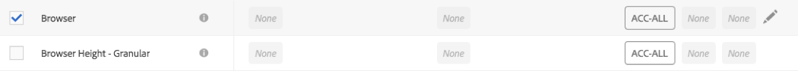
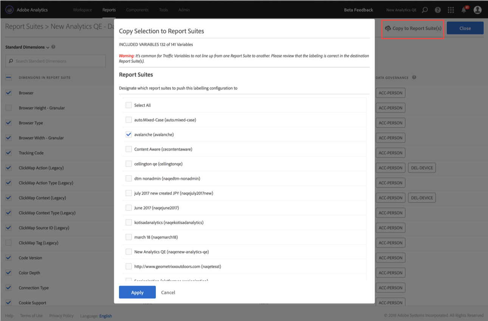

# Data i etikettrapportsvit

Med hjälp av data i etikettrapportsviten kan du tilldela etiketter för identiteter, känslighet och datastyrning till varje variabel i en viss rapportsvit. Se till att du först bekanta dig med etiketterna och deras definitioner.

>[!NOTE]
>
>Kom ihåg att etikettering måste granskas varje gång en ny rapportsvit skapas eller när en ny variabel aktiveras i en befintlig rapportsvit. Du kan också behöva granska etiketteringen när nya lösningar är aktiverade, eftersom de kan visa nya variabler som kan kräva etiketter. En återimplementering av dina mobilappar eller webbplatser kan ändra hur befintliga variabler används, vilket också kan göra det nödvändigt att uppdatera etiketter.

## Tilldela eller redigera etiketter för rapportsviten {#section_39F829F35A274EACA532E2F6FF392996}

**Exempel**: Som personuppgiftsansvarig planerar du att samla in e-postadresser och cookie-ID:n från registrerade för att behandla deras begäranden om datasekretess. Dessa cookie-ID:n lagras i en rapportsvit i Adobe Analytics. Om du vill skapa en etikett för e-postadresser och cookie-ID:n måste du använda Adobe Cloud Platform-ramverket för etikettering och framtvingad användning av data (DULE) i Analytics.

1. Navigera till **[!UICONTROL Admin]** > **[!UICONTROL Data Governance]** > **[!UICONTROL (select report suite)]** 

1. Välj vilken grupp av variabler du vill etikettera.

   

   * **Standarddimensioner** (färdiga Adobe Analytics-dimensioner)
   * **Standardvärden** (Adobe Analytics-direktstatistik)
   * **Konverteringshändelser** (anpassade slutförda händelser)
   * **Dimensioner för marknadsföringskonvertering** (marknadsförande eVars)
   * **Konverteringsdimensioner** (icke-marknadsförande eVars)
   * **Anpassade trafikdimensioner** (props)
   * **Lösningsdimensioner och händelser** (dimensioner/händelser relaterade till lösningar som mobilt, video, Activity Map, o.s.v., och integreringar med lösningar som Adobe Campaign, Adobe Experience Manager, Advertising Cloud, o.s.v.)
   * **Dimensioner för databehandling** (variabler som inte exponeras direkt i rapporter via Adobe Analytics-gränssnittet, men som är tillgängliga för dig via dataflöden och/eller begäranden från Data Warehouse)

1. (Valfritt) Klicka på informationsikonen (i) bredvid varje variabel för att se mer information om de vanligaste värdena under de senaste 90 dagarna. (Den här funktionen är inte tillgänglig för dimensioner för databehandling eftersom de inte är tillgängliga i analysgränssnittet.)

   

1. Markera en eller flera variabler genom att klicka på deras kryssruta och markera sedan ikonen **[!UICONTROL Edit]** (till höger) om du vill redigera en eller flera variabler.

   

1. Dialogrutan **Etiketter för identitetsdata** öppnas automatiskt. Dessa etiketter klassificerar data som kan användas fristående eller tillsammans med andra data för att identifiera eller möjliggöra direktkontakt med en individ. Mer information om dessa alternativ finns i [Etiketter för identitetsdata (DULE).](/help/admin/c-data-governance/gdpr-labels.md#identity-data-labels)

   >[!NOTE]
   >
   >DULE-ramverket (Data Usage Labeling &amp; Enforcement) är utformat för att tillhandahålla ett enhetligt sätt att i alla lösningar/tjänster/plattformar samla in, kommunicera och använda metadata om data i hela Adobe Experience Cloud. Metadata hjälper personuppgiftsansvariga att indikera vilka data som är personuppgifter, vilka data som är känsliga och vilka avtalsbegränsningar som är kopplade till data.

   

1. Öppna avsnittet **Känsliga data** för att ange etiketter för känsliga data, som kategoriserar geolokaliseringsdata. Mer information om de här alternativen finns i [Etiketter för känsliga data (DULE).](/help/admin/c-data-governance/gdpr-labels.md#sensitive-data-labels)

   

1. Öppna avsnittet Data som omfattas av datasekretess för att ange etiketter för **datastyrning**. Följ det här avsnittet för att ge Adobe instruktioner om hur varje variabel ska hanteras för att få åtkomst till och ta bort data, men även för att definiera vilka variabler som ska genomsökas för att hitta ID:n för registrerade personer för dessa begäranden. Mer information om de här alternativen finns i [Etiketter för datastyrning (Datasekretess).](/help/admin/c-data-governance/gdpr-labels.md#data-governance-labels)

   

1. Klicka på **[!UICONTROL Apply]** när du är klar med alla etiketter.

## Kopiera etiketter till rapportsvit(er) {#section_7C6FDAFF049F4126B84F6261F72668EE}

Gör följande om du vill använda samma inställningar för DULE/datasekretess för fler än en rapportsvit:

1. Markera variabelgruppen (standarddimensioner, konverteringsdimensioner, o.s.v.) som innehåller variabeln som du vill kopiera. Observera att du bara kan kopiera etiketterna för en grupp med variabler åt gången.
1. Markera några eller alla variabler i den här gruppen.
1. Klicka på **[!UICONTROL Copy Labels to Report Suite(s)]** längst upp till höger i dialogrutan Datastyrning.

   

1. Markera antingen **[!UICONTROL Select All]** för att kopiera etiketter för de valda variablerna till alla rapportsviter eller markera de enskilda rapportsviter som du vill kopiera etiketterna till.

   >[!IMPORTANT]
   >
   >Kom ihåg att alla rapporteringsprogram du markerar måste mappas till din Experience Cloud-organisation.

   När du kopierar etiketterna för en variabel eller variabeluppsättning till en annan rapportsvit, flyttas kopian till variabeln på motsvarande plats i målrapportsviten. För Standarddimensioner, Standardmått, Lösningsdimensioner samt Händelser och Dimensioner för databehandling kopieras etiketterna till variabeln med **samma namn** i målrapportsviten.

   För Konverteringsvariabler (eVars), Dimensioner för marknadsföringskonvertering och Anpassade trafikdimensioner (props) skickas däremot kopian till variabeln med **samma nummer** i målrapportsviten. eVar12 kopieras till exempel till eVar12 i alla målrapportsviter. Namnen på dessa variabler ignoreras när kopians mål fastställs. Om motsvarande variabel inte är aktiverad i målrapportsviten misslyckas kopieringen för den variabeln.

   När du kopierar etiketterna för klassificeringar som definierats för en variabel kopieras etiketterna till en klassificering för motsvarande variabel i målrapportsviten (t.ex. eVar7 till eVar7) som har ett namn som är identiskt med den klassificering som kopieras. Annars misslyckas kopian för den klassificeringens etiketter.

   Ett statusmeddelande visas när en uppsättning etiketter har tillämpats. Statusmeddelandet innehåller namnen på de målvariabler eller klassificeringar och deras rapportsviter för vilka kopieringen misslyckades.

   >[!IMPORTANT]
   >
   >Kontrollera alltid målrapportsviterna för att säkerställa att etiketterna som kopieras över är korrekta. Detta är särskilt viktigt för variabler som har ID- eller DEL-etiketter.

1. Klicka på **[!UICONTROL Apply]**.
