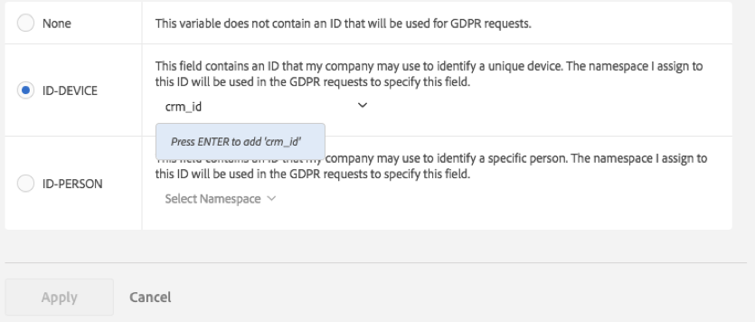

# Datasekretessetiketter för analysvariabler

Adobe kunder, som personuppgiftsansvariga, ansvarar för att följa gällande dataintegritetslagstiftning, som General Data Protection Regulation (GDPR) och California Consumer Privacy Act (CCPA). Kunderna bör rådfråga sina egna juridiska team för att avgöra hur deras data ska hanteras för att följa lagstiftningen om dataintegritet. Adobe vet att var och en av sina kunder har unika sekretessrelaterade behov, vilket är anledningen till att Adobe gör det möjligt för sina kunder att anpassa de inställningar de vill ha för databehandling. På så sätt kan varje unik kund behandla begäranden om datasekretess på det sätt som bäst passar deras varumärke och deras unika datauppsättning.

Adobe Analytics har verktyg som används för att etikettera data utifrån känslighet och avtalsbegränsningar. Etiketter är ett viktigt steg för att: (1) identifiera registrerade, (2) fastställa vilka data som ska returneras som en del av en begäran om åtkomst och (3) identifiera datafält som måste tas bort som en del av en begäran om borttagning.

Innan du kan ta reda på vilka etiketter som ska användas på vilka variabler/fält måste du [förstå vilka ID:n](/help/admin/tools/privacy-labeling/best-practices.md) som du hämtar i dina Analytics-data, och du måste bestämma vilka som ska användas för begäranden om datasekretess.

Implementering av datasekretess i Adobe Analytics stöder följande etiketter för identitetsdata, känsliga data och datastyrning.

>[!NOTE]
>
>Etiketterna I1, I2, S1 och S2 har samma betydelse som motsvarande DULE-etiketter i Adobe Experience Platform. De används dock för mycket olika syften. I Adobe Analytics används dessa etiketter för att identifiera fält som ska anonymiseras som ett resultat av en Privacy Service-förfrågan. Inom Adobe Experience Platform används de för åtkomstkontroll, samtyckeshantering och för att genomdriva marknadsföringsbegränsningar för de märkta fälten. Adobe Experience Platform stöder många extra etiketter som inte används av Adobe Analytics. Dessutom används etiketter i Adobe Experience Platform på scheman. Om du använder Analytics Data Connector för att importera dina Adobe Analytics-data till Adobe Experience Platform måste du se till att rätt DULE-etiketter är konfigurerade i Adobe Experience Platform för de scheman som används av var och en av rapportsviterna. Etiketter som tilldelats i Adobe Analytics används inte automatiskt på dessa scheman i Adobe Experience Platform eftersom de bara representerar en delmängd av de DULE-etiketter som du kanske måste använda. Olika rapportsviter kan dela ett schema men ha olika etiketter tilldelade till props och evar med samma nummer och schemat kan delas av datauppsättningar från andra datakällor, vilket kan skapa förvirring över varför vissa fält tog emot dessa etiketter.

## Identitetsdataetiketter {#identity-data-labels}

Identitetsdata ”I”-etiketter används för att kategorisera data som kan identifiera eller kontakta en viss person.

| Etikett | Definition | Andra krav |
| --- | --- | --- |
| I1 | Direkt identifierbar: Data som specifikt kan identifiera eller aktivera direktkontakt med en individ, till exempel ett namn eller en e-postadress. | <ul><li>Kan inte anges för händelser</li><li>Kan inte anges för marknadsförande eVars</li></ul> |
| I2 | Indirekt identifierbar: Data som kan användas i kombination med andra data för att identifiera eller aktivera direktkontakt med en individ eller enhet.  Tillåter inte identifiering av en enskild person, utan kan kombineras med annan information (som du kanske har tillgång till) för att identifiera någon. Exempel är ett kundlojalitetsnummer eller ett ID som används av ett företags CRM-system och som är unikt för varje kund. | <ul><li>Kan inte anges för händelser</li><li>Kan inte anges för marknadsförande eVars</li></ul> |

{style="table-layout:auto"}

## Känsliga dataetiketter {#sensitive-data-labels}

Känsliga ”S”-etiketter används för att kategorisera känsliga data som geografiska data. Ytterligare etiketter för känsliga data kommer att införas i framtiden för att identifiera andra typer av känslig information.

| Etikett | Definition |
| --- | --- |
| S1 | Exakta geolokaliseringsdata för latitud och longitud som kan användas för att fastställa en enhets exakta placering (högst 100 meter). |
| S2 | Geolokaliseringsdata som kan användas för att fastställa ett brett definierat geostaketområde. |

{style="table-layout:auto"}

## Dataförvaltningsrubriker (dataintegritet) {#data-governance-labels}

Etiketter för datastyrning ger användarna möjlighet att klassificera data som avspeglar integritetsrelaterade överväganden och avtalsvillkor för att hjälpa Adobe kunder att fortsätta följa regler och företagspolicyer.

### Etiketter för dataintegritet {#access}

| Etikett | Definition | Andra krav |
| --- | --- | --- |
| Ingen | Välj det här alternativet om den här variabeln inte innehåller data som måste inkluderas i data som skickas till den registrerade som en del av en begäran om dataintegritet. | |
| ACC-ALL | Värdena i det här fältet ska inkluderas i alla förfrågningar om dataintegritet. Om den här träffen kommer från en enhet som delas av flera personer, kan du i egenskap av personuppgiftsansvarig, genom att tillämpa den här etiketten, indikera att det är acceptabelt att dela data i det här fältet med alla som har åtkomst till den delade enheten. | Fält med den här etiketten returneras för alla begäranden om datasekretess. |
| ACC-PERSON | Värdena i det här fältet ska endast inkluderas för dataintegritetsåtkomstbegäranden när du är någorlunda säker på att träffen kom från den registrerade, vilket bestäms av ett dataintegritetsbegärande-ID som matchar ett ID-PERSON-fälts värde. | Du måste också ha en ID-PERSON-etikett angiven för en viss variabel i den här rapportsviten, och skicka begäranden med det ID:t, annars kommer den här etiketten aldrig att gälla. |

{style="table-layout:auto"}

Även om få variabler mottar någon av de andra etiketterna, förväntas åtkomstetiketter tillämpas för många av dina variabler. Det är dock upp till er, i samråd med er juridiska avdelning, att avgöra vilka uppgifter ni har samlat in som ska delas med registrerade.

### Ta bort etiketter för datasekretess {#delete}

Till skillnad från de andra etiketterna utesluter inte dessa borttagningsetiketter varandra. Du kan välja antingen båda eller ingen. En separat [!UICONTROL None]-etikett är inte nödvändig eftersom [!UICONTROL None] bara anges genom att inte markera något av borttagningsalternativen.

En Ta bort-etikett krävs bara för fält som innehåller ett värde som skulle göra det möjligt att koppla en träff till den registrerade (dvs. som skulle göra det möjligt att identifiera den registrerade). Annan personlig information (favoriter, webbsurfnings-/inköpshistorik, hälsovillkor osv.) behöver inte tas bort eftersom associationen med den registrerade kommer att tas bort.

| Etikett | Definition | Andra krav |
| --- | --- | --- |
| DEL-DEVICE | För begäran om borttagning av dataskydd ska värdena i det här fältet endast anonymiseras för begäranden där en angiven ID-DEVICE finns i träffen.  Om samma värde inträffar för andra träffar som inte tas bort, ändras inte de övriga instanserna. Detta resulterar i att antalet ändras för rapporter som beräknar unika antal i det här fältet. På delade enheter kan detta ta bort identifierare för andra personer, utöver bara den registrerade.  Antalet ändras inte om det här fältet även har en ID-DEVICE-etikett och värdet i det här fältet användes som ID för begäran om datasekretess. | <ul><li>Kräver även etiketten I1, I2 eller S1</li><li>Kan inte anges för händelser</li><li>Kan inte anges för marknadsförande eVars</li></li><li>Kan inte anges för klassificeringar</li><li>Du måste skicka begäranden med en ID-DEVICE eller ange expandID till sant, annars kommer den här etiketten aldrig att gälla.</li></ul> |
| DEL-PERSON | För begäran om borttagning av datasekretess ska värdena i det här fältet endast anonymiseras för begäranden där en angiven ID-PERSON finns i träffen.  Om samma värde används för andra träffar som inte tas bort ändras inte de andra värdena. Detta resulterar i att antalet ändras för rapporter som beräknar unika antal i det här fältet. Antalet ändras inte om det här fältet även har en ID-PERSON-etikett och värdet i det här fältet användes som ID för begäran om datasekretess. | <ul><li>Kräver även etiketten I1, I2 eller S1</li><li>Kan inte anges för händelser</li><li>Kan inte anges för marknadsförande eVars</li></li><li>Kan inte anges för klassificeringar</li><li>Du måste skicka begäranden med en ID-PERSON-etikett som har angetts för en viss variabel i den här rapportsviten och skicka begäranden med det ID:t, annars kommer den här etiketten aldrig att gälla.</li></ul> |

{style="table-layout:auto"}

### Identitetsetiketter för datasekretess {#identity}

| Etikett | Definition | Andra krav |
| --- | --- | --- |
| Ingen | Den här variabeln innehåller inte något ID som ska användas för begäranden om datasekretess. | Du behöver bara ange en av dessa andra etiketter om det här fältet innehåller ett ID som du använder när du skickar in åtkomst- eller borttagningsbegäranden via [Privacy Service API](https://experienceleague.adobe.com/docs/experience-platform/privacy/api/overview.html?lang=sv-SE) eller användargränssnittet. |
| ID-DEVICE | Det här fältet innehåller ett ID som kan användas för att identifiera en enhet för en datasekretessbegäran, men det går inte att skilja mellan olika användare av en delad enhet.  Du behöver inte ange den här etiketten för alla variabler som innehåller ID:n (det vill säga I1/I2-etiketterna). Använd den här etiketten om du skickar begäranden om datasekretess med ID:n som lagras i den här variabeln och vill söka efter det angivna ID:t i variabeln. | Kräver även etiketten I1 eller I2.<ul><li>Kan inte anges för händelser</li><li>Kan inte anges för marknadsförande eVars</li><li>Kan inte anges för klassificeringar</li></ul> |
| ID-PERSON | Det här fältet innehåller ett ID som kan användas för att identifiera en autentiserad användare (en viss person) för en begäran om dataintegritet.  Du behöver inte ange den här etiketten för alla variabler som innehåller ID:n (det vill säga I1/I2-etiketterna). Använd den här etiketten om du ska skicka begäranden om datasekretess med ID:n som lagras i den här variabeln och vill söka efter det angivna ID:t i variabeln. | <ul><li>Kräver även etiketten I1 eller I2.</li><li>Kan inte anges för händelser</li><li>Kan inte anges för marknadsförande eVars</li><li>Kan inte anges för klassificeringar</li></ul> |

{style="table-layout:auto"}

## Ange ett namnutrymme när en variabel taggas som ID-DEVICE eller ID-PERSON {#provide-namespace}

När du etiketterar en variabel som ID-DEVICE eller ID-PERSON uppmanas du att ange ett namnutrymme. Du kan antingen använda ett tidigare definierat namnutrymme eller definiera ett nytt.

### Använda ett tidigare definierat namnutrymme {#previously-defined}

Du kan välja ett av de befintliga namnutrymmena om du tidigare har tilldelat en ID-etikett till andra variabler i någon av rapportsviterna i ditt inloggningsföretag. Återanvänd namnutrymmet om den här variabeln innehåller samma typ av ID:n som andra variabler som redan är etiketterade med det här namnutrymmet och du vill söka igenom dem alla när du skickar en begäran.

1. Klicka på **[!UICONTROL Select Namespace]** och välj ett av de befintliga namnutrymmena.
   
1. Klicka på **[!UICONTROL Apply]**.


### Definiera ett nytt namnutrymme {#define}

Du kan också definiera ett nytt namnutrymme. Strängar för namnutrymme bör även begränsas till alfanumeriska tecken, samt understreck, bindestreck och blanksteg. De konverteras till små bokstäver.

1. Klicka på **[!UICONTROL Select Namespace]** och ange titeln för namnutrymmet.

   

1. Tryck på **[!UICONTROL Enter]** för att lägga till det här namnutrymmet. Först nu aktiveras knappen Använd.
1. Klicka på **[!UICONTROL Apply]**.

Strängen som du anger som namnutrymme är samma sträng som du använder när du skickar begäranden via API:t för datasekretess som värdet för parametern ”namnutrymme”. Begäran gör sedan att Adobe Analytics söker igenom alla variabler i alla rapportsviter som delar det här namnutrymmet för det ID som du angav med begäran.

Du behöver inte ange ID-DEVICE- eller ID-PERSON-etiketter för alla variabler som innehåller ID:n (det är i I1/I2-etiketterna som används). Använd den här etiketten om du ska skicka begäranden om datasekretess med ID:n som lagras i den här variabeln och vill söka efter det angivna ID:t i variabeln. Om eVar1 till exempel kan innehålla en e-postadress och eVar2 kan innehålla ett användarnamn för inloggning, men du bara skickar begäranden med användarnamnet, kan du ge eVar1-etiketten I1, ACC-PERSON, DEL-PERSON, men eVar2 etiketten I2, ACC-PERSON, DEL-PERSON, ID-PERSON med namnutrymmet ”användarnamn”. Du kan sedan skicka en begäran med ett JSON-block för användaravsnitt som:

```
{
     "namespace": "user name",
     "type": "analytics",
     "value": "rocketman123"
}
```

Det är möjligt att använda samma namnutrymme för olika variabler i samma rapportsvit. I vissa anpassade implementeringar lagras till exempel ett CRM-ID i både en prop och en eVar. Om CRM-ID alltid finns i någon av dem (t.ex. eVar), och endast ibland inträffar i den andra (propen), och aldrig i propen när den inte finns i eVar, behöver bara eVar en ID-etikett och ett namnutrymme eftersom Adobe bara kan söka efter ID i den eVar som finns. Men om CRM-ID ibland förekommer i en variabel och ibland i en annan, ska båda ha samma namnutrymme och Adobe söker i båda variablerna efter förekomster av det ID som anges som en del av en begäran om datasekretess med det här namnutrymmet. Du ska fortfarande ha DEL-etiketter på alla dessa variabler, så att värdet anonymiseras oavsett var det finns.

Ett annat exempel är att du kan ha ett CRM-ID som ibland skickas in via eVar1 och ibland skickas in via prop7. Sedan har du en behandlingsregel som kopierar värdet från eVar1, om det finns, till eVar3. Annars kopieras värdet från prop7 till eVar3. I det här scenariot innehåller eVar3 alltid CRM-ID om det är känt, så endast eVar3 kräver en ID-PERSON-etikett.

>[!CAUTION]
>
>Namnutrymmena&quot;visitorId&quot; och&quot;customVisitorId&quot; är reserverade för att identifiera den äldre Analytics-spårningscookien och Analytics-kundens besökar-ID. Använd inte dessa namnutrymmen för anpassade trafikvariabler och konverteringsvariabler.

## Variabeltyper och de dataintegritetsetiketter de stöder {#variable-types}

Märkning av datasekretess påverkar fyra breda klasser av analysvariabler. Alla variabler har inte stöd för alla etiketter. Tabellen visar vilka variabler som stöder eller inte stöder vilka etiketter.

| Variabeltyp | Etiketter som stöds | Etiketter som inte stöds |
|--- |--- |--- |
| <ul><li>Anpassade slutförda händelser</li><li>Marknadsförande eVars</li><li>Multivärdesvariabler (mvVars)</li><li>Hierarkivariabler</li></ul> | <ul><li>S1/S2</li><li>ACC-ALL, ACC-PERSON</li></ul> | <ul><li>I1/I2</li>  <li>ID-DEVICE, ID-PERSON</li><li>DEL-DEVICE, DEL-PERSON</li></ul> |
| Klassificeringar | <ul><li>I1/I2, S1/S2</li><li>ACC-ALL, ACC-PERSON</li></ul> | <ul><li>ID-DEVICE, ID-PERSON</li><li>DEL-DEVICE, DEL-PERSON</li></ul> |
| <ul><li>Trafikvariabler (props)</li><li>Handelsvariabler (icke-marknadsförande eVars)</li></ul> | Alla etiketter | - |
| De flesta andra variablerna (*Se tabellen nedan för undantag*) | ACC-ALL, ACC-PERSON | <ul><li>I1/I2, S1/S2</li><li>ID-DEVICE, ID-PERSON</li><li>DEL-DEVICE, DEL-PERSON)</li></ul> |

{style="table-layout:auto"}

## Variabler till vilka andra etiketter än ACC-ALL/ACC-PERSON kan tilldelas/ändras {#variables}

<table id="table_0972910DB2D7473588F23EA47988381D"> 
 <thead> 
  <tr> 
   <th colname="col1" class="entry"> Grupp </th> 
   <th colname="col2" class="entry"> Variabler </th> 
   <th colname="col3" class="entry"> Ändringsbara etiketter </th> 
   <th colname="col4" class="entry"> Kommentar </th> 
  </tr>
 </thead>
 <tbody> 
  <tr> 
   <td colname="col1" morerows="1"> 
    <ul id="ul_62FA1BAA3B9245909509566D8C03F900"> 
     <li id="li_38F7C4E18ECB42C292370713F502B8EB">Konverteringsdimensioner </li> 
     <li id="li_41CB61F927CB4402AAB4A62E219CD153">Anpassade trafikdimensioner </li> 
    </ul> </td> 
   <td colname="col2"> <p>Alla, utom klassificeringar </p> </td> 
   <td colname="col3"> <p>Alla </p> </td> 
   <td colname="col4"> </td> 
  </tr>
  <tr> 
   <td colname="col1"> <p>Trafikvariabler </p> </td> 
   <td colname="col2"> <p>Visa utkast </p> </td> 
   <td colname="col3"> <p>Ingen/S1/S2 </p> </td> 
   <td colname="col4"> <p>Listproppar kan innehålla flera värden och är inte tillåtna som sekretessidentifierare.</p> </td> 
  </tr> 
  <tr> 
   <td colname="col2"> <p>Klassificeringar </p> </td> 
   <td colname="col3"> <p>Ingen/I1/I2 </p> <p>Ingen/S1/S2 </p> </td> 
   <td colname="col4"> </td> 
  </tr> 
  <tr> 
   <td colname="col1"> <p>Konverteringshändelser </p> </td> 
   <td colname="col2"> <p>Alla </p> </td> 
   <td colname="col3"> <p>Ingen/S1/S2 </p> </td> 
   <td colname="col4"> </td> 
  </tr> 
  <tr> 
   <td colname="col1"> <p>Lösningsdimensioner och händelser </p> </td> 
   <td colname="col2"> <p>Länk till Activity Map, </p> <p>Sida för Activity Map </p> </td> 
   <td colname="col3"> <p>Ingen/I1/I2 </p> <p>Ingen/DEL-DEVICE / DEL-PERSON </p> </td> 
   <td colname="col4"> <p>Variabler kan innehålla URL-parametrar, som kan innehålla direkt eller indirekt identifierbara data. Om implementeringen inte samlar in direkt eller indirekt identifierbara data i dessa variabler behöver de ingen identitets- eller raderingsetikett. </p> <p>Observera att radering tar bort URL-parametrarna, men bevarar bas-URL:en. </p> </td> 
  </tr> 
  <tr> 
   <td colname="col1"> <p>Dimensioner för databehandling </p> </td> 
   <td colname="col2"> <p>Anpassat besökar-ID </p> </td> 
   <td colname="col3"> <p>ID-DEVICE/ID-PERSON </p> <p>DEL-DEVICE/DEL-PERSON </p> </td> 
   <td colname="col4"> <p>Du kan inte ta bort ID- eller DEL-etiketterna (inställda på Ingen), men du kan ändra dem så att de antingen är DEVICE- eller PERSON-varianter, beroende på implementeringen av ditt anpassade ID. </p> <p>Om du inte använder det anpassade besökar-ID:t spelar inställningen ingen roll. </p> </td> 
  </tr> 
  <tr> 
   <td colname="col1" morerows="1"> 
    <ul id="ul_5EB0193732D44A20AEA08CE9DFE01DBD"> 
     <li id="li_F70D969F83314A94BD8567449968EE2F">Standarddimensioner </li> 
     <li id="li_6046764B19FF4679B51E55671C2C0ADB">Dimensioner för databehandling </li> 
    </ul> </td> 
   <td colname="col2"> <p>IP-adress </p> <p>IP-adress 2 </p> </td> 
   <td colname="col3"> <p>DEL-DEVICE/DEL-PERSON </p> </td> 
   <td colname="col4"> <p>Du kan inte ta bort DEL-etiketten, men du kan ändra den till antingen DEL-DEVICE eller DEL-PERSON, eller både och. </p> </td> 
  </tr> 
  <tr> 
   <td colname="col2"> <p>ClickMap-åtgärd (äldre), </p> <p>ClickMap Context (äldre), </p> <p>Sida, </p> <p>Sidans URL, </p> <p>URL för ursprunglig startsida, </p> <p>Referent, </p> <p>Besök URL till startsidan </p> </td> 
   <td colname="col3"> <p>Ingen/I1/I2 </p> <p>Ingen/DEL-DEVICE / DEL-PERSON </p> </td> 
   <td colname="col4"> <p>Variabler kan innehålla URL-parametrar, som kan innehålla direkt eller indirekt identifierbara data. Om implementeringen inte samlar in direkt eller indirekt identifierbara data i dessa variabler behöver de ingen identitets- eller raderingsetikett. </p> <p>Observera att radering tar bort URL-parametrarna, men bevarar bas-URL:en. </p> </td> 
  </tr> 
 </tbody> 
</table>

## Borttagningshantering {#deletion}

Adobe Analytics-stöd för begäranden om borttagning av datasekretess är utformat för att minimera påverkan på rapporter. I de flesta fall ska den metrik som visas i rapporter inte ändras. En historikrapport som kördes före borttagning av datasekretess kommer att matcha samma rapportkörning efter att borttagning har utförts. Detta uppnås genom att de borttagna uppgifterna fullständigt kopplas bort från den registrerade, samtidigt som icke-identifierbara data lämnas kvar så att de rapporterade värdena förblir konsekventa.

Följande tabell beskriver hur olika variabler tas bort. Det här är inte en fullständig lista.

| Variabler | Borttagningsmetod |
| --- | --- |
| <ul><li>Trafikvariabler (props)</li><li>Commerce Variables (eVars)</li></ul> | Befintligt värde ersätts med ett nytt värde i formatet&quot;Data Privacy-356396D55C4F9C7AB3FBB2F2FA223482&quot;, där det 32-siffriga hexadecimala värdet efter prefixet&quot;Data Privacy-&quot; är ett kryptografiskt starkt 128-bitars pseudvärde Orandomnummer.<p>Eftersom det i princip ersätts av en slumpmässig sträng finns det inget sätt att avgöra det ursprungliga värdet utifrån det nya värdet och inget sätt att härleda det nya värdet i vetskap om det ursprungliga värdet.  Om det identiska värdet som ersätts för en viss variabel förekommer i andra träffar som också tas bort som en del av samma begäran om datasekretess, kommer alla instanser av det värdet att ersättas med samma nya värde.<p>Om vissa förekomster av ett värde ersätts med en borttagningsbegäran och en senare begäran tar bort andra (nya) förekomster av det ursprungliga värdet, kommer det nya ersättningsvärdet att vara ett annat värde än det ursprungliga ersättningsvärdet. |
| Inköps-ID | Befintligt värde ersätts med ett nytt värde i formatet ”G-7588FCD8642718EC50”, där de 18 hexadecimala siffrorna efter ”G-”-prefixet är de första 18 siffrorna i ett kryptografiskt starkt 128-bitars pseudoslumpmässigt nummer. Alla kommentarer som gäller borttagning av trafikvariabler och handelsvariabler gäller också här.<p>Inköps-ID är ett transaktions-ID vars främsta syfte är att se till att ett inköp inte krediteras två gånger, till exempel när någon uppdaterar sin sida för inköpsbekräftelse. Själva ID:t kan knyta köpet till en rad i din egen databas där köpet registreras. I de flesta fall är det inte nödvändigt att ta bort detta ID, så det tas inte bort som standard.<p>Om du fortfarande kan knyta köpet till en användare efter att ha tagit bort din egen begäran om datasekretess, kan du behöva ta bort det här fältet, så att analysdata för den här besökaren inte kan knytas tillbaka till köparen. |
| Besökar-ID | Värdet är ett 128-bitars heltal och ersätts med ett kryptografiskt starkt 128-bitars pseudoslumpmässigt värde. |
| <ul><li>MCID</li><li>Anpassat besökar-ID</li><li>IP-adress</li><li>IP-adress 2 | Värdet rensas (anges till antingen den tomma strängen eller 0 beroende på variabeltypen). |
| <ul><li>ClickMap Action (Legacy)</li><li>ClickMap Context (Legacy)</li><li>Sida</li><li>Sidans URL</li><li>URL för ursprunglig startsida</li><li>Referent</li><li>Besök URL till startsidan</li></ul> | URL-parametrar rensas/tas bort. Om värdet inte ser ut som en URL rensas värdet (anges till den tomma strängen). |
| <ul><li>Latitude</li><li>Longitud</li></ul> | Precisionen minskas till högst 1 km. |

{style="table-layout:auto"}

## Variabler som kanske inte stöder de förväntade Delete-etiketterna {#no-delete-support}

Det här avsnittet syftar till att förtydliga information om Analytics-variabler som kanske inte stöder borttagning. Ibland tas dessa variabler bort av icke-analytiska användare (t.ex. det juridiska teamet) som inte förstår vilken typ av data som finns i variabeln och gör antaganden baserat på variabelns namn.

Det är viktigt att du förstår vilken typ av data som finns i varje variabel innan du fattar ett beslut om etikettering eller borttagning, och inte behöver förlita dig enbart på variabelnamn. Här är en lista över några av dessa variabler och varför de inte behöver tas bort, eller varför de inte behöver en viss borttagningsetikett:

| Variabel | Kommentarer |
| --- | --- |
| [!UICONTROL New Visitor ID] | Nytt besökar-ID är ett booleskt värde som är true första gången vi ser ett visst besökar-ID. Du behöver inte ta bort det när besökar-ID:t har anonymiserats. Efter anonymisering motsvarar det första gången vi ser detta anonyma ID. |
| [!UICONTROL Zip Code]<p>[!UICONTROL Geo Zip Code] | Postnummer anges endast för träffar med ursprung i USA. De är inte inställda för träffar från EU. Även om de är inställda erbjuder de bara ett brett geografiskt område som gör det svårt att återidentifiera den registrerade. |
| [!UICONTROL Geo Latitude]<p>[!UICONTROL Geo Longitude] | Dessa tillhandahåller en grov uppskattning av platsen som härleds från IP-adressen. Detta är ungefär lika noggrant som ett postnummer, inom ett par dussin kilometer från den faktiska platsen. |
| [!UICONTROL User Agent] | Användaragenten identifierar vilken version av webbläsaren som användes. |
| [!UICONTROL User ID] | Anger Analytics-rapportsviten (som ett tal) som innehåller data. |
| [!UICONTROL Report Suite ID] | Anger namnet på Analytics-rapportsviten som innehåller data. |
| [!UICONTROL Visitor ID]<p>[!UICONTROL MCID] / [!UICONTROL ECID] | Dessa ID:n har en DEL-DEVICE-etikett, men det går inte att lägga till etiketten DEL-PERSON. Om du vill att dessa cookie-ID:n ska anonymiseras i träffar som innehåller ett matchande ID i en prop eller eVar, kan du kringgå den här etiketteringsbegränsningen genom att etikettera propen eller eVar med en ID-DEVICE-etikett, även om den verkligen identifierar en person (alla DEL-PERSON-etiketter måste också ändras till DELL-DEVICE-etiketter). I det här fallet ändras den historiska rapporteringen eftersom endast vissa instanser av besökar-ID eller ECID anonymiseras. |
| [!UICONTROL AMO ID] | Adobe Advertising Cloud ID är en lösningsvariabel som har en [!UICONTROL DEL-DEVICE]-etikett som inte kan ändras. Den fylls i från en cookie på samma sätt som besökar-ID och MCID. Den ska tas bort från träffar när dessa andra ID:n tas bort. Mer information finns i beskrivningen av dessa variabler. |

{style="table-layout:auto"}

## Datumfält för åtkomstbegäranden {#access-requests}

Det finns fem standardvariabler som innehåller tidsstämplar:

| Tidsstämpel | Definition |
| --- | --- |
| Tid för träff i UTC | Den tidpunkt då Adobe Analytics mottog träffen. |
| Anpassad tid för träff i UTC | Tid då träffen inträffade, vilket för vissa mobilappar och andra implementeringar kan vara tidigare än den tidpunkt då den togs emot. Om till exempel en nätverksanslutning inte var tillgänglig när den inträffade, kan programmet hålla träffen och skicka den när en anslutning blir tillgänglig. |
| Datum och tid | Samma värde som anpassad tid för träff i UTC, men i tidszonen för rapportsviten i stället för GMT. |
| Tid för första träff i GMT | Värdet för anpassad tid för träff i UTC för den första träffen som tagits emot för besökar-ID-värdet för den här träffen. |
| Starttid för besök i UTC | Värdet för anpassad tid för träff i UTC för den första träffen som tagits emot för det aktuella besöket för detta besökar-ID. |

{style="table-layout:auto"}

Koden för att generera de filer som returneras för åtkomstbegäranden om datasekretess kräver att minst en av de tre första tidsstämpelvariablerna inkluderas i åtkomstbegäran (har en ACC-etikett som gäller för typen av begäran). Om ingen av dessa inkluderas behandlas anpassad tid för träff i UTC som om den har en ACC-ALL-etikett.

Den CSV-fil på träffnivå som returneras för datasekretessåtkomstbegäranden konverterar värdena i dessa fält från unika tidsstämplar till datum-/tidsfält i formatet `YYYY-MM-DD HH:MM:SS` (till exempel `2018-05-01 13:49:22`). I den sammanfattande HTML-filen trunkeras dessa tidsstämpelvärden så att endast datumet `YYYY-MM-DD` inkluderas, vilket minskar antalet unika värden som förekommer för dessa fält.
