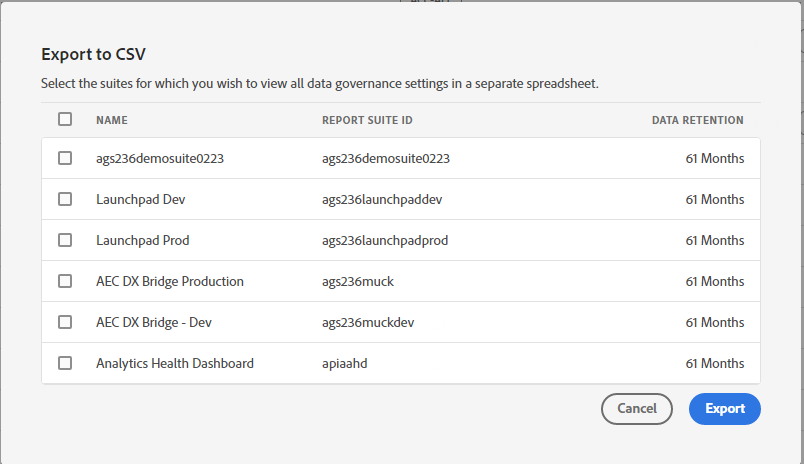

# Visa/hantera integritetsetiketter för datastyrning

Dialogrutan **[!UICONTROL Privacy Labeling for Data Governance]** innehåller en översikt över en rapportrites sekretessetiketter och namnutrymmen. Du kan också exportera inställningarna till en CSV-fil härifrån.

## Visa sekretessetiketter {#view-privacy}

1. Logga in på Adobe Experience Cloud.
2. Navigera till **[!UICONTROL Analytics]** > **[!UICONTROL Admin]** > **[!UICONTROL All admin]** > **[!UICONTROL Data configuration & collection]** > **[!UICONTROL Data Governance]**.

   >[!NOTE]
   >
   >Om du inte ser det här menyalternativet måste du läggas till i en [produktprofil i Admin Console](/help/admin/admin-console/permissions/product-profile.md) med behörigheter för den här funktionen eller ha fått tillgång till en Report Suite i Admin Console.

3. Överst till höger väljer du en rapportserie vars sekretessetiketter du vill visa eller hantera.

   

| Inställning | Beskrivning |
| --- | --- |
| **[!UICONTROL Component Name]** | I den här kolumnen visas alla komponenter (dimensioner, mått) som ingår i den här rapportsviten. |
| **[!UICONTROL Identity]** | Identitetsdata&quot;I&quot;-etiketter används för att kategorisera data som kan identifiera eller kontakta en viss person. [Läs mer](/help/admin/tools/privacy-labeling/labels.md#data-privacy-identity-labels) |
| **[!UICONTROL Sensitivity]** | Känsliga ”S”-etiketter används för att kategorisera känsliga data som geografiska data. Ytterligare känsliga dataetiketter kommer att införas i framtiden för att identifiera andra typer av känslig information. [Läs mer](/help/admin/tools/privacy-labeling/labels.md#sensitive-data-labels) |
| **[!UICONTROL GDPR Access]** | Etiketter för datastyrning ger användarna möjlighet att klassificera data som avspeglar integritetsrelaterade överväganden och avtalsvillkor så att de följer regler och företagspolicyer. [Läs mer](/help/admin/tools/privacy-labeling/labels.md#data-privacy-access-labels) |
| **[!UICONTROL GDPR Delete]** | En Ta bort-etikett krävs bara för fält som innehåller ett värde som skulle göra det möjligt att koppla en träff till den registrerade (dvs. som skulle göra det möjligt att identifiera den registrerade). [Läs mer](/help/admin/tools/privacy-labeling/labels.md#data-privacy-delete-labels) |
| **[!UICONTROL Namespace]** | När du etiketterar en variabel som ID-DEVICE eller ID-PERSON uppmanas du att ange ett namnutrymme. Du kan antingen använda ett tidigare definierat namnutrymme eller definiera ett nytt. |
| **[!UICONTROL Category]** | Refererar typ av komponent, t.ex. standardkomponent, konverteringsvariabel. |

{style="table-layout:auto"}

## Kopiera sekretessetiketter till en rapportserie  {#copy-to-rs}

Om du vill använda samma inställningar för datasekretess på mer än en rapportserie gör du så här:

1. Markera variabeln som du vill kopiera. Observera att du bara kan kopiera etiketterna för en variabel åt gången.
1. Klicka på **[!UICONTROL Copy to Report Suite(s)]** längst ned i dialogrutan Datastyrning.

   

1. På den slutliga skärmen visas variabelnamnet, den eller de etiketter som du försöker kopiera över, rapportsviterna och deras ID:n samt om inställningarna i målrapportsviterna matchar.

   

   >[!IMPORTANT]
   >
   >Kom ihåg att alla rapporteringsprogram du väljer måste mappas till din Experience Cloud-organisation.

   När du kopierar etiketterna för en variabel eller variabeluppsättning till en annan rapportsvit, flyttas kopian till variabeln på motsvarande plats i målrapportsviten. För standardkomponenter, listvariabler och lyckade händelser kopieras etiketterna till variabeln med **samma namn** i målrapportsviten.

   För konverteringsvariabler (eVars) och trafikdimensioner (props) går kopian till variabeln med **samma nummer** i målrapportsviten. eVar12 kopieras till exempel till eVar12 i alla målrapportsviter. Namnen på dessa variabler ignoreras när kopians mål fastställs. Om motsvarande variabel inte är aktiverad i målrapportsviten misslyckas kopieringen för den variabeln.

   När du kopierar etiketterna för klassificeringar som definierats för en variabel kopieras etiketterna till en klassificering för motsvarande variabel i målrapportsviten (t.ex. eVar7 till eVar7) som har ett namn som är identiskt med den klassificering som kopieras. Annars misslyckas kopian för den klassificeringens etiketter.

1. Markera rutan bredvid en eller flera rapportsviter där inställningarna matchar.
1. Klicka på **[!UICONTROL Apply]**.

   Ett statusmeddelande visas när en etikett har tillämpats. Statusmeddelandet innehåller namnen på de målvariabler eller klassificeringar och deras rapportsviter för vilka kopieringen misslyckades.

   >[!IMPORTANT]
   >
   >Du bör alltid kontrollera målrapportsviterna för att se till att etiketterna har kopierats korrekt. Detta är särskilt viktigt för variabler som har ID- eller DEL-etiketter.

## Exportera till en CSV-fil {#export-csv}

Du kan hämta en CSV-fil som innehåller alla aktuella etikettdefinitioner för alla variabler för de valda rapportsviterna. Vi rekommenderar att ditt juridiska team granskar dina etikettval och det här alternativet underlättar den här granskningen. I stället för att behöva utföra granskningen när du är inloggad i användargränssnittet för datastyrning kan du dela .CSV-filen med dem.

1. Klicka på **[!UICONTROL Export CSV]** längst upp till höger så visas följande dialogruta:

   

1. Välj en eller flera rapportsviter som du vill exportera alla datastyrningsinställningar för.

## Redigera sekretessetiketter {#edit}

Se [Tilldela eller redigera etiketter för sekretesspolicy för rapportsviten](/help/admin/tools/privacy-labeling/labeling-overview.md).
