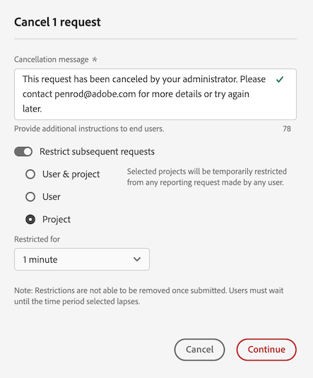

# Avbryt rapportbegäranden i Rapporteringsaktivitetshanteraren

Med [!UICONTROL Reporting Activity Manager] kan administratörer snabbt diagnostisera och avbryta rapporteringsbegäranden för att åtgärda problem med rapporttapaciteten under perioder med hög rapporteringsnivå.

Tänk på följande när du avbryter rapportbegäranden:

* Du kan avbryta specifika begäranden, avbryta alla begäranden från en viss användare eller avbryta alla begäranden som rör ett visst projekt.

  När du avbryter en begäran registreras åtgärden i [loggarna](/help/admin/tools/logs.md). Kolumnen [!UICONTROL **Händelsetyp**] visas som [!UICONTROL **Administratörsåtgärd**] och en beskrivning av annulleringen finns i kolumnen [!UICONTROL **Händelse**].

* När du avbryter begäranden kan du även välja att begränsa efterföljande begäranden för en viss tidsperiod.

  När du begränsar en efterföljande begäran registreras åtgärden i [loggarna](/help/admin/tools/logs.md). Kolumnen [!UICONTROL **Händelsetyp**] visas som [!UICONTROL **Administratörsåtgärd**] och en beskrivning av begränsningen finns i kolumnen [!UICONTROL **Händelse**].

* Du kan inte avbryta en begäran om kolumnen [!UICONTROL **Användare**] i en begäran visas som [!UICONTROL **Okänd**]. När detta inträffar innebär det att användaren befinner sig i ett inloggningsföretag där du inte har administratörsbehörighet.

Mer information om Reporting Activity Manager, inklusive viktiga fördelar och behörighetskrav, finns i [Översikt över Reporting Activity Manager](/help/admin/tools/reporting-activity-manager/reporting-activity-overview.md).

## Avbryt specifika begäranden

Du kan avbryta enskilda begäranden som förbrukar en stor del av rapporteringskapaciteten.

1. Gå till **[!UICONTROL Admin]** > **[!UICONTROL Reporting Activity Manager]** i Adobe Analytics.

1. Välj den rapportsvit där du vill avbryta rapporteringsbegäranden. <!--double-check this step-->

   Mer information om tillgängliga data på den här sidan finns i [Visa rapporteringsaktivitet i Rapporteringsaktivitetshanteraren](/help/admin/tools/reporting-activity-manager/reporting-activity.md).

1. Välj fliken [!UICONTROL **Förfrågningar**] och välj sedan en eller flera förfrågningar.

   <!-- add screenshot -->

1. Välj [!UICONTROL **Avbryt begäranden**].

   Dialogrutan [!UICONTROL **Avbryt _x_ rapportbegäranden**] visas.

1. I meddelandefältet för annullering visas meddelandet som visas för användarna när deras begäranden avbryts. Ett standardmeddelande har angetts. Du kan uppdatera standardmeddelandet om du vill ha mer information.

1. (Valfritt) Begränsa framtida begäranden för en viss tidsperiod:

   1. Aktivera alternativet att [!UICONTROL **Begränsa efterföljande begäranden**]

      

   1. Välj bland följande alternativ:

      | Alternativ | Funktion |
      |---------|----------|
      | [!UICONTROL **Användare och projekt**] | Användare som är associerade med de valda förfrågningarna kommer tillfälligt att begränsas från att köra rapportförfrågningar för associerade projekt. |
      | [!UICONTROL **Användare**] | Användare som är associerade med de valda förfrågningarna hindras tillfälligt från att göra några rapportförfrågningar. |
      | [!UICONTROL **Projekt**] | Projekt som är associerade med de valda förfrågningarna begränsas tillfälligt från alla rapporteringsförfrågningar. |
      | [!UICONTROL **Begränsad för**] | Välj hur länge begäranden ska begränsas. Du kan välja 1 minut (standard), 5 minuter, 10 minuter, 15 minuter eller 30 minuter. <!-- double-check this -->
Du kan inte ta bort en begränsning tidigt efter att den har angetts.
 |

      {style="table-layout:auto"}

1. Välj [!UICONTROL **Fortsätt med annullering**].

   Ett meddelande visas i Analysis Workspace som informerar användare om att begäran har avbrutits. Mer information om hur detta visas i Analysis Workspace finns i [Upplevelse när användare öppnar en avbruten rapport](#experience-when-users-access-a-cancelled-report).

## Avbryt begäranden från användare

Du kan avbryta alla begäranden som är kopplade till en eller flera användare.

1. Gå till **[!UICONTROL Admin]** > **[!UICONTROL Reporting Activity Manager]** i Adobe Analytics.

1. Välj den rapportsvit där du vill avbryta rapporteringsbegäranden. <!--double-check this step-->

   Mer information om tillgängliga data på den här sidan finns i [Visa rapporteringsaktivitet i Rapporteringsaktivitetshanteraren](/help/admin/tools/reporting-activity-manager/reporting-activity.md).

1. Markera fliken [!UICONTROL **Användare**] och markera sedan en eller flera användare.

   <!-- add screenshot -->

1. Välj [!UICONTROL **Avbryt begäranden**].

   Dialogrutan [!UICONTROL **Avbryt _x_ rapportbegäranden från x-användare**] visas.

1. I meddelandefältet för annullering visas meddelandet som visas för användarna när deras begäranden avbryts. Ett standardmeddelande har angetts. Du kan uppdatera standardmeddelandet om du vill ha mer information.

1. (Valfritt) Begränsa framtida begäranden för en viss tidsperiod:

   1. Aktivera alternativet att [!UICONTROL **Begränsa efterföljande begäranden**].

      

   1. Välj bland följande alternativ:

      | Alternativ | Funktion |
      |---------|----------|
      | [!UICONTROL **Användare och projekt**] | De valda användarna kommer tillfälligt att hindras från att göra några rapportförfrågningar för de associerade projekten. |
      | [!UICONTROL **Användare**] | De valda användarna kommer tillfälligt att hindras från att göra några rapportförfrågningar. |
      | [!UICONTROL **Projekt**] | Projekt som är associerade med de valda användarna kommer att begränsas från alla rapportförfrågningar som görs av alla användare. |
      | [!UICONTROL **Begränsad för**] | Välj hur länge begäranden ska begränsas. Du kan välja 1 minut (standard), 5 minuter, 10 minuter, 15 minuter eller 30 minuter. <!--double-check this--> 
Du kan inte ta bort en begränsning tidigt efter att den har angetts.
 |

      {style="table-layout:auto"}

1. Välj [!UICONTROL **Fortsätt med annullering**].

   Ett meddelande visas i Analysis Workspace som informerar användare om att begäran har avbrutits. Mer information om hur detta visas i Analysis Workspace finns i [Upplevelse när användare öppnar en avbruten rapport](#experience-when-users-access-a-cancelled-report).

## Avbryt begäranden per projekt

Du kan avbryta alla begäranden som är kopplade till ett eller flera projekt.

1. Gå till **[!UICONTROL Admin]** > **[!UICONTROL Reporting Activity Manager]** i Adobe Analytics.

1. Välj den rapportsvit där du vill avbryta rapporteringsbegäranden. <!--double-check this step-->

   Mer information om tillgängliga data på den här sidan finns i [Visa rapporteringsaktivitet i Rapporteringsaktivitetshanteraren](/help/admin/tools/reporting-activity-manager/reporting-activity.md).

1. Välj fliken [!UICONTROL **Projekt**] och välj sedan ett eller flera projekt.

   <!-- add screenshot -->

1. Välj [!UICONTROL **Avbryt begäranden**].

   Dialogrutan [!UICONTROL **Avbryt _x_ rapportbegäranden från x-projekt**] visas.

1. I meddelandefältet för annullering visas meddelandet som visas för användarna när deras begäranden avbryts. Ett standardmeddelande har angetts. Du kan uppdatera standardmeddelandet om du vill ha mer information.

1. (Valfritt) Begränsa framtida begäranden för en viss tidsperiod:

   1. Aktivera alternativet att [!UICONTROL **Begränsa efterföljande begäranden**].

      

   1. Välj bland följande alternativ:

      | Alternativ | Funktion |
      |---------|----------|
      | [!UICONTROL **Användare och projekt**] | De valda projekten kommer tillfälligt att begränsas från alla rapportförfrågningar som görs av associerade användare. |
      | [!UICONTROL **Användare**] | Användare som är associerade med de valda projekten kommer inte att kunna göra några rapportförfrågningar. |
      | [!UICONTROL **Projekt**] | De valda projekten kommer tillfälligt att begränsas från alla rapportförfrågningar som görs av någon användare. |
      | [!UICONTROL **Begränsad för**] | Välj hur länge begäranden ska begränsas. Du kan välja 1 minut (standard), 5 minuter, 10 minuter, 15 minuter eller 30 minuter. <!--double-check this--> 
Du kan inte ta bort en begränsning tidigt efter att den har angetts.
 |

      {style="table-layout:auto"}

1. Välj [!UICONTROL **Fortsätt med annullering**].

   Ett meddelande visas i Analysis Workspace som informerar användare om att begäran har avbrutits. Mer information om hur detta visas i Analysis Workspace finns i [Upplevelse när användare öppnar en avbruten rapport](#experience-when-users-access-a-cancelled-report).

## Avbryt begäranden per program

Du kan avbryta alla begäranden som är kopplade till ett eller flera program. När du avbryter begäranden som är kopplade till ett program kan du välja att begränsa begäranden som är kopplade till det programmet ytterligare under en viss tidsperiod.

Programmen omfattar följande:

* Analysis Workspace UI
* Workspace reguljära projekt
* Report Builder
* Användargränssnitt för byggare: segment, beräknade värden, anteckningar, målgrupper osv.
* API-anrop från 1.4 eller 2.0 API
* Aviseringar
* Dela med alla länkar
* Alla andra program som frågar efter analysrapportmotorn

Så här avbryter du begäranden per program:

1. Gå till **[!UICONTROL Admin]** > **[!UICONTROL Reporting Activity Manager]** i Adobe Analytics.

1. Välj den anslutning där du vill avbryta rapporteringsbegäranden. <!--double-check this step-->

   Mer information om tillgängliga data på den här sidan finns i [Visa rapporteringsaktivitet i Rapporteringsaktivitetshanteraren](/help/admin/tools/reporting-activity-manager/reporting-activity.md).

1. Välj fliken [!UICONTROL **Program**] och välj sedan ett eller flera program.

   <!-- add screenshot -->

1. Välj [!UICONTROL **Avbryt begäranden**].

   Dialogrutan [!UICONTROL **Avbryt _x_ rapportbegäranden från x-projekt**] visas.

1. I meddelandefältet för annullering visas meddelandet som visas för användarna när deras begäranden avbryts. Ett standardmeddelande har angetts. Du kan uppdatera standardmeddelandet om du vill ha mer information.

1. (Valfritt) Begränsa framtida begäranden för en viss tidsperiod:

   1. Aktivera alternativet att [!UICONTROL **Begränsa efterföljande begäranden**]

      

   1. Välj bland följande alternativ:

      | Alternativ | Funktion |
      |---------|----------|
      | [!UICONTROL **Användare och projekt**] | De valda programmen kommer tillfälligt att begränsas från alla rapportförfrågningar som görs av associerade användare och projekt.
Det här är det minst restriktiva alternativet.
 |
      | [!UICONTROL **Användare**] | Användare som är associerade med de valda programmen kommer inte att kunna göra några rapportförfrågningar. |
      | [!UICONTROL **Projekt**] | Projekt som är associerade med de valda programmen kommer att begränsas från alla rapportförfrågningar som görs av alla användare. |
      | [!UICONTROL **Begränsad för**] | Välj hur länge begäranden ska begränsas. Du kan välja 1 minut (standard), 5 minuter, 10 minuter, 15 minuter eller 30 minuter. <!--double-check this--> 
Du kan inte ta bort en begränsning tidigt efter att den har angetts.
 |

      {style="table-layout:auto"}

1. Välj [!UICONTROL **Fortsätt med annullering**].

   Ett meddelande visas i programmet (t.ex. Analysis Workspace) som informerar användarna om att begäran har avbrutits. Mer information om hur detta visas i Analysis Workspace finns i [Upplevelse när användare öppnar en avbruten rapport](#experience-when-users-access-a-cancelled-report).

## Upplevelse när användare öppnar en avbruten rapport

I Analysis Workspace visas följande meddelanden när användare försöker få åtkomst till en rapport eller visualisering som påverkas av en annullering:

### Meddelande i projektet

När användare försöker komma åt ett projekt som påverkas av en annullering visas ett meddelande som informerar dem om att rapporten är tillfälligt begränsad:

### Meddelande om visualiseringen

När en användare försöker få åtkomst till en visualisering som påverkas av en annullering visas ett meddelande som informerar användaren om att databearbetningen för rapporten är tillfälligt begränsad:

