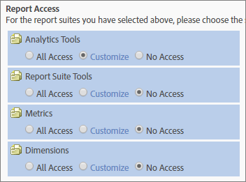

# Anpassa rapportåtkomst - översikt

>[!IMPORTANT]
>
>Användar- och produkthanteringen övergår till [Admin Console](https://helpx.adobe.com/enterprise/using/admin-console.html). Adobe meddelar dig när det är dags att migrera användare. När alla kunder har migrerat tas hjälpinnehåll för **[!UICONTROL Analytics]** > **[!UICONTROL Admin Tools]** > **[!UICONTROL User Management]** bort.

Anpassa gruppbehörigheter till analysverktyg, rapportsvitsverktyg, mätvärden och dimensioner.

**[!UICONTROL Add New Group]** > **[!UICONTROL Report Access]**

Avsnittet [!UICONTROL Report Access] på [!UICONTROL Define User Group] sidan innehåller åtkomstkategorier som gör att du kan anpassa behörigheter på detaljnivå.

Du kan till exempel skapa en grupp med tillgång till flera analysverktyg (, [!UICONTROL Analysis Workspace]och [!UICONTROL Reports & Analytics][!UICONTROL Report Builder]), med behörighet till specifika mått och mått (inklusive eVars), och funktioner som att skapa segment eller beräknade mätvärden.

## Vad du bör veta om behörigheter {#section_3D25D4A5BD044008870C5B98F696244E}

<table id="table_DB7806E05E2040EC9A4CB7C3596879EC"> 
 <thead> 
  <tr> 
   <th colname="col1" class="entry"> Objekt </th> 
   <th colname="col2" class="entry"> Beskrivning </th> 
  </tr> 
 </thead>
 <tbody> 
  <tr> 
   <td colname="col1"> 
Administratörsåtkomst/fördefinierade grupper 
 </td> 
   <td colname="col2"> 
 Fördefinierade grupper krävs inte längre för administratörer. Administratörer har nu tillgång till alla objekt (verktyg, mått, mått) samt Web Service-åtkomst, Report Builder, Activity Map och Ad Hoc Analysis. 
 
Syftet med grupper är att ge eller begränsa åtkomst till icke-administrativa användare. 
 </td> 
  </tr> 
  <tr> 
   <td colname="col1"> 
Anpassade grupper 
 </td> 
   <td colname="col2"> 
 Anpassade grupper har ersatt fördefinierade grupper. Befintliga fördefinierade grupper migreras till anpassade grupper med samma gruppnamn. Alla anpassade grupper som du har skapat, inklusive deras inställningar, bevaras. Du kommer dock att märka att platsen för inställningarna kommer att ha flyttats. Företagsinställningar (i Anpassa Admin Console) finns nu i <a href="/help/admin/user-management2/c-customize-report-access/groups-analytics-tools.md"> Anpassa analysverktyg</a>. 
 
 Användare som tillhör  All Report Access har migrerats till en anpassad grupp med åtkomst till: 
 
    <ul id="ul_7E1B443DEEF7452E85FEB30CA0BBC8BE"> 
     <li id="li_A510C2A4129340E0AB08EEBDBE4AEAD9">Alla dimensioner </li> 
     <li id="li_8BA1D7A2527C4F10AC93108B9E87F418">Alla mått </li> 
     <li id="li_265830A2C6B94AF28720DA99980EAA51">Alla rapportsviter </li> 
     <li id="li_685B99DEAB814D7B9C11B14AA4CB8CD4">Kanalrapport </li> 
     <li id="li_B35420302AAB42509BD6AF0FA6349BF8">Analysidentifiering </li> 
     <li id="li_3787E4696C454D3ABD1D75F6C282A9A2">Realtidsrapport </li> 
     <li id="li_3797DF9C40D1426588819116362962F5">Åtkomst till analysarbetsyta </li> 
    </ul> 
Administratörer kan ta bort anpassade grupper och skapa egna, eftersom alla inställningar som tidigare fanns i fördefinierade grupper är tillgängliga för anpassning under inställningarna för  rapportåtkomst i Definiera användargrupper</a>. 
 </td> 
  </tr> 
  <tr> 
   <td colname="col1"> 
Behörigheter på dimensionsnivå 
 </td> 
   <td colname="col2"> 
Du kan anpassa behörigheter för att inkludera eller exkludera åtkomst till dimensioner (utöver mått). 
 
    <ul id="ul_DA5A54223673474E9151AF979DA50659"> 
     <li id="li_C3E82F7BC07A4F2F83A85D3D511292CC"> 
Alla aktuella dimensioner och mått i anpassade grupper har automatiskt migrerats till de nya kategorierna. Om en befintlig grupp har mätvärden aktiverade får den som standard alla nya tillåtna mått (eVars och innehållsmedvetna) och mätvärden. 
 </li> 
     <li id="li_CC56F9181CC14AB59318628E72F2E8C9"> Behörigheter för klassificeringsimporteraren (tidigare SAINT): Åtkomsten till klassificeringar bestäms av tillgången till den <a href="https://marketing.adobe.com/resources/help/en_US/reference/c_classifications.html"> variabel</a> som klassificeringen baseras på. </li> 
    </ul> 
Se <a href="/help/admin/user-management2/c-customize-report-access/groups-dimensions.md"> Anpassa dimensionsbehörigheter</a>. 
 </td> 
  </tr> 
  <tr> 
   <td colname="col1"> 
<a href="https://helpx.adobe.com/enterprise/using/admin-console.html"> Adobe Admin Console</a> 
 </td> 
   <td colname="col2"> 
Rekommenderas endast för nya kunder eller kunder med företag som <a href="https://marketing.adobe.com/resources/help/en_US/mcloud/core_services.html"> etablerats i Experience Cloud</a>. En migrering av befintliga  Analytics -kunder till identitetshanteringssystemet i  Experience Cloud planeras. 
 
Mer information finns i <a href="https://marketing.adobe.com/resources/help/en_US/experience-cloud/admin-console/analytics-migration/"> Användarmigrering för Analytics till Admin Console</a>. 
 </td> 
  </tr> 
  <tr> 
   <td colname="col1"> 
Innehållsanpassat 
 </td> 
   <td colname="col2"> 
Innehållsmedveten inkluderar variabler som gör att du kan hantera behörigheter för mätvärden som rör Experience Cloud-lösningsintegreringar. Du kan hantera behörigheter på  socialadata,  mobildataoch andra data som infogats via en  Experience Cloud -integrering. Dessa aktiveras som standard. 
 </td> 
  </tr> 
  <tr> 
   <td colname="col1"> 
Felaktiga behörigheter/rapporter 
 </td> 
   <td colname="col2"> 
Dessa inaktiva rapporter tas bort: 
 
    <ul id="ul_C0415CFF0562472297272EC58ECC0774"> 
     <li id="li_62B1CE33B1454987B878B321EB40D62E">Månadssammanfattning </li> 
     <li id="li_71CD776D212540A18F9B083D2E11A296">Besökarens hemsida </li> 
     <li id="li_406200AD68C74D11B5F53988A4E76A68">Netscape-plugin-program </li> 
     <li id="li_A124637D69C94C78921C8B028D890541">Viktiga besökare </li> 
     <li id="li_5C26FF95371B4F3080FF75C7F8DE0F72">Sidor som visas av viktiga besökare </li> 
     <li id="li_E7E262BD0CF64E16B838F995F6A13B8A">Ögonblicksbild av besökare </li> 
     <li id="li_0EDC74625C0D4B1A992FCA49B648E4C0">DRM </li> 
     <li id="li_ACC92E6EA188409486E7C943F26B9DAC">Nettoprotokoll </li> 
     <li id="li_6E18C4D12377416A8124BBD13164B03A">Java-version </li> 
     <li id="li_1599265E59EF4F34BB406356410C9E68">URL-längd för bokmärke </li> 
     <li id="li_3035442010984C409089B21E03DB7BCC">Överföring av enhetsnummer </li> 
     <li id="li_6B2163ED8FC84EBF933D97A504B4D527">PTT </li> 
     <li id="li_0EB8A4A7619B45DF87109B183A7C69C8">Stöd för dekoration av e-post </li> 
     <li id="li_989FAC662F7344E6BDDC517B79D4581E">Information </li> 
     <li id="li_F1FB7F8E415443F3B63F6D11D59A04AB">Informationstjänst </li> 
    </ul> 
Dessa rapporter: 
 
    <ul id="ul_F71505C59F734EA9B541BF8AB9F9388F"> 
     <li id="li_7D461907B895447280E69CF1520DF47C">Kan fortfarande kommas åt av bokmärken. </li> 
     <li id="li_27BA2DD6BA4C446FBAA06B6C76CD171F">Ingår inte i behörighetskategorin för nya dimensioner. </li> 
     <li id="li_504E9D8421714406A0F37DEF1E10E34B">Behörigheterna kan inte längre redigeras. </li> 
     <li id="li_0022E8DCA07344C793847E8282EFBEEF">Bevarar åtkomst för anpassade grupper med aktuell åtkomst. </li> 
    </ul> </td> 
  </tr> 
 </tbody> 
</table>

