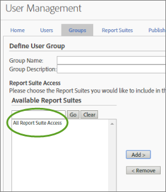

# Behörighetsändringar för användare och grupper

>[!IMPORTANT]
>
>Användar- och produkthantering har flyttats till [Admin Console](https://helpx.adobe.com/se/enterprise/using/admin-console.html). Adobe meddelar dig när det är dags att migrera användare. När alla kunder har migrerat kommer hjälpinnehåll för **[!UICONTROL Analytics]** > **[!UICONTROL Admin Tools]** > **[!UICONTROL User Management]** att tas bort.

## Vad har ändrats? {#section_2C205DE94155441B9E9D3E4C46CCF2EE}

**[!UICONTROL Admin]** > **[!UICONTROL User Management]** > **[!UICONTROL Groups]**

>[!NOTE]
>
>På grund av det stora antalet möjliga behörighetskombinationer kan vi inte tillhandahålla dokumentation som beskriver alla API-metoder som kan användas i varje behörighetskombination. I allmänhet har icke-administratörer som beviljas åtkomst till webbtjänster bara läsbehörighet till API-metoder. De har inte skrivåtkomst till metoder.

Eftersom API:t och gränssnittet använder samma behörighetssystem, kommer alla behörigheter som en viss icke-administratör har beviljats av en administratör i gränssnittet (Adobe Admin Console) att vara samma behörigheter som användaren har i API:t.

<table id="table_D1DB0DE37752450BBCCA44DB760BB505"> 
 <thead> 
  <tr> 
   <th colname="col1" class="entry"> Förbättring </th> 
   <th colname="col2" class="entry"> Beskrivning </th> 
  </tr> 
 </thead>
 <tbody> 
  <tr> 
   <td colname="col1"> 
Ändringar i -rapportåtkomsten (Anpassa grupper) 
 </td> 
   <td colname="col2"> 
  Lägg till ny grupp  &gt;   Rapportåtkomst 
 
Avsnittet  Rapportåtkomst på sidan  Definiera användargrupp har strömlinjeformats till fyra kategorier, som gör att du kan anpassa behörigheter på detaljnivå. 
 
 </img> 
 
Objekt tidigare i 
 
    <ul id="ul_16D5EF18D57D4608AEEDEC40D90D8828"> 
     <li id="li_F29E84C6228A464C8807F09205AEAAC6"> 
 <a href="/help/admin/user-management2/c-customize-report-access/groups-analytics-tools.md"> Analysverktyg</a>: Aktivera användarbehörigheter för allmänna objekt (fakturering, loggar osv.), företagshantering, verktyg, webbtjänståtkomst, Report Builder och integrering med Data Connectors. 
 
 <b>Obs!</b> Företagsinställningar från kategorin Anpassa Admin Console har flyttats till Analytics-verktygen. 
 </li> 
     <li id="li_A6EB788162A2455E94CE54B9279A854D"> 
 <a href="/help/admin/user-management2/c-customize-report-access/groups-report-suite-tools.md"> Report Suite-verktyg</a>: Aktivera användarbehörigheter för Web Services, Report Suite Management, Tools and Reports och Dashboard Items. 
 </li> 
     <li id="li_EDB0255E009B4F1CAFAF53966B41363C"> 
 <a href="/help/admin/user-management2/c-customize-report-access/groups-metrics.md"> Mätvärden</a>: Aktivera behörigheter för trafik, konvertering, anpassade händelser, lösningshändelser, innehållsmedveten osv. 
 </li> 
     <li id="li_8DAE87D1DEF54803A9C6FE31C01F0FB0"> 
 <a href="/help/admin/user-management2/c-customize-report-access/groups-dimensions.md"> Dimensioner</a>: Anpassa användaråtkomsten på detaljnivå: eVars, trafikrapporter, lösningsrapporter och kundvägsrapporter. 
 </li> 
    </ul> 
Du kan till exempel skapa en grupp med tillgång till flera analysverktyg ( Analysis Workspace,  Rapporter och analyser och  Report Builder), med behörighet till specifika mått och mått (inklusive eVars) och funktioner som att skapa segment eller beräknade mätvärden. 
 </td> 
  </tr> 
  <tr> 
   <td colname="col1"> 
Ändringar i fördefinierade grupper 
 </td> 
   <td colname="col2"> 
 <b>Administratörsåtkomst:</b> Fördefinierade grupper krävs inte längre för administratörer. Administratörer har nu tillgång till alla objekt (verktyg, mått, mått) samt webbtjänståtkomst, Report Builder och Activity Map. 
 
Framöver är syftet med grupper att ge eller begränsa åtkomst till icke-administrativa användare. 
 
 <b>Egna grupper:</b> Egna grupper har ersatt fördefinierade grupper. Befintliga fördefinierade grupper migreras till anpassade grupper med samma gruppnamn. Alla anpassade grupper som du har skapat, inklusive deras inställningar, bevaras. Du kommer dock att märka att platsen för inställningarna kommer att ha flyttats. Företagsinställningar (i Anpassa Admin Console) finns nu i <a href="/help/admin/user-management2/c-customize-report-access/groups-analytics-tools.md"> Anpassa analysverktyg</a>. 
 
 Användare som tillhör  All Report Access har migrerats till en anpassad grupp med åtkomst till: 
 
    <ul id="ul_696A9243F5FD4AF187352C2F4B1CFDC2"> 
     <li id="li_683A0A3BB7214CFFBC61D5A4CD237F48">Alla Dimensioner </li> 
     <li id="li_D8FDBF6A32224731AB706315DEA0A03E">Alla mått </li> 
     <li id="li_65ABE5C95D43444D88E63EE95C9AED05">Alla rapportsviter </li> 
     <li id="li_7ED1505590144B38B3B9851BAA6BBB49">Behörighet för kanalrapport </li> 
     <li id="li_F718FE1FCF9A4B05AB933CA3F105F3EC">Behörighet för avvikelseidentifieringsrapport </li> 
     <li id="li_527BD52007E846FE8B5F71AB3C12F695">Behörighet för realtidsrapport </li> 
     <li id="li_AFFB58C7FB644AC8A85E2D76BA7D51F5">Analysis Workspace Access Permission </li> 
    </ul> 
Administratörer kan ta bort anpassade grupper och skapa egna, eftersom alla inställningar som tidigare fanns i fördefinierade grupper är tillgängliga för anpassning under inställningarna  Report Access i <a href="/help/admin/user-management2/c-user-groups/groups.md"> Definiera användargrupper</a>. 
 </td> 
  </tr> 
  <tr> 
   <td colname="col1"> 
Behörigheter på Dimension-nivå 
 </td> 
   <td colname="col2"> 
Du kan anpassa behörigheter för att inkludera eller exkludera åtkomst till dimensioner (utöver mått). 
 
    <ul id="ul_DA5A54223673474E9151AF979DA50659"> 
     <li id="li_C3E82F7BC07A4F2F83A85D3D511292CC"> 
Alla aktuella dimensioner och mått i anpassade grupper har automatiskt migrerats till de nya kategorierna. Om en befintlig grupp har mätvärden aktiverade får den som standard alla nya tillåtna mått (eVars och innehållsmedvetna) och mätvärden. 
 </li> 
     <li id="li_CC56F9181CC14AB59318628E72F2E8C9"> Behörigheter för klassificeringsimporteraren (tidigare SAINT): Åtkomsten till klassificeringar bestäms av åtkomsten till variabeln  som klassificeringen baseras på. </li> 
    </ul> 
Se <a href="/help/admin/user-management2/c-customize-report-access/groups-dimensions.md"> Anpassa behörigheter för Dimension</a>. 
 </td> 
  </tr> 
  <tr> 
   <td colname="col1"> 
Admin Console 
 </td> 
   <td colname="col2"> 
Rekommenderas endast för nya kunder eller kunder med företag <a href="https://docs.adobe.com/content/help/en/core-services/interface/about-core-services/core-services.html"> som finns i Experience Cloud</a>. En migrering planeras för befintliga  Analytics-kunder till identitetshanteringssystemet  Experience Cloud. 
 
Mer information finns i <a href="https://helpx.adobe.com/enterprise/using/manage-permissions-and-roles.html"> Hantera produktbehörigheter i Admin Console</a>. 
 </td> 
  </tr> 
 </tbody> 
</table>

## Vanliga frågor om behörighetsändringar {#section_02809EFC95054B40A089E6C6E4FACA13}

Här finns viktig ny information om nya och planerade uppdateringar och hur de påverkar er administrativa miljö.

<table id="table_1E93F45C66E841E6882FB602509F30A3"> 
 <thead> 
  <tr> 
   <th colname="col1" class="entry"> Fråga </th> 
   <th colname="col2" class="entry"> Svar </th> 
  </tr> 
 </thead>
 <tbody> 
  <tr> 
   <td colname="col1">Vilka behörighetsändringar gjordes i <b>juli 2016</b>-versionen? </td> 
   <td colname="col2"> 
 <b>Alla åtkomst till Report Suite</b> 
 
När du lägger till rapportsviter som ska inkluderas i en grupp kan du ange  Alla rapportsvitåtkomst. Den här inställningen tillämpar gruppbehörigheter för alla aktuella och framtida rapportsviter. 
 
Om du vill aktivera den här funktionen går du till  Användarhantering &gt;  Grupper &gt;  Lägg till ny användargrupp och väljer sedan  All Report Suite Access. 
 
 
 </td> 
  </tr> 
  <tr> 
   <td colname="col1"> 
Ska jag använda Admin Console för att hantera användare eller den befintliga användarhanteringen i Analytics? 
 </td> 
   <td colname="col2"> 
Ändringar som görs i Analytics &gt; Admin &gt; User Management återspeglas inte i Admin Console. Därför bör endast nya kunder som redan använder Admin Console för användar- och grupphantering fortsätta göra det. En migrering av befintlig grupphantering i Analytics till Admin Console planeras. 
 </td> 
  </tr> 
  <tr> 
   <td colname="col1"> 
Vilka behörighetsändringar gjordes i <b>oktober 2016</b>-versionen? 
 </td> 
   <td colname="col2"> 
Följande förbättringar av det aktuella  Admin Tools-gränssnittet är tillgängliga: 
 
 
     <ul id="ul_2A31E8DC17A94B7FABDBA9C87C3947EF"> 
      <li id="li_AE2ECCA01CC64D30B109BE74379EE474">Behörighetsändringar som beskrivs i <a href="/help/admin/user-management2/c-user-management/permissions-changes.md"> Administrativa ändringar - hösten 2016</a>. </li> 
      <li id="li_33CB2B6A2E5F45BE97CC5E0983AF280E">Borttagen icke-fungerande trafikrapporter som inte längre fanns på menyn. </li> 
      <li id="li_57234CF27E1D405987DE89312CD62C52">Klassificeringsbehörigheter: Tillgången till klassificeringar bestäms av tillgången till variabeln som klassificeringen avser. </li> 
     </ul> 
 </td> 
  </tr> 
  <tr> 
   <td colname="col1"> 
Finns det något jag behöver göra för att migrera användare? 
 </td> 
   <td colname="col2"> 
Nej, alla behörighetsmigreringar sker transparent. 
 
 
     <ul id="ul_654F85286EC04416B3E0BA725EBE10AD"> 
      <li id="li_8050B8941F794103B82A0ADF0930D216">Alla aktuella trafikrapporter i en anpassad Dimension migreras automatiskt till den nya kategorin. </li> 
      <li id="li_B97079DB29A346B98D066F11AB7F94AF">Om en anpassad grupp redan har några mätvärden aktiverade, får den automatiskt alla nya dimensioner som är tillåtna (eVars- och Solution-variabler). </li> 
      <li id="li_F1219EF490DA473BA15F2B215F2995AE"> En anpassad grupp med minst ett mått får automatiskt åtkomst till alla eVars och andra innehållsanpassade dimensioner <b>förutom</b> de nya tillgängliga trafikdimensionerna (tidigare trafikrapporter). </li> 
      <li id="li_F494CE6144A04A6199CFBBA1D7BEA32B">Alla fördefinierade grupper ändras till behörigheter. Dessa nya behörigheter läggs till i en ny  Analysverktyg-kategori. </li> 
      <li id="li_2FCD9254FC3C4FD7871EEF9453E5CE1E">Alla anpassade grupper med mätvärden kommer att ha alla Analytics Solution-händelser tillagda som nya mätvärden. </li> 
      <li id="li_34C4560769B64F28A4E83BAE71065DCC">Alla användare som tidigare fanns i Alla rapportåtkomst läggs till i den nya anpassade gruppen. All rapportåtkomst finns inte längre. </li> 
     </ul> 
 </td> 
  </tr> 
  <tr> 
   <td colname="col1"> 
Vad kommer inte att ändras? 
 </td> 
   <td colname="col2"> 
Besökarattributen fortsätter att vara otillåtna. 
 </td> 
  </tr> 
 </tbody> 
</table>

## Snabbreferens för behörighet {#section_A3FDD8259F524B21A5489833533D1B28}

I följande tabell visas uppgifter och var de kan utföras (beroende på ett företags status).

>[!NOTE]
>
>En *`migrated user`* och *`Experience Cloud user`* hänvisar till användare som har accepterat en e-postinbjudan att gå med i Experience Cloud. Om e-postinbjudan inte accepteras är användarna fortfarande Analytics-användare och kan inte hanteras i Admin Console. (Undantaget är om migreringen använder [företags-ID eller Federated ID](https://helpx.adobe.com/enterprise/using/set-up-identity.html). I det här fallet migreras användaren när administratören migrerar användare per användare.)

<table id="table_B68FD00FC5D24823A86BB69558C0327C"> 
 <thead> 
  <tr> 
   <th colname="col1" class="entry"> Uppgift </th> 
   <th colname="col2" class="entry"> Icke-migrerande inloggningsföretag </th> 
   <th colname="col3" class="entry"> Migrerar företag </th> 
   <th colname="col4" class="entry"> Inloggningsföretaget har migrerats </th> 
  </tr> 
 </thead>
 <tbody> 
  <tr> 
   <td colname="col1"> Skapa en användare </td> 
   <td colname="col2"> 
Admin Console (skapar en användare och lägger till honom eller henne i en Analytics <a href="https://docs.adobe.com/content/help/en/core-services/interface/manage-users-and-products/admin-getting-started.html">-produktkonfiguration</a> skapar även användarkontot i Analytics). 
 
 <a href="/help/admin/user-management2/c-user-management/t-add-user-account.md"> Administratörsverktyg</a> 
 </td> 
   <td colname="col3"> 
 <a href="https://adminconsole.adobe.com/enterprise/"> Admin Console</a> 
 </td> 
   <td colname="col4"> 
 <a href="https://adminconsole.adobe.com/enterprise/"> Admin Console</a> 
 </td> 
  </tr> 
  <tr> 
   <td colname="col1"> Redigera en användare </td> 
   <td colname="col2"> 
 <a href="/help/admin/user-management2/c-user-management/t-add-user-account.md"> Administratörsverktyg</a> 
 </td> 
   <td colname="col3"> 
 <a href="https://adminconsole.adobe.com/enterprise/"> Admin Console</a> 
 
 Administratörsverktyg - Redigering i administratörsverktygen för migrerade användare är begränsad till API-nyckelhantering och borttagning/överföring av resurser. 
 </td> 
   <td colname="col4"> 
 <a href="https://adminconsole.adobe.com/enterprise/"> Admin Console</a> 
 
 Administratörsverktyg - Redigering begränsas till API-nyckelhantering och borttagning/överföring av resurser. 
 </td> 
  </tr> 
  <tr> 
   <td colname="col1"> Ta bort en användare </td> 
   <td colname="col2"> 
Admin Console - för Experience Cloud 
 
Administratörsverktyg - för alla användare, men för Experience Cloud-användare, tas endast den mappade Analytics-användaren bort, inte Experience Cloud-kontot. 
 </td> 
   <td colname="col3"> 
Admin Console - För migrerade användare. 
 
Administratörsverktyg - för användare som bara använder analyser. 
 </td> 
   <td colname="col4"> 
Admin Console 
 
 Administratörsverktyg - När du har tagit bort en Experience Cloud-användare eller tagit bort länken för deras konto i Admin Console kan du ta bort Analytics-inloggningen från Admin Tools. 
 </td> 
  </tr> 
  <tr> 
   <td colname="col1"> Logga in på Analytics </td> 
   <td colname="col2"> 
 <b>Experience Cloud:  </b>  marketing.adobe.com. Endast tillgängligt för användare av Experience Cloud. 
 
 <b>Analytics (legacy):</b>  sc.omniture.com. För användare som endast använder Analytics och för Experience Cloud som har sina Analytics-autentiseringsuppgifter 
 </td> 
   <td colname="col3"> 
  marketing.adobe.com  - endast för Experience Cloud. 
 
  sc.omniture.com - För användare med enbart analys och för Experience Cloud med deras inloggningsuppgifter för Analytics. 
 
Under migreringen kan administratörer inaktivera inloggningsfunktionen  omniture.com för specifika användare. 
 </td> 
   <td colname="col4"> 
Admin Console 
 </td> 
  </tr> 
  <tr> 
   <td colname="col1"> Skapa en grupp </td> 
   <td colname="col2"> 
Admin Console - När en grupp skapas i Admin Console visas en mappad grupp i Analytics i Admin Tools, men namnet på den mappade gruppen kan inte ändras från Admin Tools eller tas bort från Admin Tools. 
 
Administratörsverktyg. 
 </td> 
   <td colname="col3"> 
Admin Console (<a href="https://docs.adobe.com/content/help/en/core-services/interface/manage-users-and-products/admin-getting-started.html"> skapa produktkonfiguration</a>) 
 </td> 
   <td colname="col4"> 
Admin Console (<a href="https://docs.adobe.com/content/help/en/core-services/interface/manage-users-and-products/admin-getting-started.html"> skapa produktkonfiguration</a>) 
 </td> 
  </tr> 
  <tr> 
   <td colname="col1"> Redigera användare i en grupp </td> 
   <td colname="col2"> 
Admin Console - endast för Experience Cloud 
 
Administratörsverktyg - Både användare med enbart Analytics och användare i Experience Cloud kan redigeras i administratörsverktygen. Om en Experience Cloud-användare ingår i en grupp i Admin Console kan de inte tas bort från gruppen i Admin Tools. 
 </td> 
   <td colname="col3"> 
Admin Console - endast användare av Experience Cloud 
 
 Administratörsverktyg - Det går fortfarande att lägga till/ta bort inloggningar för enbart analys i grupper i administratörsverktygen. 
 </td> 
   <td colname="col4"> 
Admin Console 
 </td> 
  </tr> 
  <tr> 
   <td colname="col1"> Redigera behörigheter för en grupp </td> 
   <td colname="col2"> 
Admin Console - Du kan redigera grupper som skapats i Admin Console. 
 
Administratörsverktyg - Du kan redigera behörigheter för alla grupper. 
 </td> 
   <td colname="col3"> 
Admin Console 
 </td> 
   <td colname="col4"> 
Admin Console 
 </td> 
  </tr> 
  <tr> 
   <td colname="col1"> Ta bort grupp </td> 
   <td colname="col2"> 
Admin Console - Du kan bara ta bort grupper som skapats i Admin Console. 
 
Administratörsverktyg - Du kan bara ta bort grupper som har skapats med Administratörsverktyg. 
 </td> 
   <td colname="col3"> 
Admin Console 
 </td> 
   <td colname="col4"> 
Admin Console 
 </td> 
  </tr> 
  <tr> 
   <td colname="col1"> Ändra administratörsstatus för användare </td> 
   <td colname="col2"> 
Admin Console - Endast för Experience Cloud. 
 
Administratörsverktyg 
 </td> 
   <td colname="col3"> 
Admin Console - Endast för Experience Cloud. 
 
Administratörsverktyg - Endast för Analytics-användare. 
 </td> 
   <td colname="col4"> 
Admin Console 
 </td> 
  </tr> 
 </tbody> 
</table>
