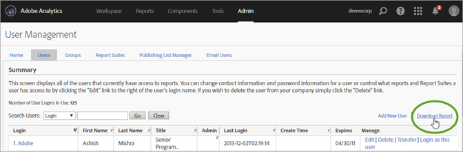
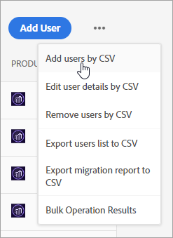
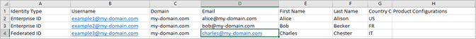
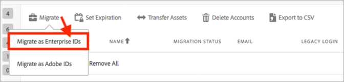

# Migrera Analytics-användarkonton för Enterprise ID och Federated ID{#migrate-analytics-user-accounts-for-enterprise-and-federated-ids}

Så här migrerar du Analytics-användarkonton som Enterprise ID eller Federated ID till Admin Console.

## Förutsättningar {#prereqs}

Förutsättningar för att hantera användare på Admin Console.

För nya domäner och kataloger följer du stegen för att:

* Konfigurera en katalog
* Konfigurera domäner
* Länka domäner till kataloger

Mer information finns i [Konfigurera ett identitetssystem](https://helpx.adobe.com/enterprise/using/set-up-identity.html) .

Om en katalog redan har skapats i en annan organisation av en annan affärsenhet eller ett annat team följer du stegen i [katalogförtroendet](https://helpx.adobe.com/enterprise/using/set-up-identity.html#Directorytrusting) för att skapa katalogen i den organisation som du använder för Analytics.

## Migrera användarkonton för Enterprise ID och Federated ID {#task-0cfb3e4400fd4ab58e4d9704528b05fa}

I den här proceduren kommer du att:

* Hämta en inloggningslista från **[!UICONTROL Analytics]** > **[!UICONTROL Analytics Users & Assets]**.

* Hämta en aktuell användarlista från **[!UICONTROL Admin Console]** > **[!UICONTROL Users]**.

* Jämför listorna (söker efter dubbletter så att du inte skriver över kontodata i Admin Console).
* Överför en färdig fil [!DNL .csv] (från **[!UICONTROL Admin Console]** > **[!UICONTROL Users]**) med Enterprise ID- eller Federated ID-användare till Admin Console.

Om du behöver migrera befintliga Adobe ID-användarkonton till ett Enterprise ID eller Federated ID kontaktar du Adobes kundtjänst och begär en [bulkändring](https://helpx.adobe.com/enterprise/using/bulk-operations.html)av användaridentitet.

**Så här migrerar du användarkonton**

1. Hämta Analytics-användarens inloggningsfil ( [!DNL User Logins List.tab]) från Analytics User Management på något av följande sätt (beroende på om du redan har migrerat användare).
   1. *Före migreringen* navigerar du till **[!UICONTROL Admin]** > **[!UICONTROL User Management (Legacy)]** > **[!UICONTROL Edit Users]** och klickar sedan på **[!UICONTROL Download Report]**.

      

      Länken Hämta rapport visas endast för kunder som inte har migrerat användare.

   1. *Om du redan har migrerat användare,* navigera till **[!UICONTROL Analytics]** > **[!UICONTROL Analytics users and Assets]**.

      

   1. Markera användare på [!DNL Users] sidan och klicka sedan på **[!UICONTROL Export to CSV]**.

      

   1. Öppna den hämtade [!DNL User List.csv] filen i Excel.

      Var redo att kopiera värdena *`Email`*, *`First Name`* och *`Last Name`* till en [!DNL sample.csv] fil (beskrivs i nästa steg).

      > [!IMPORTANT] Värdena i CSV-filen måste vara kommaavgränsade.

      > [!TIP] Under det här steget rekommenderar Adobe att du effektiviserar användarlistan så att endast de användare som har ett giltigt e-post-ID inkluderas i migreringen av Enterprise ID eller Federated ID.

1. Hämta en lista över användare av Admin Console i [!UICONTROL Admin Console]dialogrutan:

   1. Navigera till [!UICONTROL Admin Console] > **[!UICONTROL Users]** och klicka sedan på [Exportera användarlista till CSV](https://helpx.adobe.com/enterprise/using/users.html).

      

   1. Jämför de två filerna: befintliga Admin Console-användare i den exporterade [!DNL .csv] filen ( [!DNL sample.csv]i det här exemplet) med användarna i Analytics- [!DNL User Logins List.csv] filen.

      > [!IMPORTANT] Om du hittar dubbletter tar du bort dem från Analytics- [!DNL User Logins List.csv] filen. Det här steget hjälper dig att förhindra att befintliga Experience Cloud-användarbehörigheter skrivs över i Admin Console och ger dig en lista över konton som ska migreras.

1. Hämta CSV-mallen från Admin Console:
   1. Klicka på fliken Användare **[!UICONTROL Add users by CSV]** och sedan **[!UICONTROL Download CSV Template]**.

      

   1. Välj **[!UICONTROL Standard Template]**.

      I det här steget hämtas en [!DNL sample.csv] mallfil.

      

1. Kopiera värdena *`Email`*, *`First Name`* och *`Last Name`* för kolumnerna från [!DNL User Logins List.tab] till motsvarande kolumner i [!DNL sample.csv] mallen.

   **Exempel på mallfil**

   

1. Fyll i följande obligatoriska fält i mallen ( [!DNL sample.csv]):

<table id="table_1B5EEFDB5BD8436EB760BE5FFAB1CF02"> 
 <thead> 
  <tr> 
   <th colname="col1" class="entry"> Fält </th> 
   <th colname="col2" class="entry"> Beskrivning </th> 
  </tr>
 </thead>
 <tbody> 
  <tr> 
   <td colname="col1"> 
E-post 
 </td> 
   <td colname="col2"> 
Kopierad från fliken  Användarinloggningar. 
 </td> 
  </tr> 
  <tr> 
   <td colname="col1"> 
Förnamn 
 </td> 
   <td colname="col2"> 
Kopierad från fliken  Användarinloggningar. 
 </td> 
  </tr> 
  <tr> 
   <td colname="col1"> 
Efternamn 
 </td> 
   <td colname="col2"> 
Kopierad från fliken  Användarinloggningar. 
 </td> 
  </tr> 
  <tr> 
   <td colname="col1"> 
Identitetstyp 
 </td> 
   <td colname="col2"> 
 Federated ID eller  Enterprise ID. 
 </td> 
  </tr> 
  <tr> 
   <td colname="col1"> 
Domän 
 </td> 
   <td colname="col2"> 
Kontrollera att domänerna i kolumnen  Domän och  E-post matchar de domäner som har upprättats i förutsättningarna</a>. 
 </td> 
  </tr> 
  <tr> 
   <td colname="col1"> 
Landskod 
 </td> 
   <td colname="col2"> </td> 
  </tr> 
 </tbody> 
</table>

Mer information om fälten i [!DNL .csv] filen finns i [CSV-filformat](https://helpx.adobe.com/enterprise/using/users.html).

> [!NOTE] Andra kolumner, till exempel [!UICONTROL Product Configurations] och [!UICONTROL Admin Roles] kan vara tomma.

1. På fliken Användare i Admin Console överför du mallfilen genom att klicka på **[!UICONTROL Add users by CSV]** (som i steg 3).
1. Kör migreringsverktyget i Analytics (enligt beskrivningen i [Migrate Analytics-användarkonton](/help/admin/user-management2/user-migration/t-migrate-users.md)).
1. Klicka på **[!UICONTROL Migrate]** > **[!UICONTROL Migrate as Enterprise IDs]**.

   

   När du klickar **[!UICONTROL Migrate]** länkas användaren till Enterprise ID/Federated ID-kontot i Admin Console. Behörigheterna för det äldre användarkontot i Analytics matchar behörigheterna för Enterprise/Federated ID-inloggningen i **[!UICONTROL Admin Console]** > **[!UICONTROL Analytics]** > **[!UICONTROL Product Profiles]**. Användar-ID:t visas i migreringsknappen Slutförd. Du kan inaktivera deras tidigare [!DNL my.omniture.com] åtkomst.

   När du har migrerat användare ändras statusen under kolumnen Migreringsstatus från **[!UICONTROL Not Initiated]** till **[!UICONTROL Migrated]**.

   Adobe ID-användare som visas i migreringsverktyget kan också migreras i den här processen. De måste fortfarande logga in med sitt Adobe ID tills en identitetsväxling görs. Kontakta Adobes kundtjänst om du behöver hjälp med att byta identitet.
