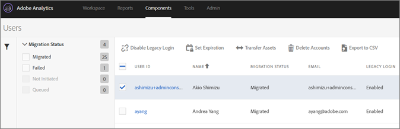

# Inaktivera äldre inloggningar{#disable-legacy-logins}

Lär dig hur du inaktiverar äldre inloggningar för Analytics-användare.

När användarna har migrerat från det äldre användarhanteringssystemet Analytics till Adobe Admin Console kan du inaktivera deras tidigare inloggningar. Om du inaktiverar äldre inloggningar dirigeras användarna om till Experience Cloud-inloggningen om de försöker använda den gamla inloggningen.

1. Öppna migreringsverktyget i **[!UICONTROL Analytics]** > **[!UICONTROL Admin]** > **[!UICONTROL User ID Migration]**.
1. I [!DNL User Information] avsnittet letar du reda på domänen som innehåller de användare du vill arbeta med och klickar sedan på **[!UICONTROL Select Users]**.
1. Markera de användare med äldre inloggningar som du vill inaktivera.

   

   De användare som är berättigade får statusen *`Migrated`* under kolumnen Migreringsstatus. Du kan inte inaktivera en användares tidigare inloggning förrän användaren har migrerats.
1. Klicka **[!UICONTROL Disable Legacy Login]** och sedan på **[!UICONTROL Done]**.

   Inaktivera äldre inloggning anger vilka av dina användare som kan fortsätta använda sitt gamla [!DNL my.omniture.com] användarnamn och lösenord.

   Du kan inte inaktivera äldre inloggningar för en användare som ännu inte har migrerats. När det är inaktiverat måste användaren använda sitt Experience Cloud ID för att logga in och få åtkomst till Analytics.

