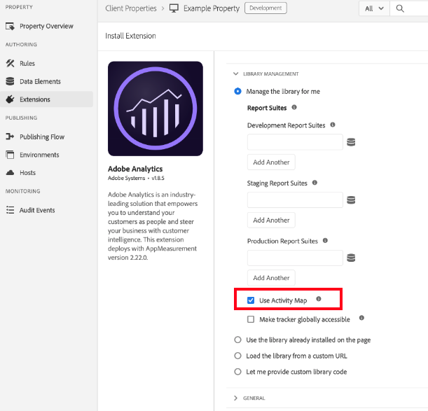

# Aktivera och aktivera Activity Map

Beskriver de steg som Analytics Admin måste slutföra för att aktivera Activity Map-länksamling och användarhämtning.

## Steg 1. Aktivera Activity Map {#update_code}

Modulen Activity Map är en del av taggarna AppMeasurement.js, Adobe Experience Platform och Web SDK (alloy.js). Data från Activity Map kan inte samlas in om du inte uppdaterar till **Adobe Analytics-taggtillägg v1.90** eller högre, **AppMeasurement version 1.6** eller högre eller **Web SDK version 2.15.0** eller senare.

### Adobe Experience Platform-taggar {#tags}

I Adobe Experience Platform-taggar navigerar du till den egenskap som du implementerar Analytics för. I [!UICONTROL Install Extension] dialogruta, välja **[!UICONTROL Use Activity Map]**.

### Web SDK-kod {#web_sdk}

I Adobe Experience Platform-taggar navigerar du till den egenskap som du implementerar Analytics för. Under [!UICONTROL Extensions] -> [!UICONTROL Adobe Experience Platform Web SDK], markera **[!UICONTROL Enable click data collection]** som markerats nedan. Bygg sedan biblioteket med ändringarna och publicera biblioteket i produktion.

Se [Spåra länkar](https://experienceleague.adobe.com/docs/experience-platform/edge/data-collection/track-links.html) om du vill ha information om hur du implementerar länkspårning och hur du aktiverar aktivitetsmappning genom att hämta `region` för det klickade HTML-elementet.

>[!NOTE]
>
>Om du aktiverar länkspårning med Web SDK skickas länkhändelser när en kund navigerar från en sida till nästa. Detta skiljer sig från hur AppMeasurement fungerar och kan eventuellt resultera i extra fakturerbara träffar som skickas till Adobe.

### AppMeasurement {#appmeasurement}

Hämta det senaste JavaScript-biblioteket beroende på om du använder AppMeasurement eller Web SDK.
Gå till **[!UICONTROL Analytics]** > **[!UICONTROL Admin]** > **[!UICONTROL All admin]** > **[!UICONTROL Code manager]** och [implementera](https://experienceleague.adobe.com/docs/analytics/implementation/js/overview.html).

## Steg 2. Aktivera Activity Map-rapporter {#enable}

Först måste du aktivera Activity Map-rapporter på rapportsvitsnivå.

1. Logga in på Adobe Analytics och navigera till  **[!UICONTROL Analytics]** > **[!UICONTROL Admin]** > **[!UICONTROL Report Suites]** > Välj rapportserie > **[!UICONTROL Edit Settings]** > **[!UICONTROL Activity Map]** > **[!UICONTROL Activity Map Reporting]** .

1. Activity Map samlar in länkdata i Activity Map-rapporter. För att aktivera måste du först aktivera variablerna genom att klicka på **[!UICONTROL Enable Activity Map Reports]**.

   I det här steget läggs alla analysdimensioner till som du behöver för att samla in data.

   

1. Efter ungefär en timme ska du kontrollera [Activity Map Page report](/help/analyze/activity-map/activitymap-reporting-analytics.md), som visar alla sidor där användarna klickade på en länk.

## Steg 3. Lägg till användare i [!UICONTROL Activity Map Access] produktprofil {#add_users}

1. Klicka på **[!UICONTROL Add Users to Group]**.

   Då kommer du till produktprofilsidan på sidan [Adobe Admin Console](https://adminconsole.adobe.com/E2F05B3B52F54D2E0A490D44@AdobeOrg/overview).

1. Om du inte har skapat en [!UICONTROL Activity Map Access] produktprofil, gör det nu. Behörighetsobjekten som krävs för profilen är [!UICONTROL Analytics Tools] > [!UICONTROL Activity Map] och [!UICONTROL Analytics Tools] > [!UICONTROL Segment Publishing].

1. Lägg till användare i den produktprofilen. Detta gör att dina användare kan hämta Activity Map från  **[!UICONTROL Adobe Analytics]** > **[!UICONTROL Tools]** > **[!UICONTROL ActivityMap]** .

