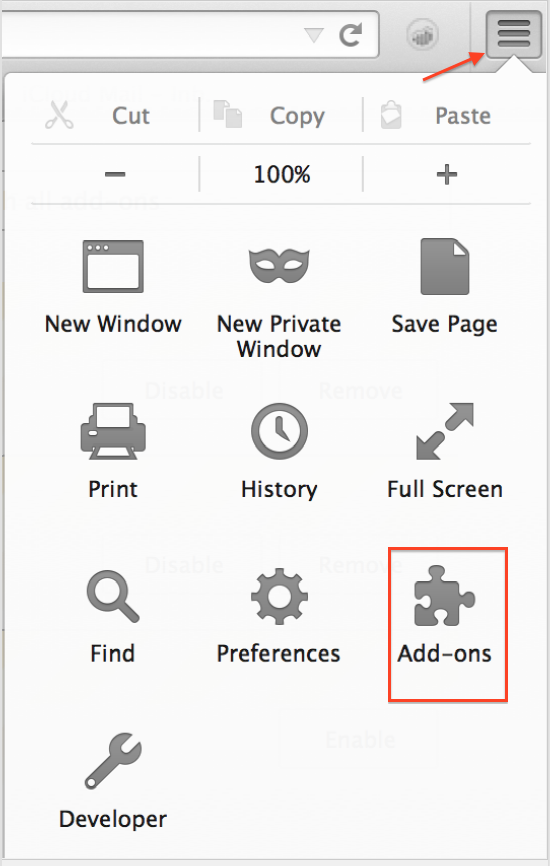

# Installera webbläsarplugin-program för Activity Map{#install-activity-map-browser-plug-ins}

Installationsprocessen varierar beroende på vilken webbläsare du använder.

Plugin-program för Activity Map-webbläsare:

* Inmatas manuellt som en Analytics-sidtagg.
* Startas av en knapp eller ett menyalternativ i webbläsarens verktygsfält.
* Är endast kompatibla med de senaste versionerna av dessa webbläsare: Internet Explorer, Firefox och Chrome.
* Stöd för **[!UICONTROL Remember my login]** -funktion.
* **Kan injiceras** verktygsfältet Activity Map på webbsidor som inte innehåller Analytics-sidkod. Visar ett felmeddelande om sidan inte innehåller koden för sidan Analytics.
* Kräv att du går igenom en installationsprocess för ett plugin-program för webbläsare.

## Installera insticksprogrammet Activity Map i Chrome {#section_6907253D5D5E4422967E6439207A013F}

1. Gå till **[!UICONTROL Adobe Analytics]** > **[!UICONTROL Tools]** > **[!UICONTROL Activity Map]**.  
1. Klicka på **[!UICONTROL Download Activity Map]**.
1. Klicka på **[!UICONTROL Install the Activity Map Plug-in]**.
1. Svar **[!UICONTROL Yes]** när säkerhetsvarningen frågar om du vill hämta webbläsarplugin-programmet för Activity Map.
1. När nedladdningen är klar letar du reda på platsen för ZIP-filen och packar upp innehållet.
1. Återgå till Chrome-adressfältet och ange `chrome://extensions`.
1. Markera rutan Utvecklarläge.
1. Klicka på Läs in opackade tillägg och välj den uppzippade mappen i popup-fönstret.
1. Om en Adobe Analytics-ikon läggs till i verktygsfältet har hämtningen slutförts.   Nu kan du [starta Activity Map](/help/analyze/activity-map/activitymap-getting-started/activitymap-getting-started-users/activitymap-launch.md) från sidan.

## Installera plugin-programmet Activity Map i Firefox {#section_1F69D3D22DB34D6992747B1A62C1D2DA}

1. Gå till **[!UICONTROL Analytics]** > **[!UICONTROL Activity Map]**.

1. Klicka på **[!UICONTROL Download Activity Map]**.
1. Klicka på **[!UICONTROL Install the Activity Map Plug-in]**.
1. Klicka **[!UICONTROL Allow]** när det här meddelandet visas: 
1. Klicka på **[!UICONTROL Install Now]**.
1. Klicka på **[!UICONTROL Open Menu]** ikonen längst upp till höger och välj **[!UICONTROL Add-Ons]**. {width="250px"}
1. Activity Map ska vara listad som ett av Firefox-tilläggen.
1. Om en Adobe Analytics-ikon läggs till i verktygsfältet har hämtningen slutförts.   Nu kan du [starta Activity Map](/help/analyze/activity-map/activitymap-getting-started/activitymap-getting-started-users/activitymap-launch.md) från sidan.

## Installera plugin-programmet Activity Map i Internet Explorer {#section_1A33705D7F784C4A88C9026ADC860FB8}

1. Gå till **[!UICONTROL Analytics]** > **[!UICONTROL Activity Map]**.
1. Klicka på **[!UICONTROL Download Activity Map]**.
1. Klicka på **[!UICONTROL Install the Activity Map Plug-in]**.
1. Klicka **[!UICONTROL Run]** för att initiera installationen av Activity Map.
1. Klicka **[!UICONTROL Yes]** på popup-menyn så att programmet kan göra ändringar i datorn.
1. Följ instruktionerna i installationsguiden.
1. Om Activity Map installerades visas ett meddelande i Internet Explorer om att verktygsfältet Activity Map är klart att användas. Aktivera det för att börja använda programmet. Nu kan du [starta Activity Map](/help/analyze/activity-map/activitymap-getting-started/activitymap-getting-started-users/activitymap-launch.md) från sidan.
