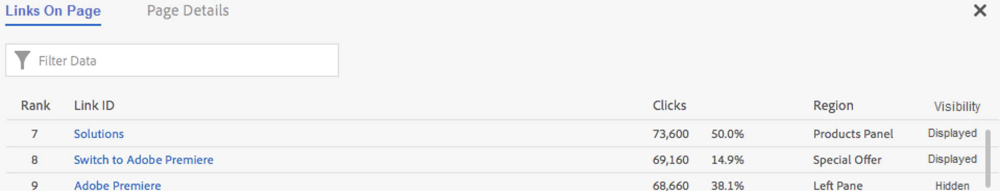

# Länkrapport

Länkarna rapporterar om länkarna som finns på den aktuella sidan. Den rapporterar inte om alla länkar som samlats in för den sidan.

I rapporten Länkar på sidan finns länkarna i en tabell. Ibland kanske du vill se länkklick (eller andra mätvärden) rankade i en enda vy. På så sätt kan du bättre jämföra en länk med en annan. Skapa rapporten Länkar på sida med en rankad lista över alla länkar på sidan (per länk-ID), klickinformationen (# och %) och regionen på sidan. Klicka på rapportknappen Länkar i sidan i verktygsfältet Activity Map.

The **[!UICONTROL Links On Page]** -rapporten öppnas under webbläsarramen på kontrollpanelen i Activity Map.

## Standardläge {#section_C8D2A1C07A2A4E3A8F84AC9240603FA7}

I standardläge visar rapporten Länkar på sidan länkdata från en dag till flera dagar, aggregerade över hela datumintervallet. Följande information visas för varje länk:

<table id="table_3DE41B2CFA644B70AF802A3123CE51D9"> 
 <thead> 
  <tr> 
   <th colname="col1" class="entry"> Kolumn </th> 
   <th colname="col2" class="entry"> Beskrivning </th> 
  </tr> 
 </thead>
 <tbody> 
  <tr> 
   <td colname="col1"> Rankning </td> 
   <td colname="col2"> Rankning på sidan. I standardläge ändras inte rangordningens värde, oavsett vilken kolumn du klickar på. </td> 
  </tr> 
  <tr> 
   <td colname="col1"> Länk-ID </td> 
   <td colname="col2">Länkens primära ID (för mer information om hur primärt ID definieras av <a href="/help/analyze/activity-map/activitymap-link-tracking/activitymap-link-tracking-methodology.md">Ny metod för länkspårning</a>) </td> 
  </tr> 
  <tr> 
   <td colname="col1"> Klickningar </td> 
   <td colname="col2"> Antalet raw-klick för en angiven länk och dess procentandel av det totala antalet klick på sidan. Om användaren väljer ett annat mätvärde i verktygsfältet kommer länkrapporten att rapportera det måttet i stället. </td> 
  </tr> 
  <tr> 
   <td colname="col1"> Län </td> 
   <td colname="col2"> Representerar regionen på sidan där länken finns. </td> 
  </tr> 
  <tr> 
   <td colname="col1"> Synlighet </td> 
   <td colname="col2">Relaterar till länkens synlighetsstatus. Två värden är möjliga: 
    <ul id="ul_BABCC0F64145407C9D439150A6898E6D">
     <li id="li_9AF0479BDCEB4A44A37292FAABFA83A5"><b>Dold</b>: länken finns på sidan men inte är synlig för slutanvändaren (som en undermeny på en navigeringsmeny som bara visas om användaren hovrar över den överordnade menyn) </li>
     <li id="li_C6FA4EC27EDD4341AB9821E2B4BC9E60"><b>Visad</b>: länken visas på sidan. Den kan dock visas under förskjutningen: användaren måste rulla sidan för att se den. </li>
    </ul>
Obs! Om en länk är inställd på "Dold" visas inga övertäckningar för den. 
</td> 
  </tr> 
 </tbody> 
</table>

**Filtrera data**

När du vill nollställa en länk kan du söka efter en relaterad term i **[!UICONTROL Filter Data]** fält. Endast länkarna som matchar sökningen kommer att ha övertäckningar. Utan ett filter är de övertäckningar som anges i [Inställningar för Activity Map](/help/analyze/activity-map/activitymap-overlay-settings.md) visas.

## Live-läge {#section_AC1967217B5A4532ACB01D33636F6770}

I Live-läget visar rapporten Länkar på sidan trenddata som sträcker sig över flera minuter.

<table id="table_61D1FB0F02894055A1AB394DE4FE4742"> 
 <thead> 
  <tr> 
   <th colname="col1" class="entry"> Kolumn </th> 
   <th colname="col2" class="entry"> Beskrivning </th> 
  </tr> 
 </thead>
 <tbody> 
  <tr> 
   <td colname="col1"> Rankning </td> 
   <td colname="col2"> Rankning på sidan. Om det är en övertonings- eller bubbelövertäckning förblir rangvärdet detsamma, oavsett vilken kolumn du klickar på. Om det finns en övertäckning för vinst/förlorare ändras rangordningen baserat på vilka länkar som har vunnit/försvunnit mest. </td> 
  </tr> 
  <tr> 
   <td colname="col1"> Länk-ID </td> 
   <td colname="col2">Länkens primära ID. Mer information om hur det primära ID:t definieras av Nytt <a href="/help/analyze/activity-map/activitymap-link-tracking/activitymap-link-tracking-methodology.md"> Länkspårningsmetod</a>. </td>
  </tr> 
  <tr> 
   <td colname="col1"> Länkklickningar </td> 
   <td colname="col2"> Totalt antal klick för den valda tidsperioden. </td> 
  </tr> 
  <tr> 
   <td colname="col1"> % ändring </td> 
   <td colname="col2"> % förändring mellan länkstatistik för aktuell period och länkstatistik för föregående period. Negativ förändring i % visas i rött, positiv i grönt. </td> 
  </tr> 
  <tr> 
   <td colname="col1"> Trend </td> 
   <td colname="col2"> Ett linjediagram för alla insamlade perioder. Den markerade perioden markeras med en grön markör. Den aktuella hovrade perioden anges med en röd markör. </td> 
  </tr> 
  <tr> 
   <td colname="col1"> Län </td> 
   <td colname="col2"> Representerar regionen på sidan där länken finns. </td> 
  </tr> 
  <tr> 
   <td colname="col1"> Synlighet </td> 
   <td colname="col2">Relaterar till länkens synlighetsstatus. Två värden är möjliga: 
    <ul id="ul_B10C55ED4D3C4CF99506DC467E2E7CFB">
     <li id="li_EA646722A51041CC9E62C56DEF92C81F">Dold: -länken finns för närvarande på sidan men inte synlig för dig (t.ex. en länk som visas när sidan har lästs in). </li>
     <li id="li_F9543614C2894003AC9984A7404E2785">Visas: -länken visas för närvarande på sidan. Den kan dock visas under förskjutningen: måste du rulla sidan för att se den. </li>
    </ul></td> 
  </tr> 
 </tbody> 
</table>

## Sortering och filtrering {#section_4B8E8233C21247CAA70DAEC2156548AD}

Ibland behöver du bara analysera resultaten från ett visst sidområde (t.ex. den vänstra panelen) för att bestämma hur innehållet i det specifika området på webbsidan ska ordnas.

Därför har vi skapat en sorterings- och filtreringsfunktion för länkar i rapporten Länkar på sidan. Filtrering är tillgängligt via filterfältet och söktermen används i kolumnen Länk-ID och Länka region. Sortering är tillgängligt genom att klicka på samtalen (Rank, Link ID, Clicks, Change over time, Region, Visibility) och kan vara både stigande och fallande. Övertäckningar försvinner från webbplatsen när länkar filtreras bort från rapporten Länkar på sidan.
