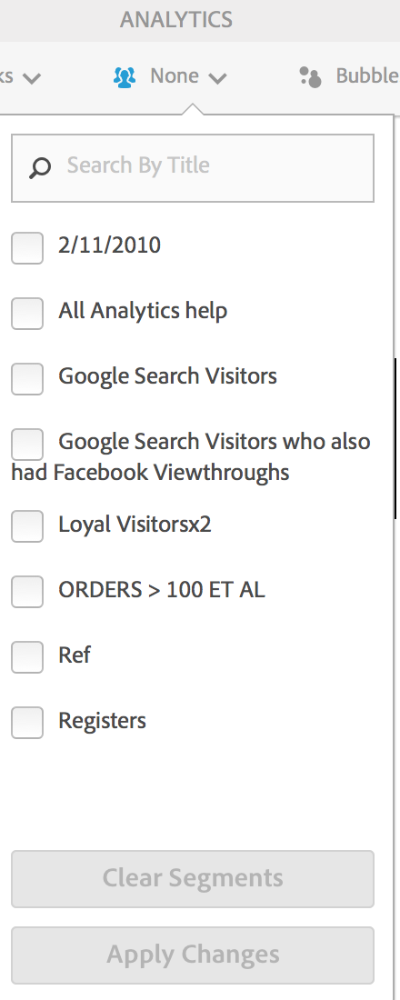

# Kundsegmentering

Gör att du kan använda ett flersegmentsfilter i Activity Map.

>[!NOTE]
>
>Segmentkontrollen är endast tillgänglig i standardläge eftersom Adobe Analytics-plattformen inte stöder segmentering av realtidsdata.

Du kan markera ett eller flera av segmenten i **[!UICONTROL Segments]** listrutan som visas nedan. De listade segmenten är identiska med de som du äger eller som har delats med dig för den rapportserie som valts.

När segmentmarkeringen har ändrats och när segmentväljaren har stängts startas en ny datahämtningsprocess för Analytics för alla mätvärden som visas i programmet. De valda segmenten sparas när du navigerar mellan sidor.

När mer än ett segment är markerat visas&quot;Flera&quot; i etiketten för segmentmarkering (i komprimerat läge). Den fullständiga listan över valda segment visas när du klickar på kontrollen.

De valda segmenten används för alla Analytics-rapporter som presenteras i Activity Map, dvs. överlägg och **[!UICONTROL Links on Page]** och **[!UICONTROL Page Details]** rapporter.
