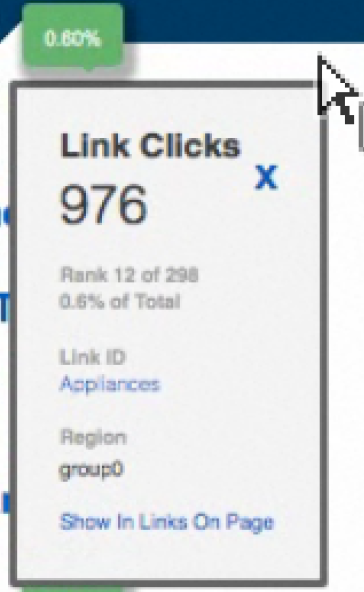

# Överlagringsinformation

Övertäckningsinformation visas när du hovrar över en länkövertäckning.

Övertäckningsinformation visar följande värden som spåras för länken:

* Mått
* Råvärde
* Rankning
* Procentvärde
* Länk-ID
* Län
* Visa i rapporten Länkar på sidan

