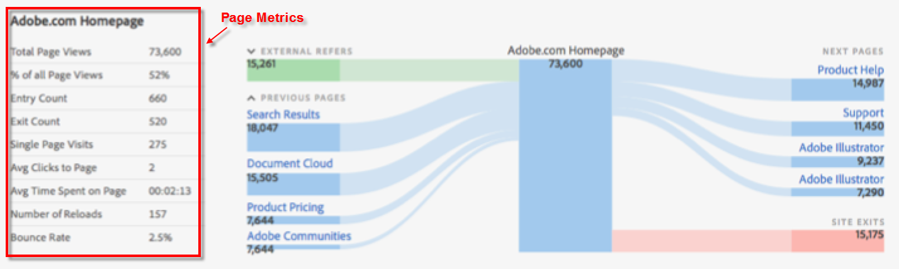

# Sidinformation

På fliken Sidinformation visas sidrapporten som en tabell och sidflödesrapporten visas som en rosettrapport (fjäril).

## Sidrapport {#section_2335A9EFE57B4A7687B397DF2098CC6B}

I den här panelen visas trafikdata för den webbsida som du besöker. Om du går till en webbsida som inte har sidtaggen Analytics implementerad visas inte panelen.

## Sidflödesrapport {#section_D6EDE78CF7124758BF846E57ADABA234}

På den vänstra sidan visas Föregående sidor och referensfiler (externa), som kan utökas för att visa de fyra översta posterna för varje kategori.

På höger sida visas de fyra översta Nästa-sidorna och antalet utgångar.

Om en URL spåras för alla interna sidor som visas i det här avsnittet, visas sidan som en länk. Du kan alltså klicka på den sidan och fortsätta nedåt på sökvägen för sidor med den största tillhörigheten. Med den här rapporten kan du interaktivt navigera i dina webbegenskaper från ett webbanalysperspektiv.

Sidflödesrapporten är bara tillgänglig i standardläge.

| **Sidflöde** | **Beskrivning** |
|---|---|
| Externa referenter | URL för andra webbplatser som refererar till den aktuella sidan. |
| Föregående sidor | Namnger den interna sidan i rapportsviten före den aktuella sidan. |
| Nästa sidor | Sidan som besöks efter att den aktuella sidan har lämnat den. |
| Platsen avslutas | Nummer som har lämnat webbplatsen helt efter att ha visat sidan. |
