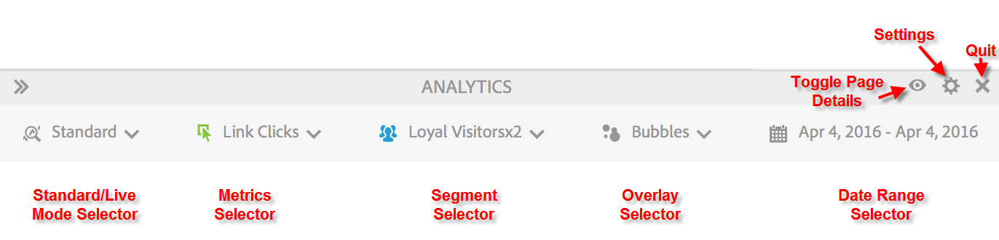
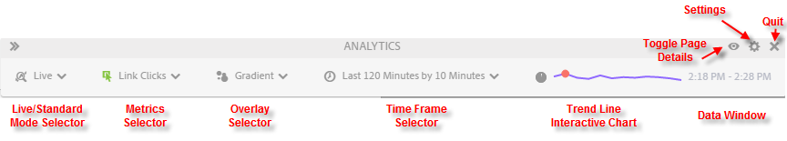

# Standardläge jämfört med live-läge

Activity Map har två grundläggande sätt att komplettera rapporteringen av sidaktiviteter.

* Standardläge, i vilket [länkarna i sidrapporten](/help/analyze/activity-map/activitymap-links-report.md)visar länkdata från en dag till flera dagar, aggregerade över hela datumintervallet.
* I Live-läget visas aktivitetstrender i realtid.

Du kan växla mellan de två lägena genom att klicka på knappen Läge i verktygsfältet.

## Standardläge {#section_0C755F30B7EC4A13A62AB9A391AF51E6}

I **Standardläge** kan du välja datumintervall i verktygsfältet enligt nedan.

I det här läget tilldelas Commerce-statistik som inte har &quot;Deltagande&quot; aktiverat linjärt. Låt oss till exempel säga att en användare klickar på länken&quot;IPod mini&quot; på hemsidan och sedan navigerar genom ytterligare tre sidor. På den fjärde sidan köper han en IPod mini för 200 dollar. Länken&quot;IPod mini&quot; får 200 dollar i deltagarintäkter och 50 ($200/4) i intäkter (linjärt fördelade intäkter).

F: Vad händer om en sida har länkar med samma länknamn i olika regioner? Tar de två länkarna emot krediter separat eftersom de har olika regioner men samma länknamn på en sida?

S: Det beror på hur du sammanställer länkdata. I Activity Map tittar vi på Link ID|Region för en viss sida, så de allokerade data skulle vara för kombinationen Link ID|Region. I det här fallet skulle länken|regionen vara distinkt eftersom den skiljer sig åt, och därför kommer eventuella allokerade intäkter för den första länken|regionen att skilja sig från alla allokerade intäkter för den andra länken. Men i Adobe Analytics-gränssnittet kan du bara titta på länk-ID-rapporten (i stället för Länk|Region-rapporten) för en viss sida (sidan delas upp efter Länk). I så fall skulle intäkterna läggas samman i båda regionerna.

## Live-läge {#section_D619B77D89A840F0B1C2DEA2715A516A}

I **Live-läge** visas analysdata i steg om 1 minut till 15 minuter, i trender. Det här läget handlar om att analysera och övervaka kortsiktiga trender på webbsidan.

Live-läget svarar på behoven hos förlag. Dessa organisationer måste övervaka mikrotrender om länkpopularitet på några få viktiga sidor. Möjligheten att snabbt ta reda på vilka länkar som är dåligt fungerande eller håller på att bli heta är avgörande för er publiceringsverksamhet.

>[!IMPORTANT]
>
>Virtuella rapportsviter är inte kompatibla med Live-läge, endast med standardläge.

