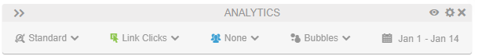

# Activity Map-tilläggsgränssnitt

Med Activity Map-tillägget kan du visa klickdata på din webbplats. Du kan hämta tillägget genom att gå till följande sida, som innehåller en länk till webbutiken:

**[!UICONTROL Tools]** > **[!UICONTROL Activity Map]** > **[!UICONTROL Download Activity Map]**

När gränssnittet har installerats och aktiverats består det av flera delar:

* En övre panel där du kan konfigurera tillägg och rapporter
* En övertäckning som visar de vanligaste länkarna
* En nedre panel som visar mätvärden för de vanligaste länkarna

## Övre panelen

Den översta panelen innehåller dina grundläggande kontroller för Activity Map-övertäckningen.

Här finns följande inställningar:

* **Standard-/Live-vy**: Växlar mellan standardvyn och Live-vyn.
   * Standardvy: Visar övertäckningen baserat på historiska data.
   * Live-vy: Visar övertäckningen baserat på livedata. Datumväljaren ändras till en listruta där du kan ändra granulariteten för livedata.
* **Måttväljare**: Gör att du kan ändra måttet som övertäckningen rapporterar. Endast [!UICONTROL Link Clicks] är tillgängliga om du har markerat Live-vyn.
* **Segmentväljare**: Gör att du kan välja ett [segment](/help/components/segmentation/seg-overview.md) och visa en delmängd med data i övertäckningen. Segment är inte tillgängliga i Live-vyn.
* **Övertäckningsvisualiseringstyp**: Gör att du kan ändra hur länkrankningen visas i övertäckningen.
   * **[!UICONTROL Bubble]**: De översta länkarna får en grön bubbla som visar den numeriska rankningen under rapporteringsperioden. Du kan ändra bubbelfärgen i [Inställningar](settings.md).
   * **[!UICONTROL Gradient]**: De översta länkarna visas skuggade med genomskinlig röd. De vanligaste länkarna är den mörkaste röda. Du kan ändra övertoningsfärgen i [Inställningar](settings.md).
   * **[!UICONTROL Off]**: Inaktivera länkövertäckningar.
* **Datumväljare**: Gör att du kan ändra rapporteringsperioden.

Panelens sidhuvud innehåller följande inställningar:

* **Utöka/komprimera den övre panelen**: Växlar den övre panelen så att inställningarna visas vågrätt eller lodrätt (dubbelpil-ikon).
* **[!UICONTROL Toggle page details]**: Visa eller dölj den nedre panelen (ögonikon).
* **[!UICONTROL Show settings]**: Öppnar en meny för inställningar som du kan ändra (kugghjulsikon):
   * **[!UICONTROL Settings]**: Öppnar tilläggets [Inställningar](settings.md).
   * **[!UICONTROL Help]**: Öppnar dokumentationen för Experience League (den här sidan).
   * **[!UICONTROL Adobe community]**: Öppnar [Experience League Community](https://experienceleaguecommunities.adobe.com/).
   * **[!UICONTROL About]**: Visar tilläggsversionen.
   * **[!UICONTROL Logout]**: Loggar ut dig från tillägget och kräver att du loggar in igen.
* **[!UICONTROL Quit Activity Map]**: Stänger alla övertäckningar för tillägget (X-ikon).

## Sidövertäckning

Sidöverlägget innehåller webbplatsinnehållet med en övertäckning som visar platsen för de mest populära länkarna som klickades under rapportperioden. Du kan konfigurera de här länkövertäckningarna så att de visas som bubblor eller övertoningar i den översta panelens **[!UICONTROL Overlay visualization type]**.

Om du klickar på en bubbla eller övertoning kan du visa information om den aktuella länken.

## Nedre panelen

På den nedre panelen visas en sammanställd vy över länkarna som visas på övertäckningen.

* **Rapporttyp**: Växla den nedre panelen för att visa **[!UICONTROL Links on page]**-rapporten eller **[!UICONTROL Page details]**-rapporten.
* **[!UICONTROL Page name]**: Det aktuella [Page](/help/components/dimensions/page.md)-dimensionsnamnet.
* **[!UICONTROL Search]**: Filtrera rapporten så att endast länknamn som matchar den angivna texten visas.
* **[!UICONTROL Download]**: Exporterar rapporten till CSV. Du kan inkludera rapporten [!UICONTROL Links on page], rapporten [!UICONTROL Page] och rapporten [!UICONTROL Page flow] i samma hämtningsfil.
* **[!UICONTROL Change report docking position]**: Växlar panelens position så att den visas längst ned eller längst upp i webbläsarfönstret.
* **[!UICONTROL Close the report]**: Stänger den här panelen. Du kan öppna panelen igen med knappen **[!UICONTROL Toggle page details]** i den övre panelen (ögonikonen).

Rapporten **[!UICONTROL Links on page]** visar en grundläggande arbetsyterapport med följande inställningar:

* Dimensionen för länken [Activity Map](/help/components/dimensions/activity-map-link.md)
* Måttet [Förekomster](/help/components/metrics/occurrences.md) (märkt som **[!UICONTROL Link clicks]**)
* Det aktuella [sidvärdet](/help/components/dimensions/page.md) används som ett segment

Rapporten **[!UICONTROL Page details]** visar en [Flow](/help/analyze/analysis-workspace/visualizations/c-flow/flow.md)-visualisering med dimensionen [Page](/help/components/dimensions/page.md), med fokus på den aktuella sidan. Följande mått för den aktuella sidan visas till vänster:

* Totalt [sidvisningar](/help/components/metrics/page-views.md)
* [!UICONTROL % of all page views]
* [Antal poster](/help/components/metrics/entries.md)
* [Avsluta](/help/components/metrics/exits.md) antal
* [Besök enstaka sidor](/help/components/metrics/single-page-visits.md)
* [!UICONTROL Avg clicks to page]
* Genomsnittlig [tid på sidan](/help/components/metrics/time-spent.md)
* Antal [återinläsningar](/help/components/metrics/reloads.md)
* [Studsfrekvens](/help/components/metrics/bounce-rate.md)
* [!UICONTROL Link clicks]

