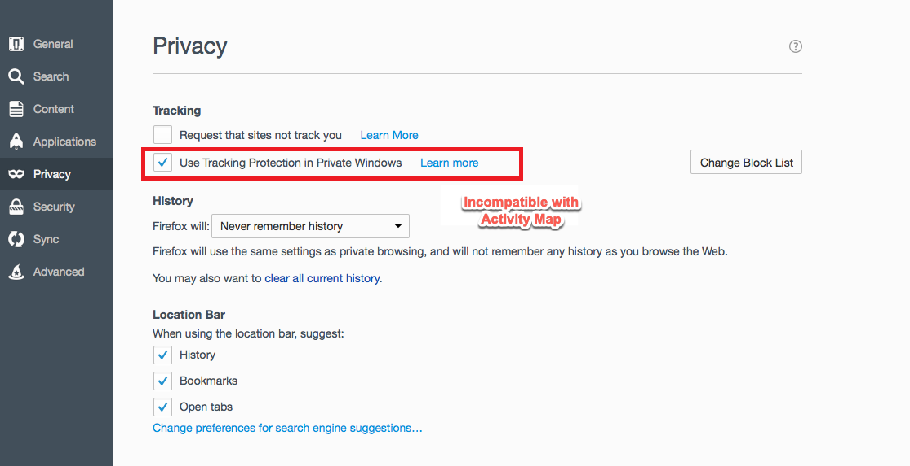

# Felsöka datainsamling i Activity Map

Om du inte ser data för Activity Map-dimensioner kan du använda den här sidan för att avgöra varför.

## Bekräfta datainsamling med hjälp av felsökaren

Kontrollera först att AppMeasurementet samlar in Activity Map data på rätt sätt.

1. Hämta och installera [Adobe Experience Cloud Debugger Chrome Extension](https://experienceleague.adobe.com/en/docs/experience-platform/debugger/home).
2. Navigera till webbsidan och klicka sedan på en länk.
3. Öppna felsökaren när den följande sidan läses in. Verifiera att du ser datavariabler för kontext i Activity Map som är sammanflätade mellan `activitymap.` och `.activitymap`:

## Möjliga orsaker till varför det inte finns några data från Activity Map

Kontrollera följande för att se till att komponenterna i Activity Map finns:

* **AppMeasurementen version**: Activity Map stöds i version 1.6 och senare. Många problem med edge-ärenden åtgärdas när du uppgraderar till den senaste stabila versionen av AppMeasurementet.
* **Activity Map-modul**: Kontrollera om modulen `AppMeasurement_Module_Activity_Map` finns i `AppMeasurement.js`-filen. Om din implementering använder Adobe Experience Platform för att samla in data ska du kontrollera att **[!UICONTROL Enable ClickMap]** är markerat när du konfigurerar Analytics-tillägget under **[!UICONTROL Link tracking]**.
* **`s_sq`-cookien**: Activity Map är beroende av `s_sq`-cookien för datainsamling.
   * Kontrollera att variabeln `cookieDomainPeriods` är korrekt inställd, särskilt för regionala domäner som `*.co.uk` eller `*.co.jp`.
   * Kontrollera att variabeln `linkInternalFilters` är inställd på önskade värden. Om en klickad länk inte matchar interna filter ser Activity Map den som en avslutslänk och samlar inte in data.
* **Activity Map-övertäckning som körs**: AppMeasurementet spårar inte klickdata för webbsidan när Activity Map-övertäckningen är aktiverad.

Visar webbläsarparametrar som inte är kompatibla med Activity Map. Adobe rekommenderar att du inaktiverar de här inställningarna.

## Chrome

## Firefox

## Safari

## Internet Explorer

**Validering**

Interagera samtal med Developer Console Network Tab:

1. Läs in utvecklingsstartskriptet på webbplatsen.
1. Om du klickar på Elements söker du efter &quot;/ee&quot; på fliken Nätverk

Adobe Experience Platform Debugger:

1. Hämta och installera [Adobe Experience Platform debugger](https://chromewebstore.google.com/detail/adobe-experience-platform/bfnnokhpnncpkdmbokanobigaccjkpob).
1. Gå till [!UICONTROL Logs] > [!UICONTROL Edge] > [!UICONTROL Connect to Edge].

* **Det interaktiva anropet utlöses inte på nätverksfliken**: Klickdatainsamlingen i ett insamlingsanrop, filtrera med antingen `"/ee"` eller `"collect?"`.
* **Det finns ingen nyttolastvisning för det samlade anropet**: Samlingsanropet är utformat så att spårningen inte påverkar navigering till andra webbplatser, så dokumentborttagningsfunktionen kan användas för samlarsamtal. Den här funktionen påverkar inte din datainsamling, men om du behöver validera på sidan lägger du till `target="_blank"` i respektive element. Länken öppnas på en ny flik.
