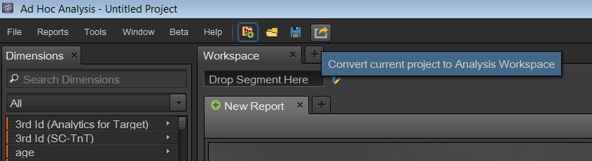

# Konvertera dina projekt i Ad hoc-analys

## Konvertera dina projekt i Ad hoc-analys {#topic_5A55F73488704C5D8E42CDD04B5984DE}

Observera följande innan du konverterar dina projekt:

* Om du vill konvertera projekt måste du vara inloggad på Ad hoc-analys som administratör eller som icke-administratör med behörighet att använda Analysis Workspace.
* Eftersom detta är en engångskonvertering kommer eventuella ändringar du gör i Ad hoc-projekt som du konverterat inte att visas i Analysis Workspace. Du kan dock välja att konvertera ett projekt igen.
* Alla konverterade Ad hoc-analysprojekt finns fortfarande i Ad Hoc, med en parentes i titeln som anger att de har konverterats och hur många gånger. Exempel:

   

Det finns två alternativ för konvertering av Ad hoc-analysprojekt:

* Välj projekt som ska konverteras från en lista.
* Konvertera endast det öppna projektet.

**Välj projekt från en lista**

1. I Ad hoc-analys klickar du på **[!UICONTROL File]** > **[!UICONTROL Convert Projects to Analysis Workspace]**.

   

1. I **[!UICONTROL Convert Projects to Analysis Workspace]** dialogrutan väljer du det projekt som ska konverteras eller trycker på + för att markera hela listan.

   

1. Klicka på **[!UICONTROL Convert]**.
1. I en lista visas [!UICONTROL Conversion Summary] nu alla projekt som har konverterats, tillsammans med statuskolumner som anger att konverteringen lyckades eller misslyckades, tillsammans med felkoden. Kontakta Adobe Client Care om du vill ha mer information om &quot;`Error-Id: <Error-Code>`&quot;.

   

**Konvertera aktuellt projekt**

1. Öppna ett projekt som du vill konvertera i Ad Hoc Analysis.
1. Klicka på **[!UICONTROL Convert current project to Analysis Workspace.]** 

1. I en lista visas [!UICONTROL Conversion Summary] nu alla projekt som har konverterats, tillsammans med statuskolumner som anger att konverteringen lyckades eller misslyckades, tillsammans med felkoden. Kontakta Adobe Client Care om du vill ha mer information om &quot;`Error-Id: <Error-Code>`&quot;.
