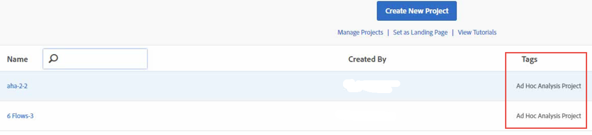

# Visa konverterade projekt på analysarbetsytan

Innan du visar dina projekt i Workspace bör du läsa [Frågor och svar](/help/analyze/ad-hoc-analysis/c-aha-project-converter/aha2aw-converter-faq.md#topic_8231595303AD403E9322645A63632D57) och läsa [skillnaderna i terminologi](/help/analyze/ad-hoc-analysis/c-aha-project-converter/aha2aw-converter-faq.md#topic_8231595303AD403E9322645A63632D57) mellan Ad Hoc Analysis och Workspace.

1. Navigera till **[!UICONTROL Analytics]** > **[!UICONTROL Workspace]**. Observera att projekt som konverterats från ad hoc-analyser är taggade som&quot;Ad Hoc Analysis Project&quot;.

   

1. Klicka på projektnamnet för att visa projektet.
1. Om du vill kan du göra ytterligare ändringar i projektet. Observera att dessa ändringar inte återspeglas i Ad hoc-analysen.

