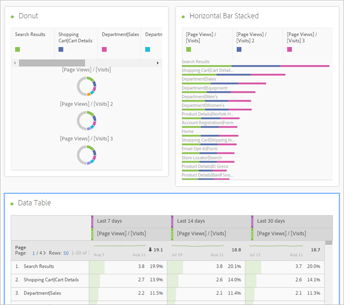
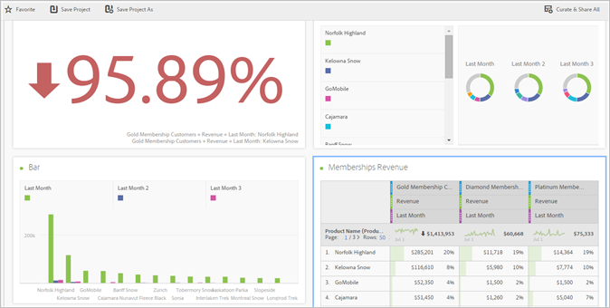
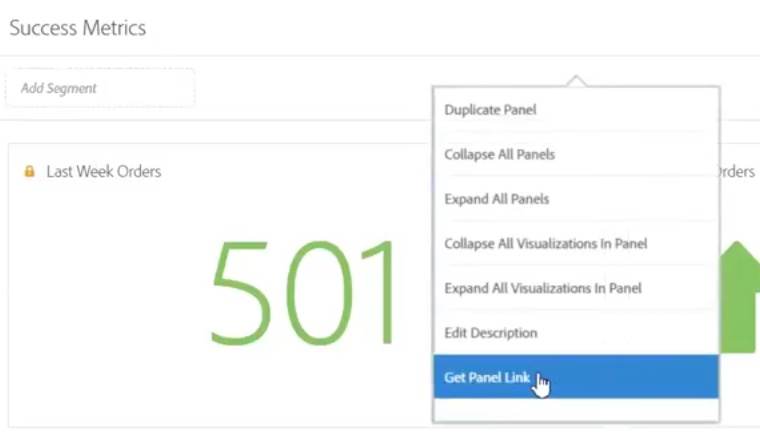

# Översikt över Analysis Workspace

Analysis Workspace tar bort alla vanliga begränsningar i en enskild Analytics-rapport. Den ger en robust, flexibel arbetsyta för att skapa anpassade analysprojekt. Dra och släpp valfritt antal datatabeller, visualiseringar och komponenter (mått, mätvärden, segment och tidsdetaljer) till ett projekt. Skapa snabbt indelningar och segment, skapa kohorter för analys, skapa aviseringar, jämföra segment, göra flödes- och bortfallsanalyser samt strukturera och schemalägg rapporter för delning med vem som helst i företaget.

**[!UICONTROL Analytics]** > **[!UICONTROL Workspace]**

## Videoöversikt {#section_B99BF8A326D94ECB91BD69C9888AD10C}

>[!VIDEO](https://www.youtube.com/watch?v=IHOy-QsvVcA)

Fullständig YouTube-spellista finns [här](https://www.youtube.com/playlist?list=PL2tCx83mn7GuNnQdYGOtlyCu0V5mEZ8sS).

>[!NOTE]
>
>Uppdateringar av funktioner finns i [Nyheter på arbetsytan](/help/analyze/analysis-workspace/new-features-in-analysis-workspace.md) för analyser.

## Full kontroll över projektelement och -komponenter {#section_B7E3EDA3EDEE407D833F4FDB69646EEC}

Analysis Workspace ger frihet och flexibilitet:

* Dra-och-släpp komponenter (dimensioner, mätvärden, segment och tidsdetaljer)
* Dra och släpp flera visualiseringar till projektet
* Flytta, ändra storlek på och stapla visualiseringar var du vill i ett projekt

Mer information finns i [Skapa ett Analysis Workspace-projekt](/help/analyze/analysis-workspace/build-workspace-project/t-freeform-project.md) .

## Flera visualiseringar i ett projekt {#section_B7670740C2D44130B21DAF0873280DA5}

Dra-och-släpp så många visualiseringar du vill i ett projekt.

Skapa ett projekt som visar procentandelen förändring, med flera visualiseringar som motsvarar celler i en datatabell på frihand.

Mer information finns i [Skapa ett Analysis Workspace-projekt](/help/analyze/analysis-workspace/build-workspace-project/t-freeform-project.md) .

## Intralänkning till paneler och visualiseringar {#section_253EA04E067F4A29A8B54CE2B7631086}

I kombination med de [avancerade textredigeringsfunktionerna](/help/analyze/analysis-workspace/visualizations/text.md) i Analysis Workspace kan du länka till specifika paneler och visualiseringar i ett projekt från en textruta, till exempel för att skapa ett projekts innehållsförteckning. Du kan dela dessa länkar på samma sätt som du delar en projektlänk för att dirigera någon till en viss visualisering eller panel i ett projekt. Nya högerklicksalternativ med namnen Hämta panellänk och Hämta visualiseringslänk har lagts till. Så här lägger du till länkar till ditt projekt:

1. Dra en textvisualisering till ett projekt, kanske bredvid en visualisering eller tabell som behöver kontext.
1. Fyll i textrutan med t.ex. en innehållsförteckning och markera sedan ett objekt som du vill länka till en panel eller visualisering, t.ex. Success Metrics.

   

1. Bläddra till den panelen eller visualiseringen och högerklicka på panelens sidhuvud.
1. Bläddra nedåt och markera **[!UICONTROL Get Panel Link]** eller **[!UICONTROL Get Visualization Link]**:

   

1. Kopiera länken och lägg till den i hyperlänken Success Metrics i textvisualiseringen. Klicka på bockmarkeringen för att spara texten.

Om du har paneler eller visualiseringar komprimerade i ditt projekt utökas panelen/visualiseringen när du klickar på en länk så att användarna kan se den.

> [!NOTE] Du kan också använda den här funktionen i alternativet för **[!UICONTROL Edit Description]** högerklick.

## Länka till andra projekt {#section_AE886C367C3E4F189B65B1BD9BCDBD8C}

Du kan länka användare till andra projekt som kan vara intressanta för dem genom att till exempel gå till **[!UICONTROL Share]** > **[!UICONTROL Get Project Link]** och bädda in länken i projektbeskrivningar.

## Dynamisk visualisering av markerade celler {#section_182CEC285E4547EBA4608D5F70C9D5D7}

Markera enskilda celler och se hur visualiseringarna ändras dynamiskt. [Synkronisera och lås](/help/analyze/analysis-workspace/analysis-workspace-features.md#section_9D66A001586F49CEB0C565581E44957C) en visualisering med markerade celler.

## Lås markerade objekt eller positioner {#section_9D66A001586F49CEB0C565581E44957C}

Genom att låsa visualiseringar kan du styra vilka datakällor i frihandsdatatabellen som motsvarar visualiseringar.

Se [Hantera datakällor](/help/analyze/analysis-workspace/visualizations/t-sync-visualization.md).

## Trendvisualiseringar från markerade celler {#section_34930C967C104C2B9092BA8DCF2BF81A}

Skapa en visualisering av markerade celler. (Högerklicka > **[!UICONTROL Trend Selection]**.)

Trendmarkeringar är nu **länkade** till tabellen nedan, så om du väljer en annan rad i tabellen återspeglas raden i trenddiagrammet.

## Dimensioner och uppdelningar av dimensionsobjekt {#section_1380C1F9E51E4BFB8C5D35E7A53BC70D}

Som återförsäljare kan ni fördjupa er i era kampanjer och förstå hur ni kan engagera era kunder bättre. Anpassa era data på ett obegränsat sätt efter era specifika behov. skapa frågor med hjälp av relevanta mått, dimensioner, segment, tidslinjer och andra analysvärden.

Se [Dela upp dimensioner](/help/analyze/analysis-workspace/components/dimensions/t-breakdown-fa.md).

## Segment från tabellmarkeringar {#section_73BC3688089B426D969B3D5B606DA970}

Markera cellerna i frihandstabellen och skapa ett segment från markeringen.

Jämför flera segment och skapa och tillämpa segment direkt. Du kan använda flera segment för att fokusera på specifika kunder baserat på beteende och interaktion och sedan jämföra och kontrastera.

Släpp ett segment på projektnivå på frihandspanelen så tillämpas segmentet på hela projektet.

Se [Segment](/help/analyze/analysis-workspace/components/t-freeform-project-segment.md).

## Projekt- och komponenttaggning {#section_F54D688132A541F2982326D5E022B90D}

Du kan använda taggar för projekt och komponenter i Analysis Workspace:

* Använd eller skapa taggar på projektnivå på informationspanelen. ( 

* Högerklicka på komponenter för att tagga (eller skapa taggar) från panelen Komponenter.
* Använd # i sökfältet för att söka efter taggar.

## Komponentåtgärder {#section_CBF4D0A5F63E4B0883077B8D852B800B}

Utför åtgärder på komponentnivå från Åtgärder-menyn längst upp i den vänstra listen för komponenten. Markera en komponent och klicka på **[!UICONTROL Actions]** för att visa åtgärderna.

| Komponentåtgärd | Beskrivning |
|--- |--- |
| Tagg | Organisera eller hantera komponenter genom att lägga till taggar i dem. Sedan visas det i respektive komponenthanterare, som Analytics (Analyser) > Components (Komponenter) > Segments (Segment)) eller Analytics (Analyser) > Components (Komponenter) > Projects (Projekt)) |
| Favorit | Lägg till komponenten i listan med favoriter. Sedan visas det i respektive komponenthanterare, som Analytics (Analyser) > Components (Komponenter) > Segments (Segment)) eller Analytics (Analyser) > Components (Komponenter) > Projects (Projekt)). |
| Godkänn | Godkänn komponenten för att göra den kanonisk. Sedan visas det i respektive komponenthanterare, som Analytics (Analyser) > Components (Komponenter) > Segments (Segment)) eller Analytics (Analyser) > Components (Komponenter) > Projects (Projekt)) |
| Dela | Gäller endast segment. |
| Ta bort | Gäller endast segment. |

Mer information finns i [Visualiseringar](/help/analyze/analysis-workspace/visualizations/freeform-analysis-visualizations.md) .

## Ytterligare funktionsbeskrivningar {#section_5F06AE43C0194CFDBCA7EE0EA3C30B05}

**Vad du kan dra och stapla**

Komponenter

* Dimensioner
* Segment
* Mått
* Datumintervall
* Tidsgranularitet (timme, dag, vecka och så vidare).

**Flera frihandstabeller och flera visualiseringar**

Det finns ingen teknisk gräns för hur många frihandsritabeller och visualiseringar du kan lägga till på panelen. Du kan också köra en ny visualisering (eller exportera till CSV) av varje frihandstabell eller markerade rader i en tabell.

**Ordna, sortera och kopiera kolumner**

* Sortera förinställningar för datumintervall (inkluderar inte anpassade datumintervall).
* CTRL (eller Kommando) + klicka + dra en kolumn kopierar kolumnen och när du drar kopian klistras den in på den nya positionen i tabellen.

Mer information finns i [Hotkeys på arbetsytan](/help/analyze/analysis-workspace/build-workspace-project/fa-shortcut-keys.md) för analyser.

**Markeringar och åtgärder**

Du kan markera rader och kolumner på samma sätt som du kan markera dem i Excel. Sedan kan du vidta åtgärder för de markeringarna. Exempel:

* Skapa visualiseringar från markeringar
* Kopiera till Urklipp (CTRL eller Cmd + C)
* Dela upp flera markerade rader. Markera raderna och dra sedan en dimension till markeringen. Du kan också högerklicka på markeringen och använda menyn Uppdelning.

**Autospara och osparade ändringar**

Du uppmanas att spara ändringarna om du försöker stänga webbläsaren (eller använda knappen Bakåt) och projektet inte har sparats. Om datorn kraschar får du ett varningsmeddelande om att återställa till ditt tidigare projekttillstånd när du läser in projektet.

Redan befintliga (inte nya) projekt sparas bara automatiskt när webbläsaren kraschar eller under andra omständigheter när du inte har fått möjlighet att spara dem.

**Alla besök**

Ett standardsegment som är unikt för Analysis Workspace. *`All Visits`* visar summor för de komponenter du lägger till i tabellen.

**Beräknade mått**

Använd beräkningar på samma sätt som du använder standardvärden.

Se [Beräknade mått](https://marketing.adobe.com/resources/help/en_US/analytics/calcmetrics/).
