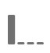

# Attributmodeller och uppslagsfönster

Attributkonceptet i Adobe Analytics kräver två komponenter:

* **Attributionsmodell:** Modellen beskriver distributionen av konverteringar till träffar i en grupp. Till exempel första beröringen eller sista beröringen.
* **Fönster för attribueringssökning:** Uppslagsfönstret beskriver vilka grupper av träffar som beaktas för varje modell. Exempel: besök eller besökare.

## Attributionsmodeller

| UI-ikon | Attributionsmodell | Definition | När ska användas |
| --- | --- | --- | --- |
|  | Sista beröring | Ger 100 % uppskattning av den beröringspunkt som inträffade senast före konverteringen. | Den mest grundläggande och vanliga attribueringsmodellen. Den används ofta för konverteringar med kort övervägandecykel. Last Touch används ofta av team som hanterar sökmarknadsföring eller analyserar interna söknyckelord. |
|  | Första beröring | Ger 100 % kredit till den beröringspunkt som först visas i attribueringssökningsfönstret. | En annan gemensam attribueringsmodell som är användbar för att analysera marknadsföringskanaler som är avsedda att öka varumärkeskännedomen eller kundvärvningen. Den används ofta av webbannonsörer eller marknadsföringsteam på sociala medier, men den är också användbar när det gäller att utvärdera produktrekommendationernas effektivitet på plats. |
|  | Samma beröring | Ger 100 % kredit till just den händelse konverteringen inträffade. Om en beröringspunkt inte inträffar vid samma träff som en konvertering, klickas den under&quot;Ingen&quot;. | En användbar modell när du utvärderar innehållet eller användarupplevelsen som presenteras direkt vid konverteringen. Produkt- eller designteam använder ofta den här modellen för att bedöma hur effektiv en sida är där konverteringen sker. |
|  | Linjär | Ger samma beröm till alla kontaktytor som leder till konvertering. | Användbar för konverteringar med längre övervägandecykler eller användarupplevelser som kräver mer frekvent kundengagemang. Det används ofta av team som mäter hur effektiva mobilappsmeddelanden är eller med prenumerationsbaserade produkter. |
|  | U-formad | Ger 40 % uppskattning av den första interaktionen, 40 % tack vare den sista interaktionen och delar de återstående 20 % på alla beröringspunkter däremellan. Vid konvertering med en enda kontaktpunkt får du 100 % kredit. För konverteringar med två kontaktpunkter får båda 50 % rabatt. | En bra modell för dem som värderar interaktioner som har orsakat eller avslutat en konvertering, men ändå vill känna igen hjälpinteraktioner. U-Shaped-attribuering används ofta av team som har ett mer balanserat tillvägagångssätt, men som vill tillgodoräkna sig fler kanaler som har hittat eller avslutat en konvertering. |
|  | J-Shaped | Ger 60 % kreativitet till den senaste interaktionen, 20 % tack till den första interaktionen och delar de återstående 20 % på alla beröringspunkter däremellan. Vid konvertering med en enda kontaktpunkt får du 100 % kredit. För konverteringar med två kontaktpunkter får 75 % poäng för den senaste interaktionen och 25 % kredit ges till den första. | Den här modellen passar perfekt för dem som prioriterar Finders och Closers, men som vill fokusera på att stänga interaktioner. J-Shaped-attribuering används ofta av team som har ett mer balanserat tillvägagångssätt och vill tillgodoräkna kanaler som stängt en konvertering mer. |
|  | Inverterad J | Ger 60 % kredit till den första beröringspunkten, 20 % kredit till den sista beröringspunkten och delar de återstående 20 % till alla beröringspunkter däremellan. Vid konvertering med en enda kontaktpunkt får du 100 % kredit. För konverteringar med två kontaktpunkter får 75 % kredit för den första interaktionen och 25 % kredit för den sista. | Den här modellen är perfekt för dem som prioriterar finare och närare, men som vill fokusera på att hitta interaktioner. Inverterad J-attribuering används av team som använder ett mer balanserat tillvägagångssätt och vill tillgodoräkna kanaler som initierade en konvertering mer. |
|  | Anpassad | Gör att du kan ange de vikter du vill ge de första beröringspunkterna, de sista beröringspunkterna och eventuella mellanliggande beröringspunkter. De angivna värdena normaliseras till 100 % även om de anpassade siffrorna inte läggs till i 100. Vid konvertering med en enda kontaktpunkt får du 100 % kredit. För interaktioner med två beröringspunkter ignoreras parametern middle. Den första och sista beröringspunkten normaliseras sedan till 100 % och krediteringen tilldelas därefter. | Den här modellen är perfekt för dem som vill ha fullständig kontroll över sin attribueringsmodell och har särskilda behov som andra attribueringsmodeller inte uppfyller. |
|  | Time-Decay | Följer en exponentiell minskning med en anpassad halveringsparameter, där standardvärdet är 7 dagar. Vikten för varje kanal beror på hur lång tid det tar mellan öppnandet av kontaktpunkten och den slutliga konverteringen. Formeln som används för att bestämma kredit är `2^(-t/halflife)`, där `t` är tiden mellan en beröringspunkt och en konvertering. Alla beröringspunkter normaliseras sedan till 100 %. | Perfekt för team som regelbundet gör videoreklam eller som marknadsför mot händelser med ett förutbestämt datum. Ju längre en konvertering sker efter en marknadsföringshändelse, desto mindre kredit ges. |
|  | Deltagande | Alla unika kontaktpunkter får 100 % beröm. Det totala antalet konverteringar är uppblåst jämfört med andra attribueringsmodeller. Deltagande duplicerar kanaler som ses flera gånger. | Utmärkt för att förstå hur ofta kunderna exponeras för en viss interaktion. Medieorganisationer använder ofta den här modellen för att beräkna innehållets hastighet. Butiksorganisationer använder ofta den här modellen för att förstå vilka delar av deras sajt som är avgörande för konverteringen. |
|  | [Algoritmisk](algorithmic.md) | Använder statistiska tekniker för att dynamiskt fastställa den optimala kreditfördelningen för det valda måttet. | Användbar för att undvika gissningar och krångel när du väljer rätt attribueringsmodell för ditt företag. |

## Sökfönster

Ett uppslagsfönster är den tid som en konvertering bör titta tillbaka för att inkludera kontaktpunkter. Attributionsmodeller som ger större tilltro till första interaktioner ser större skillnader när du visar olika uppslagsfönster.

* **Besök fönstret för sökning:** Går tillbaka till början av besöket där en konvertering inträffade. Besöksfönster är smala eftersom de inte ser bortom besöket. Besöksfönster respekterar den ändrade besöksdefinitionen i virtuella rapportsviter.

* **fönster för besökarsökning:** ser ut vid alla besök fram till den 1:e i månaden av det aktuella datumintervallet. Besöksfönster är breda, eftersom de kan omfatta många besök. Vid sökning efter besökare beaktas alla värden från början av månaden i rapportens datumintervall. Om rapportens datumintervall till exempel är 15 september - 30 september, inkluderar datumintervallet för besökarens sökning 1 september - 30 september.

* **Anpassat fönster för sökning:** Gör att du kan expandera attribueringsfönstret efter rapportdatumintervallet, upp till maximalt 90 dagar. Anpassade uppslagsfönster utvärderas för varje konvertering under rapporteringsperioden. För en konvertering som inträffar den 20 februari skulle ett uppslagsfönster på 10 dagar utvärdera alla dimensionskontaktytor från den 10 februari till den 20 februari i attribueringsmodellen.

## Exempel

Titta på följande exempel:

1. Den 15 september kommer en besökare till er webbplats via en betald sökannons, sedan går han.
2. Den 18 september kommer besökaren till er webbplats igen via en länk för sociala medier som de fått från en vän. De lägger till flera artiklar i kundvagnen, men köper ingenting.
3. Den 24 september skickar marknadsföringsteamet ett e-postmeddelande med en kupong för några av artiklarna i kundvagnen. De använder kupongen, men besöker flera andra sajter för att se om det finns några andra kuponger. De hittar en till genom en displayannons och gör sedan ett köp för 50 dollar.

Beroende på ditt uppslagsfönster och din attribueringsmodell får kanalerna olika krediter. Nedan följer några bra exempel:

* Om du använder **första beröring** och ett **besöksfönster** letar attribueringen bara efter det tredje besöket. Mellan e-post och visning var e-post först, så e-post får 100 % rabatt på 50 USD.
* Med **första beröring** och ett **besökarfönster**, söker attribueringen efter alla tre besöken. Betalsökning var först, så den får 100 % rabatt på 50 USD.
* Om du använder **linear** och ett **besöksfönster** delas krediteringen mellan e-post och skärm. Båda dessa kanaler får 25 krediter.
* Om du använder **linjär** och ett **besökarfönster** delas krediteringen mellan betalsökningar, sociala medier, e-post och visning. Varje kanal får 12,50 dollar i rabatt för detta inköp.
* Om du använder **J-formad** och ett **besökarfönster**, delas krediteringen mellan betalsökningar, sociala medier, e-post och visning.
   * 60 % kredit ges för 30 dollar.
   * 20 % kredit ges till betald sökning för 10 dollar.
   * De återstående 20 % är uppdelade i sociala medier och e-post, vilket ger 5 USD till var och en.
* Om du använder **Time Decay** och **besökarfönstret**, delas krediteringen mellan betalsökningar, sociala medier, e-post och visning. Använd standardhalveringstiden på 7 dagar:
   * Mellanrum på 0 dagar mellan visning och konvertering. `2^(-0/7) = 1`
   * Mellanrum på 0 dagar mellan e-postens kontaktpunkt och konvertering. `2^(-0/7) = 1`
   * Mellanrum på 6 dagar mellan social kontaktyta och konvertering. `2^(-6/7) = 0.552`
   * Mellanrum på 9 dagar mellan betald kontaktpunkt och konvertering. `2^(-9/7) = 0.41`
   * Normalisering av dessa värden ger följande resultat:
      * Visa: 33,8 %, får 16,88 USD
      * E-post: 33,8 % får 16,88 USD
      * Socialt: 18,6 %, får 9,32 USD
      * Betalsökning: 13,8 %, får 6,92 USD

>[!TIP]
>
>Andra konverteringshändelser, som order eller anpassade händelser, delas också upp om kredit tillhör mer än en kanal. Om två kanaler till exempel bidrar till en anpassad händelse med en linjär attribueringsmodell får båda kanalerna 0,5 av den anpassade händelsen. Dessa händelsebråktal summeras för alla besök och avrundas sedan till närmaste heltal för rapportering.
