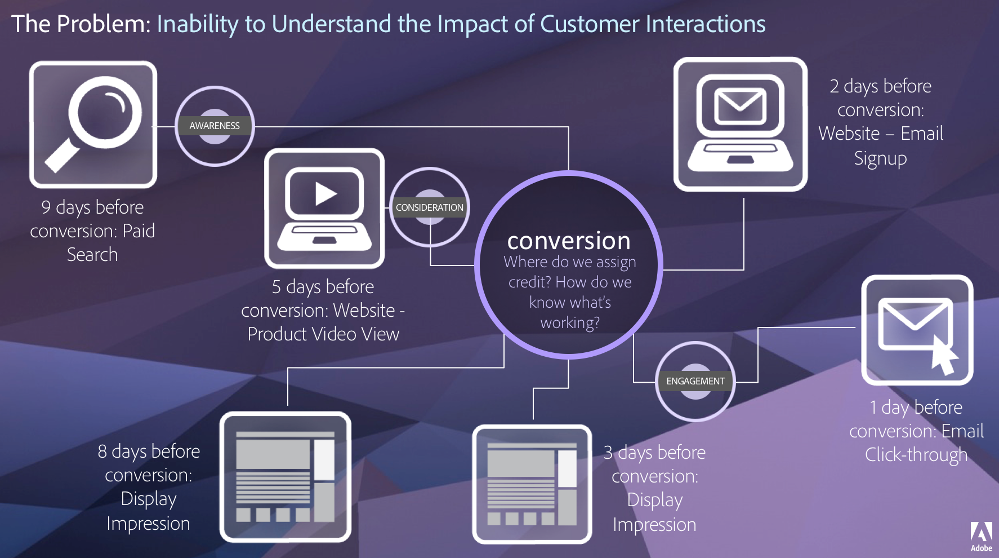

# Översikt över attribuering

Attribution ger analytiker möjlighet att anpassa hur dimensionsposter får kredit för lyckade händelser. Exempel:

1. En besökare på webbplatsen klickar på en betalsöklänk till en av dina produktsidor. Lägg produkten i kundvagnen, men köp den inte.
2. Nästa dag ser du ett inlägg på sociala medier från en av deras vänner, klickar på länken och slutför sedan köpet.

I vissa rapporter kanske du vill ha den beställning som är kopplad till betald sökning. I andra rapporter kanske du vill att ordern ska tillskrivas Social. Attribution låter dig styra den här aspekten av rapportering. Det är tillgängligt för alla organisationer på Adobe Analytics Ultimate, Prime, Select och Foundation. Om du är osäker på vilken typ av kontrakt du har med Adobe kontaktar du din organisations Account Manager.

## Attribution IQ värde

Kundresor är inte linjära, och de är dessutom ofta oförutsägbara. Alla kunder har sitt eget tempo. De går fram och tillbaka, hit och dit, börjar om eller rör sig på andra icke-linjära sätt. De här organiska aktiviteterna gör det svårt att veta hur olika marknadsföringssatsningar påverkar olika delar av kundresan. Det hämmar också arbetet med att knyta samman olika datakanaler.

Adobe Analytics förbättrar attribueringen eftersom ni kan:

* Definiera attribuering för mer än betalda medier: alla mått, mätvärden, kanaler och händelser kan användas i modellerna (till exempel intern sökning), inte bara marknadsföringskampanjer.
* Jämföra attribueringsmodeller utan begränsningar: jämför dynamiskt hur många modeller ni vill.
* Undvika implementeringsändringar: med hjälp av rapporttidshantering och sammanhangsberoende sessioner kan kundresan byggas in och användas vid körning.
* Skapa den session som bäst matchar attribueringsscenariot.
* Dela upp attribueringen efter segment: jämför enkelt resultatet för marknadsföringskanalerna i alla viktiga segment (till exempel nya jämfört med återkommande kunder, produkt X jämfört med produkt Y, lojalitetsnivå eller kundens livstidsvärde).
* Granska analyser av kontaktytor och kanalbyten: använd venndiagram och histogram samt trendattribuering.
* Analysera viktiga marknadsföringssekvenser visuellt: utforska vägar som leder till konvertering visuellt med flernodsflöde och bortfallsvisualisering.
* Skapa beräknade värden: använd valfria metoder för attribueringstilldelning.

## Funktioner

Attribution IQ omfattar följande funktioner:

* [Attributionspanelen](../c-panels/attribution.md): Utnyttja alla dimensioner och mätvärden och jämför dem snabbt med olika attribueringsmodeller.
* [Tillämpa attribuering på ett mätresultat](../visualizations/freeform-table/column-row-settings/column-settings.md): Använd en icke-standardattribuering för alla mätvärden i ett projekt.
* [Tillämpa attribuering på en fördelning](../components/dimensions/t-breakdown-fa.md): Använd en icke-standardattribuering vid en uppdelning.
* [Jämför attribueringsmodeller](../components/apply-create-metrics.md): Se snabbt hur olika attribueringsmodeller jämför olika mätvärden.

## Videor

Här är en video om Attribution IQ i frihandstabeller:

>[!VIDEO](https://video.tv.adobe.com/v/23136/?quality=12)
