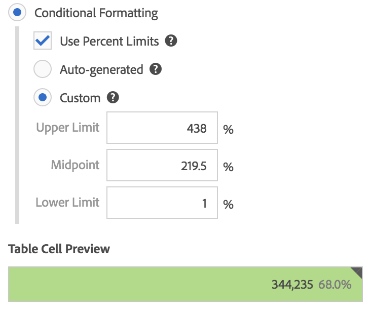

# Kolumninställningar

Med kolumninställningar kan du konfigurera kolumnformatering, som vissa kan vara villkorliga.

## Kolumninställningar {#section_C5A9C13553BF4BFDAD7FACE0139AECA3}

Du öppnar [!UICONTROL Column Settings]genom att dra en friformstabell till projektet och sedan klicka på kugghjulsikonen i kolumnrubriken.

Du kan redigera inställningar **för flera kolumner samtidigt**. Markera bara flera kolumner och klicka på inställningsikonen för någon av dessa kolumner. Alla ändringar du gör gäller för alla kolumner där celler är markerade.

| Element | Beskrivning |
|--- |--- |
| Nummer | Avgör om en cell visar/döljer det numeriska värdet för måttet. Om måttet till exempel är Sidvyer är det numeriska värdet antalet sidvyer för radobjektet. |
| Procent | Avgör om en cell visar/döljer procentvärdet för måttet. Om måttet till exempel är Sidvyer är procentvärdet antalet sidvyer för radobjektet delat med de totala sidvyerna för kolumnen.  Obs!  Vi kan visa procenttal större än 100 % för att vara mer korrekta. Vi flyttar också det övre gränsvärdet till 1 000 % för att säkerställa att kolumnerna kan växa i för stora bredder. |
| Anomalier | Avgör om avvikelseidentifiering körs på värdena i den här kolumnen. |
| Radbryt rubriktext | Gör att du kan radbryta rubriktexten i frihandstabeller så att rubrikerna blir mer läsbara och tabellerna mer delbara. Detta är användbart för .pdf-återgivning och för mått med långa namn. Aktiverat som standard. |
| Tolka noll som inget värde | För celler med värdet 0 anger om en 0-cell eller en tom cell ska visas. Det här är användbart när du tittar på data för varje dag i en månad, och vissa dagar har inte inträffat än.  I stället för att visa 0 för framtida datum kan tomma celler visas i stället. Diagram följer även den här inställningen (d.v.s. de visar inte en linje eller en stapel med 0 värden när den här inställningen är markerad). |
| Bakgrund | Anger om en cell visar/döljer all cellformatering, inklusive stapeldiagrammet och villkorsstyrd formatering. |
| Stolpdiagram | Visar ett vågrätt stolpdiagram som representerar cellens värde i förhållande till totalvärdet för kolumnen. |
| Villkorsstyrd formatering | Se avsnittet nedan. |
| Förhandsgranskning av tabellcell | Visar en förhandsvisning av hur varje cell visas med de valda formateringsalternativen. |

## Villkorsstyrd formatering {#section_3DD847151DA14914888A70FC4FD7BDFB}

Villkorsstyrd formatering tillämpar formatering på övre, mellersta och nedre gränser som du kan definiera. Om du använder villkorsstyrd formatering (färger o.s.v.) i frihandstabeller aktiveras även automatiskt vid uppdelning, såvida inte &quot;Anpassade&quot; gränser har valts.

| Element | Beskrivning |
|--- |--- |
| Villkorsstyrd formatering | Tillämpar följande färger på celler baserat på datavärden: <ul><li>Grön: höga värden</li><li>Gul: mittpunktsvärden</li><li>Röd: låga värden</li></ul> Om du ersätter en dimension i tabellen återställs de villkorliga formateringsgränserna. Om du ersätter ett mätvärde räknas gränserna för den kolumnen om (där ett mätvärde finns på X-axeln och ett mått finns på Y-axeln). |
| Använd procentgränser | Används för att använda övre, mellersta och nedre gränser baserat på procentvärden för varje mätvärde. Detta fungerar för mätvärden som endast är procentbaserade (som Studsfrekvens) samt för mätvärden som har ett antal och ett procenttal (som sidvyer). |
| Automatiskt genererad | Genererar automatiskt gränser för villkorsstyrd formatering. Den övre gränsen är det största värdet i den här kolumnen. Den undre gränsen är den lägsta och mittpunkten är medelvärdet av de övre och nedre gränserna. |
| Egen | Du kan tilldela värden manuellt för fälten Övre, Mittpunkt och Nedre gräns för villkorsstyrd formatering. Detta ger dig flexibilitet att avgöra när ett kolumnvärde blir bra, medelvärde eller dåligt. |
| Förhandsgranskning av tabellcell | Visar en förhandsvisning av hur varje cell visas med de valda formateringsalternativen. |

>[!MORELIKETHIS]
>
>* [Hantera datakällor](/help/analyze/analysis-workspace/visualizations/t-sync-visualization.md)

