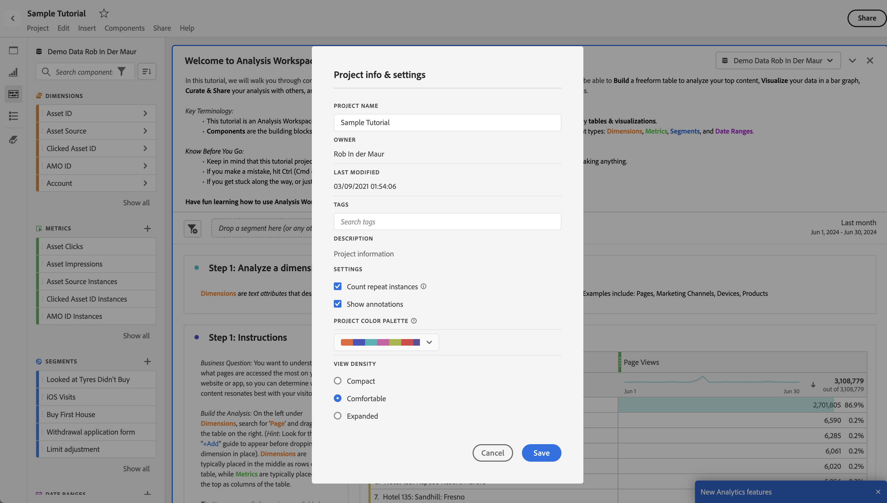
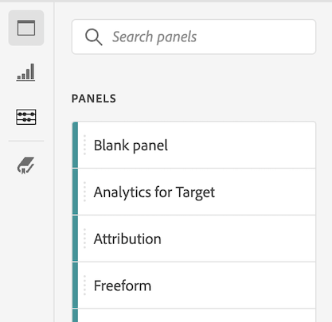
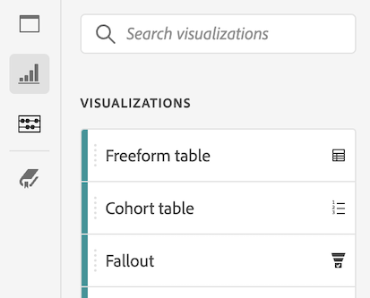

# Skapa projekt {#create-projects}

Med [Projekt](/help/analyze/analysis-workspace/build-workspace-project/freeform-overview.md) i Analysis Workspace kan du skapa och visa affärskritiska analyser.  Dessa analyser kan delas med intressenter inom eller utanför organisationen.

1. I Adobe Analytics väljer du **[!UICONTROL Workspace]**.

1. Välj **[!UICONTROL Projects]** i den vänstra panelen och välj sedan **[!UICONTROL Create project]**.

1. Välj **Tomt Workspace-projekt** om du vill skapa ditt Workspace-projekt med en webbläsare.

   Mer information om hur du skapar ett Mobile Scorecard-projekt som du kan dela med andra intressenter via en mobilapp finns i [Tomt mobilstyrkort](/help/analyze/mobile-app/curator.md) .

1. Välj [!UICONTROL **Skapa**].

Nu när du har skapat ett tomt Workspace-projekt måste du känna till användargränssnittet i [Analysis Workspace](/help/analyze/analysis-workspace/home.md). När du är klar kan du skapa ditt projekt. Så här gör du:

* Lägg till [paneler](/help/analyze/analysis-workspace/c-panels/panels.md) i ditt projekt. Till exempel **[!DNL Example Panel]** ➊.

* Lägg till [visualiseringar](/help/analyze/analysis-workspace/visualizations/freeform-analysis-visualizations.md) på panelerna. Exempel:
   * **[!DNL Line]** [Radvisualisering ](/help/analyze/analysis-workspace/visualizations/line.md) ➋
   * **[!DNL US States]** [Visualisering av frihandstabell](/help/analyze/analysis-workspace/visualizations/freeform-table/freeform-table.md) ➌
* Lägg till [komponenter](/help/analyze/analysis-workspace/components/analysis-workspace-components.md) i dina visualiseringar. Exempel:
   * **[!DNL US States]** [dimension](/help/components/dimensions/overview.md) ➍
   * **[!DNL Unique Visitors]** [metrisk](/help/analyze/analysis-workspace/components/apply-create-metrics.md) ➎
   * **[!DNL Average Revenue Per Order]** [beräknat mått ](/help/components/calculated-metrics/cm-overview.md) ➏
   * **[!DNL Visits from Mobile Devices]** [segment](/help/components/segmentation/seg-overview.md) ➐
   * **[!DNL Last Month]** [datumintervall](/help/analyze/analysis-workspace/components/calendar-date-ranges/calendar.md) ➑
   * **[!DNL Example]** [anteckning](/help/analyze/analysis-workspace/components/annotations/overview.md) ➒

## Projektinformation och inställningar {#project-info-settings}

>[!CONTEXTUALHELP]
>id="workspace_project_countrepeatinstances"
>title="Antal upprepande instanser"
>abstract="Anger om upprepade instanser räknas i rapporter.  Obs! Den här inställningen gäller inte för visualiseringar av flöde och utfall."

>[!CONTEXTUALHELP]
>id="workspace_project_repeatinstances"
>title="Antal upprepande instanser"
>abstract="Anger om upprepade instanser räknas i rapporter. Obs! Den här inställningen gäller inte för visualiseringar av flöde och utfall."

>[!CONTEXTUALHELP]
>id="workspace_project_commenting"
>title="Tillåt kommentarer"
>abstract="När det här alternativet är aktiverat finns det ett kommentarsområde till höger om projektet i Analysis Workspace."

Projektinställningar innehåller information på projektnivå om det aktiva projektet.

Inställningarna inkluderar:

| Inställning | Beskrivning |
|---|---|
| Projektnamn | Namnet på projektet. Du kan dubbelklicka på namnet för att redigera det. |
| Ägare | Projektägarnamn |
| Senast ändrad | Datum för senaste ändring av projektet. |
| Taggar | Visar alla taggar som har använts i ett projekt för enklare kategorisering. |
| Beskrivning | En beskrivning är användbar för att förtydliga syftet med ett projekt. Du kan dubbelklicka på beskrivningen för att redigera den. |
| Antal upprepande instanser | Ange om upprepade instanser ska räknas i rapporter. Obs! Den här inställningen gäller inte för visualiseringar av flöde och utfall. |
| Visa anteckningar | Ange om anteckningar ska visas för det här projektet eller inte. |
| [Projektfärgpalett](/help/analyze/analysis-workspace/build-workspace-project/color-palettes.md) | Du kan ändra den kategoriska färgpalett som används i Workspace genom att välja bland färdiga paletter som har optimerats för färgblindhet, eller genom att ange en anpassad palett. Den här funktionen påverkar många saker i Workspace, bland annat de flesta visualiseringar. |
| [Visa densitet](/help/analyze/analysis-workspace/build-workspace-project/view-density.md) | Gör att du kan se mer data på skärmen genom att minska den lodräta utfyllnaden för den vänstra panelen, frihandstabeller och kohorttabeller. |

<!--
# Create projects in Analysis Workspace

[Projects](/help/analyze/analysis-workspace/build-workspace-project/freeform-overview.md) in Analysis Workspace allow you to view business-critical analyses that can be shared with stakeholders inside or outside your organization. 

For general information about how to get started using Analysis Workspace, see [Analysis Workspace overview](/help/analyze/analysis-workspace/home.md).

The following sections describe how to create a project and start adding the key building blocks for any Analysis Workspace project: panels, visualizations, and components.

## Create a project from a blank project or a report

1. In Adobe Analytics, select [!UICONTROL **Workspace**].

1. Choose whether to create a blank project or to create a project from a report:

   +++Create a blank project

   1. On the [!UICONTROL **Workspace**] tab, select the [!UICONTROL **Projects**] tab on the left side of the page, then select [!UICONTROL **Create project**].

   1. Choose whether to create a blank project or a blank mobile scorecard

      * **Blank project** if you plan to share your analysis from the browser 
      * [**Blank mobile scorecard**](/help/analyze/mobile-app/curator.md) if you plan to share your analysis from the Adobe Analytics dashboards mobile app.

   1. Select [!UICONTROL **Create**].

   +++

   +++Create a project from a report
   
      1. On the [!UICONTROL **Workspace**] tab, select the [!UICONTROL **Reports**] tab on the left side of the page.

      1. Search for or navigate to the report you want to use, then select it when it appears.

          A set of standard reports is available by default. In addition, your organization might have created custom reports for you to choose from.
          
      1. Select [!UICONTROL **Project**] > [!UICONTROL **Save**] to save the report as a new project.

          For more information about reports, see "Navigate the Reports tab" in [Adobe Analytics landing page](/help/analyze/landing.md).

   +++

1. Next, you need to add panels, visualizations, and components to your project. First, add panels to your project in Analysis Workspace, as described in [Add panels to the project](#add-panels-to-the-project). You can then add visualizations to any panels. Finally, you can add components to any panels or visualizations.

## Add panels to the project {#panels}

[Panels](/help/analyze/analysis-workspace/c-panels/panels.md) are the foundation to any project in Analysis Workspace. Panels are used to organize the content (visualizations and components) of a project. 

Many of the panels provided in Analysis Workspace generate a full set of analyses based on a few user inputs. 

To add a panel:

1. Select the [!UICONTROL **Panels**] icon in the left rail.

   

1. Search for the panel you want to add. When it appears in the left rail, drag it into your project.

1. Add visualizations to your panel, as described in [Add visualizations to the project](#add-visualizations-to-the-project). 

   Alternatively, you can add components directly to a panel, as described in [Add components to the project](#add-components-to-the-project).

## Add visualizations to the project

[Visualizations](/help/analyze/analysis-workspace/visualizations/freeform-analysis-visualizations.md) (such as a freeform table, a bar chart, or a line chart) can be used to visually bring data to life. 

>[!TIP]
>
>Freeform tables are the most common type of visualization, and are the foundation for interactive data analysis. For more details about how to work with Freeform tables in Analysis Workspace, see [Freeform table](/help/analyze/analysis-workspace/visualizations/freeform-table/freeform-table.md).

To add a visualization:

1. Select the **[!UICONTROL Visualizations]** icon in the left rail.

   

1. Search for the visualization you want to add. When it appears in the left rail, drag it to a panel within your project. 

1. Add components to the visualization, as described in [Add components to the project](#add-components-to-the-project).

## Add components to the project

[Components](/help/analyze/analysis-workspace/components/analysis-workspace-components.md) make up the actual data of any project. You can add components to visualizations or to panels.

>[!TIP]
>
>For information about each component, select the Info icon next to a component's name in the left rail, or see the [Analytics Components Guide](/help/components/home.md).

Following is basic information about how to add a component to a project in Analysis Workspace. For more detailed information about adding the various types of components (dimensions, metrics, segments, and date ranges), see [Use components in Analysis Workspace](/help/analyze/analysis-workspace/components/use-components-in-workspace.md).

To add a component to a project in Analysis Workspace:

1. Select the **[!UICONTROL Components]** icon in the left rail.

   

1. Scroll to or search for the component you want to add, then drag it to a panel or visualization within your project. 

   For example, you can drag a segment to the segment drop zone in a panel header.

   

   For more information about adding components to projects, see [Use components in Analysis Workspace](/help/analyze/analysis-workspace/components/use-components-in-workspace.md).

1. (Optional) Share the project as described in [Save and share the project](#save-and-share-the-project).

## Save and share the project

As you create an analysis in Analysis Workspace, your work is [automatically saved](/help/analyze/analysis-workspace/build-workspace-project/save-projects.md). 

When you finish building out the project and it's gathering actionable insights, the project is ready to be consumed by others. You can share the project with users and groups in your organization, or even with people outside your organization. For information about sharing a project, see [Share projects](/help/analyze/analysis-workspace/curate-share/share-projects.md).
-->