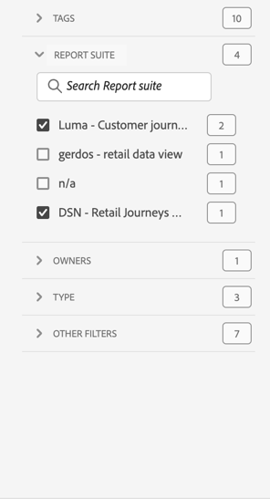

# Projektöversikt

Med Workspace-projekt kan du kombinera paneler, visualiseringar och komponenter för att skapa analyser och dela dem med vem som helst i organisationen. Innan du startar ditt första projekt bör du lära dig hur du får tillgång till, navigerar och hanterar dina projekt.

Om du vill få åtkomst till projekt i Adobe Analytics väljer du **[!UICONTROL Workspace]**.  **[!UICONTROL Projects]**-hanteraren visar alla projekt som du äger eller projekt som delas med dig. Projektledaren med projektlistan är också standardstartsida för Adobe Analytics, om du inte har konfigurerat något annat i Inställningar.

## Titelområde

I titelområdet ➊ kan du skapa ett projekt, skapa en mapp, redigera dina inställningar och visa eller dölja en panel med ytterligare paneler.

* Om du vill visa eller dölja en vänsterpanel där du kan välja mellan **[!UICONTROL Projects]** och **[!UICONTROL Learning]** väljer du .
* Titeln visar Projekt, eventuellt tillagda med en sökväg till den markerade mappen. Till exempel [!UICONTROL Projects] > **[!UICONTROL Company Folder]**. Du kan välja enskilda undermappsdelar för att gå direkt till den specifika mappen.
* Om du vill visa rutor för en [**[!UICONTROL Blank project]**](create-projects.md), [**[!UICONTROL Blank mobile scorecard]**](/help/analyze/mobile-app/create-scorecard.md), **[!UICONTROL Open the documentation]** och **[!UICONTROL Open release notes]** väljer du  **[!UICONTROL Show more]**. Om du vill dölja området med rutor väljer du  **[!UICONTROL Show less]**.
* Baserat på vad du väljer att visa kan du med [Visa väljare](#show-selector) redigera inställningar och utföra åtgärder i den aktuella mappen som visas i **[!UICONTROL Projects]**:

  | Åtgärd | Beskrivning |
  |---|---|
  | **[!UICONTROL Create project]** | Välj att [skapa ett nytt projekt](create-projects.md). |
  | **[!UICONTROL Create folder]** | Välj att [skapa en ny mapp](workspace-folders/create-folders.md). |
  |  **[!UICONTROL Edit preferences]** | [Redigera inställningar](/help/analyze/analysis-workspace/user-preferences.md) för alla dina projekt. När den synliga sökvägen resulterar i begränsat utrymme är den här åtgärden en del av undermenyn . |
  | **[!UICONTROL Add projects]** | Välj att [lägga till projekt](workspace-folders/add-projects.md) i den aktuella mappen. När den synliga sökvägen resulterar i begränsat utrymme är den här åtgärden en del av undermenyn . |
  | **[!UICONTROL Rename folder]** | [Byter namn på](workspace-folders/manage-folders.md#rename-folders) till den aktuella mappen. |
  | **[!UICONTROL Move folder]** | [Flyttar](workspace-folders/manage-folders.md#move-folders) den aktuella mappen. |
  | **[!UICONTROL Delete folder]** | [Tar bort](workspace-folders/manage-folders.md#delete-folders) den aktuella mappen. |

## Projektlista

Projektlistan ➋ visar alla projekt som du äger och som har delats med dig. Listan innehåller följande kolumner:

| Kolumn | Beskrivning |
| --- | --- | 
|  | När ett eller flera projekt är markerade visas ett blått åtgärdsfält längst ned i projektgränssnittet. Mer information finns i [Åtgärder](#actions). |
|  | Välj om du vill gynna  eller  ett projekt. |
| **[!UICONTROL Title and description]** | Om du vill redigera projektet markerar du titellänken, som öppnar [Workspace-projektet](/help/analyze/analysis-workspace/home.md). Projekt som delas med dig markeras med . Välj  om du vill visa en snabbmeny med mer information om projektet. Välj  om du vill öppna en snabbmeny med åtgärder. Mer information finns i [Åtgärder](#actions). |
| **[!UICONTROL Type]** | Ett Workspace-projekt, en -mapp eller ett [Mobile Scorecard](/help/analyze/mobile-app/home.md). |
| **[!UICONTROL Tags]** | Vilka taggar som används i projektet. |
| **[!UICONTROL Scheduled]** | Anger om ett projekt är schemalagt att skickas med e-post till mottagarna. Alternativen är  **[!UICONTROL On]** eller  **[!UICONTROL Off]**. Se [Skicka projektdata till andra](/help/analyze/analysis-workspace/curate-share/t-schedule-report.md). |
| **[!UICONTROL Shared link (anyone)]** | Om ett projekt delas med någon, även med personer som inte har tillgång till Analysis Workspace. Alternativen är  **[!UICONTROL Active]** eller  **[!UICONTROL Inactive]**. Mer information finns i [Dela ett projekt med vem som helst (ingen inloggning krävs)](/help/analyze/analysis-workspace/curate-share/share-projects.md#share-a-project-with-anyone-no-login-required) i [Dela projekt](/help/analyze/analysis-workspace/curate-share/share-projects.md). |
| **[!UICONTROL Project Role]** | Din roll för projektet. Alternativen är: Redigera, Duplicera, Visa. Mer information finns i [Projektroller](/help/analyze/analysis-workspace/curate-share/curate.md). |
| **[!UICONTROL Report Suite]** | Rapportsviten som projektet är kopplat till. |
| **[!UICONTROL Owner]** | Den person som skapade det här projektet (antingen du eller någon som delade projektet med dig). |
| **[!UICONTROL Shared with]** | Användare som projektet har delats med. |
| **[!UICONTROL Last Modified]** | Datum och tid när projektet senast ändrades. |
| **[!UICONTROL Last Opened]** | Datum och tid när projektet senast öppnades. |
| **[!UICONTROL Component ID]** | Komponentens ID. |
| **[!UICONTROL Longest Date Range]** | Det längsta datumintervallet för någon av panelerna eller visualiseringarna i projektet. |
| **[!UICONTROL Number of Queries]** | Det totala antalet frågor i projektet. |
| **[!UICONTROL Location]** | Mappen där projektet finns. |

Håll pekaren över en kolumnrubrik om du vill visa  och välj på snabbmenyn:

* **[!UICONTROL Sort Ascending]**
* **[!UICONTROL Sort Descending]**
* **[!UICONTROL Resize column]**. En blå linje visas som gör det lättare att ändra storlek på kolumnen.

### Åtgärder

Du kan vidta åtgärder för ett eller flera projekt med snabbmenyn  eller det blå åtgärdsfältet.

| Ikon | Åtgärd | Beskrivning |
|:---:| ---|---|
|  | **[!UICONTROL *x *selected]** | Avmarkera de markerade projekten och mapparna och ta bort det blå åtgärdsfältet. |
|  | **[!UICONTROL Delete]** | Ta bort ett eller flera projekt eller mappar. Du uppmanas att bekräfta åtgärden. |
|  | **[!UICONTROL Share]** | Dela ett projekt. Mer information finns i [Dela ett projekt](/help/analyze/analysis-workspace/curate-share/share-projects.md). |
|  | **[!UICONTROL Rename]** | Byt namn på ett projekt. Öppnar en **[!UICONTROL Rename: *projektnamnsdialogruta *]**. Ange ett nytt namn och välj **[!UICONTROL Save]**. |
|  | **[!UICONTROL Copy]** | Kopiera ett eller flera projekt. Projekt får inte samma namn och suffix `(Copy)`. |
|  | **[!UICONTROL Pin]** eller **[!UICONTROL Unpin]** | Fäst eller ta bort ett eller flera projekt eller mappar. Fastnålade projekt och mappar visas högst upp i listan och den sorteringsordning du anger ignoreras. |
|  | **[!UICONTROL Move up]** | Flytta ett fäst projekt eller en mapp uppåt i projektlistan. |
|  | **[!UICONTROL Move down]** | Flytta ett fäst projekt eller en mapp nedåt i projektlistan. |
|  | **[!UICONTROL Tag]** | Tagga ett eller flera projekt eller mappar. Dialogrutan **[!UICONTROL Tag Components]** visas och du kan välja en eller flera taggar. Välj **[!UICONTROL Save]** om du vill spara taggarna för de valda projekten eller mapparna. |
|  | **[!UICONTROL Approve]** eller **[!UICONTROL Unapprove]** | Godkänn eller avgodkänn ett projekt. Endast administratörer kan godkänna projekt. |
|  | **[!UICONTROL Export CSV]** | Exportera de markerade projekten till en CSV-fil med namnet `Project List.csv`. |
|  | **[!UICONTROL Add Projects]** | Lägg till ett eller flera projekt i en vald mapp. I **[!UICONTROL Add Projects]** kan du välja ett eller flera projekt. Välj **[!UICONTROL Add]** om du vill lägga till projekten i mappen. Mer information finns i [Lägg till projekt i mappar](workspace-folders/add-projects.md#from-inside-a-folder). |
|  | **[!UICONTROL Move to]** | Flytta ett eller flera markerade projekt till en mapp. I **[!UICONTROL Select Folder]** markerar du mappen som det markerade projektet ska flyttas till och väljer **[!UICONTROL Move]**. Mer information finns i [Lägg till projekt i mappar](workspace-folders/add-projects.md#from-the-project-list). |

## Visa väljare

Du kan ändra utseende och känsla för projektgränssnittet med hjälp av **[!UICONTROL Show]**-väljarna ➌. **[!UICONTROL Show]**-väljaren definierar vilka alternativ som är tillgängliga i [titelområdet](#title-area) och vilka kolumner som visas i [projektlistan](#project-list).

* Om du vill ändra tillgängliga alternativ för [titelområdet](#title-area) väljer du **[!UICONTROL Show]** **[!UICONTROL All projects]** eller **[!UICONTROL Show]** **[!UICONTROL Folders & Projects]**.

* Om du vill definiera vilka kolumner som ska visas för [projektlistan](#project-list) väljer du  och markerar eller avmarkerar kolumner i dialogrutan **[!UICONTROL Customize table]**. Välj **[!UICONTROL Apply]** om du vill använda anpassningen. Mer information om kolumnerna finns i [Projektlista](#project-list).

## Panelen Filter

Du kan filtrera projekt och mappar i [projektlistan](#project-list) med filterpanelen ➍. Om du vill visa eller dölja filterpanelen använder du .

Filterpanelen består av följande avsnitt.

### Taggar

| Taggar | Beskrivning |
|---|---|
| {width="300"} | I avsnittet **[!UICONTROL Tags]** kan du filtrera efter taggar. <ul><li>Du använder  *Sök efter taggar* för att söka efter taggar som du vill använda för att filtrera.</li><li>Du kan markera flera taggar. Vilka märkord som är tillgängliga beror på vilka markeringar du har gjort i andra avsnitt på filterpanelen.</li><li>Siffrorna anger:<ul><li>**2︎⃣**: Antalet taggar som är tillgängliga för projekten som är resultatet av det aktuella filtret.</li><li>7︎⃣: Antalet projekt som är associerade med den specifika taggen.</li></ul></li></ul> |

### Rapportsviter

| Rapportsviter | Beskrivning |
|---|---|
| {width="300"} | I avsnittet **[!UICONTROL Report Suites]** kan du filtrera efter rapportsviter. <ul><li>Du använder  *Sök i rapportsviter* för att söka efter rapportsviter som du vill använda för att filtrera.</li><li>Du kan välja mer än en rapportserie. Vilka rapportsviter som är tillgängliga beror på vad som har gjorts i andra avsnitt på filterpanelen.</li><li>Siffrorna anger:<ul><li>**3︎⃣**: Antalet rapportsviter som är tillgängliga för projekten som är ett resultat av det aktuella filtret.</li><li>4︎⃣: Antalet projekt som är associerade med den specifika rapportsviten.</li></ul></li></ul> |

### Ägare

| Ägare | Beskrivning |
|---|---|
| {width="300"} | I avsnittet **[!UICONTROL Owner]** kan du filtrera efter ägare. <ul><li>Du använder  *Sökägare* för att söka efter ägare som du vill använda för att filtrera.</li><li>Du kan välja mer än en ägare. Vilka ägare som är tillgängliga beror på vad som har gjorts i andra avsnitt på filterpanelen.</li><li>Siffrorna anger:<ul><li>**3︎⃣**: Antalet ägare som är tillgängliga för projekten som är ett resultat av det aktuella filtret.</li><li>4︎⃣: Antalet projekt som är associerade med den specifika ägaren.</li></ul></li></ul> |

### Typ

| Typ | Beskrivning |
|---|---|
| {width="300"} | I avsnittet **[!UICONTROL Type]** kan du filtrera efter typ av projekt eller mappar.<ul><li>Du kan välja ett eller flera av följande alternativ:<ul><li> **[!UICONTROL folder]**</li><li>**[!UICONTROL Workspace project]**</li><li>**[!UICONTROL Mobile scorecard]**</li></ul> <li>Du kan markera mer än ett annat filter. Vilka andra filter som är tillgängliga beror på vilka markeringar du har gjort i andra avsnitt på filterpanelen.</li><li>Siffrorna anger:<ul><li>**5︎⃣**: Antalet andra filter som är tillgängliga för projekten som är resultatet av det aktuella filtret.</li><li>4︎⃣: Antalet projekt som är associerade med det specifika andra filtret.</li></ul></li></ul> |

### Andra filter

| Andra filter | Beskrivning |
|---|---|
| {width="300"} | I avsnittet **[!UICONTROL Other filters]** kan du filtrera på andra fördefinierade filter.<ul><li>Du kan välja ett eller flera av följande alternativ:<ul><li> **[!UICONTROL Show all]**</li><li>**[!UICONTROL Shared with me]**</li><li>**[!UICONTROL Mine]**</li><li>**[!UICONTROL Approved]**</li><li>**[!UICONTROL Favorites]**</li></ul> Vad du kan välja beror på din roll och dina behörigheter.</li><li>Du kan markera mer än ett annat filter. Vilka andra filter som är tillgängliga beror på vilka markeringar du har gjort i andra avsnitt på filterpanelen.</li><li>Siffrorna anger:<ul><li>**5︎⃣**: Antalet andra filter som är tillgängliga för projekten som är resultatet av det aktuella filtret.</li><li>4︎⃣: Antalet projekt som är associerade med det specifika andra filtret.</li></ul></li></ul> |

## Sök

Du använder sökområdet ➎ för att söka efter projekt och mappar med hjälp av fältet . Börja skriva och [projektlistan](#project-list) filtrerar automatiskt dina sökindata.

I sökområdet visas även de filter som har använts på panelen Filter.

* Om du vill ta bort ett filter väljer du  i filtret.
* Om du vill ta bort alla filter väljer du Rensa alla.

Om utrymmet är begränsat för att visa de enskilda filtren visas **[!UICONTROL Segmenting by *x *filters]**.

* Ta bort ett filter:

   1. Använd **[!UICONTROL *x *filters]** överst för att öppna en snabbmeny med en lista över filtyperna och de enskilda filtren.
   1. Använd  för att ta bort ett filter.

<!--

# Projects overview

Workspace projects allow you to combine data components, tables and visualizations to craft your analysis and share with anyone in your organization. Before starting your first project, learn about how to access, navigate and manage your projects. 

Here is a video on how to build a Workspace project:

>[!BEGINSHADEBOX]

See  [Build a Workspace project](https://video.tv.adobe.com/v/334076?quality=12&learn=on){target="_blank"} for a demo video.

>[!ENDSHADEBOX]

## Project list {#project-list}

When you first go to **[!UICONTROL Analytics]** > **[!UICONTROL Workspace]**, the page lists all the projects you own or have been shared to you. This page is also the landing page for Adobe Analytics, unless you have previously set a custom landing page. 

The Projects page contains the following information: 

|  Element  | Description  |
|---|---|
| [Edit preferences](/help/analyze/analysis-workspace/user-preferences.md) | Manage settings for Analysis Workspace and its related components for all new projects or panels that you create.  |
| [Create folder](/help/analyze/analysis-workspace/build-workspace-project/workspace-folders/create-folders.md)  | Add a new folder or subfolder to the list of projects and folders. |
| [Create project](/help/analyze/analysis-workspace/build-workspace-project/create-projects.md)  | Start a new project from scratch or from a report.  |
|  Show more  | This selection reveals options for creating a blank project or mobile scorecard, [viewing training tutorials](https://experienceleague.adobe.com/en/docs/analytics-learn/tutorials/analysis-workspace/analysis-workspace-basics/analysis-workspace-introduction), or [viewing release notes](/help/release-notes/latest.md).  |
|  | To show or hide filters. You can filter on tags, report suite, owners, type (project, folder, mobile scorecard), and other filters. | 
|  | Use the search field to search for folders, Workspace projects or mobile scorecards. |
| Show Folders & Projects| Choose whether to show the folder structure of projects. For more information, see [About Folders in Analytics](/help/analyze/analysis-workspace/build-workspace-project/workspace-folders/about-folders.md). |
|   | This icon allows you to customize the columns you see for each project in the projects list.  |

The list of projects can display the following columns:

|  Column  | Description  |
|---|---|
| [!UICONTROL Name]  | Name of the Workspace project. Select  to show a popup with more details on a project or folder. Select  to show actions available. See [Manage projects](#manage-projects) for more details.  | 
| [!UICONTROL Type] | Indicates whether this entry is a Workspace project, a folder, or a [Mobile scorecard](https://experienceleague.adobe.com/en/docs/analytics/analyze/mobapp/home). |
| [!UICONTROL Tags]  |Tags that were applied to the project.  |
| [!UICONTROL Scheduled] | Indicates whether projects are scheduled to be emailed to recipients. See [Schedule projects](/help/analyze/analysis-workspace/curate-share/t-schedule-report.md). |
| Shared link (anyone) | Projects can be shared with anyone, even with people who don't have access to Analysis Workspace. This column shows whether projects have been shared in this way. See [Share a project with anyone (no login required)](/help/analyze/analysis-workspace/curate-share/share-projects.md#share-public-link) in [Share projects](/help/analyze/analysis-workspace/curate-share/share-projects.md) for more information. |
| [Project Role](https://experienceleague.adobe.com/en/docs/analytics/analyze/analysis-workspace/curate-share/share-projects) | Indicates your role for the project - owners, edit, duplicate, view. |
| [!UICONTROL Report suite] | The report suite that the project is associated with. |
| [!UICONTROL Owner]  | The person who created this project (either you or someone who shared the project with you.)  |
| [!UICONTROL Shared with]  | Users that the project has been shared with.  |
| [!UICONTROL Last Modified]  | Date and time when the project was last modified.  |
| [!UICONTROL Last Opened]  | Date and time when the project was last opened.  |
| [!UICONTROL Last Used] | Date and time when the project was last used. | 
| [!UICONTROL Project ID]  | The ID of the project.  |
| [!UICONTROL Longest Date Range]  | The longest date range of the project.  |
| [!UICONTROL Number of Queries]  | The total number of queries contained in the project.  |
| [!UICONTROL Location]  | The folder where the project resides.  |

### Manage projects

To manage projects, select one or more projects from the project list. 

From the blue action bar, you can select the following actions:

| Action | Description | 
|---|---|
|  Delete | When selected, a confirmation dialog prompts you to confirm the deletion of a Workspace project or Mobile scorecard. Select **[!UICONTROL OK]** to confirm. |
|  Share | This action allows you to share your project. See [Share projects](../curate-share/share-projects.md).|
|  Rename | Opens up a **[!UICONTROL Rename: *name*]** dialog to rename your project. Select **[!UICONTROL Save]** to save the new name for the project. |
|  Copy | Immediately copies the selected project to a new project with name *original name* (Copy).  |
|  Pin | Immediately pins the project to the top of the list. Adds the  indicator. |
|  Tag | Opens up the **[!UICONTROL Tag Project]** dialog. You can select an existing tag or add new tags. Select **[!UICONTROL Save]** to save the tags for the project. |
|  Approve or Unapprove |  Approves or unapproves the project.  |
|  Export CSV | Immediately downloads a file containing a comma-separated value list of the projects. |
|  Move to | This action allows you to move the project to a folder. In the **[!UICONTROL Select Folder]** dialog, select a folder from the **[!UICONTROL Folder]** list, and select **[!UICONTROL Move]**. | 

## Menu bar {#menu-bar}

Within a project, the menu provides options for managing your project, adding components, finding help, and more. You can also access each menu option by keyboard [shortcuts](https://experienceleague.adobe.com/en/docs/analytics/analyze/analysis-workspace/build-workspace-project/fa-shortcut-keys).

|  Menu item  | Description  |
|---|---|
|  Project  | This menu includes common actions for project management, including New, Open, Save, Save as, and [Save as company report](/help/analyze/analysis-workspace/build-workspace-project/starter-projects.md). You can also refresh the entire project to retrieve the most recent data and definitions by clicking Refresh Project. [Download CSV and PDF](https://experienceleague.adobe.com/en/docs/analytics/analyze/analysis-workspace/curate-share/download-send) options enable you to export data from Workspace. [Project Info & Settings](https://experienceleague.adobe.com/en/docs/analytics/analyze/analysis-workspace/build-workspace-project/freeform-overview) offers many options for managing your project.  |
|  Edit  | Undo or redo your last action. Clear All resets your project to a blank starting point. |
|  Insert  | Insert new panels or visualizations from this menu. You can also insert new panels and visualizations from the left rail.  |
|  [Components](https://experienceleague.adobe.com/en/docs/analytics/analyze/analysis-workspace/components/analysis-workspace-components)  | Create new segment, calculated metric, date range, or alert components from your project. You can also create new components from the left rail. If your component definitions have recently changed, Refresh Components retrieves the latest definitions. |
|  [Share](https://experienceleague.adobe.com/en/docs/analytics/analyze/analysis-workspace/curate-share/send-schedule-files)  | Curate, share and schedule PDF/CSV projects to recipients in your organization.  |
|  Help  | Access help documentation, videos, and the Analytics [Experience League community](https://experienceleaguecommunities.adobe.com/t5/adobe-analytics/ct-p/adobe-analytics-community). Manage the visibility of Workspace tips as well as the [debugger](https://developer.adobe.com/analytics-apis/docs/2.0/). Find details about Workspace and factors that impact project [performance](https://experienceleague.adobe.com/en/docs/analytics/analyze/analysis-workspace/workspace-faq/optimizing-performance).  |
|  Share button or Owner  | If you are in an Own or Edit for the project, the Share button in the top-right gives you one-click access to manage your project recipients. If you are in a Duplicate or View role for the project, you see the project owner's name. |

### Project Info & Settings {#info-settings}

>[!CONTEXTUALHELP]
>id="workspace_project_countrepeatinstances"
>title="Count repeat instances"
>abstract="Specifies whether repeat instances are counted in reports.  Note: this setting does not apply to Flow or Fallout visualizations."

>[!CONTEXTUALHELP]
>id="workspace_project_repeatinstances"
>title="Count repeat instances"
>abstract="Specifies whether repeat instances are counted in reports. Note: this setting does not apply to Flow or Fallout visualizations."

>[!CONTEXTUALHELP]
>id="workspace_project_commenting"
>title="Allow commenting"
>abstract="When enabled, a comments area is available in the right rail of the project in Analysis Workspace."

**[!UICONTROL Workspace]** > **[!UICONTROL Project]** > **[!UICONTROL Project Info & settings]** provides project-level information on the currently active project.

Settings include:

|  Setting  | Description  |
|---|---|
|  Project Name  | The name given to the project. You can double-click the name to edit it.  |
|  Owner  | Project owner name  |
|  Last Modified  | Date of last modification to the project.  |
|  Tags  |Lists any tags applied to a project for easier categorization.  |
|  Description  | A description is useful for clarifying the purpose of a project. You can double-click the description to edit it.  |
|  Count repeat instances  | Specifies whether repeat instances are counted in reports. For example, this setting (when activated) treats multiple consecutive pages views to the same page as multiple page views. With it off, they count as a single page view (this setting only affects certain metrics, such as Single Page Visits). **Note**: This setting does not apply to Flow or Fallout visualizations.  |
| [Show annotations](/help/analyze/analysis-workspace/components/annotations/overview.md) | Specify whether to show annotations in the project or not. |
|  [Project color palette](https://experienceleague.adobe.com/en/docs/analytics/analyze/analysis-workspace/build-workspace-project/color-palettes)  | You can change the categorical color palette used in Workspace, by choosing from out-of-the-box palettes that have been optimized for color blindness, or by specifying your custom palette. This feature affects many things in Workspace, including most visualizations.  |
| [View Density](https://experienceleague.adobe.com/en/docs/analytics/analyze/analysis-workspace/build-workspace-project/view-density) | Lets you see more data on the screen by reducing the vertical padding of the left rail, freeform tables and cohort tables. |

## Left rail {#left-rail}

Within a project, various icons are available in the left rail, and each represents important tools to build your project:

| Icon | Functionality |
|---|---|
|  | [Panels](/help/analyze/analysis-workspace/c-panels/panels.md) |
|  |[Visualizations](/help/analyze/analysis-workspace/visualizations/freeform-analysis-visualizations.md) |
|  | [Components](/help/analyze/analysis-workspace/components/analysis-workspace-components.md) |
|  | [Data dictionary](/help/analyze/analysis-workspace/components/data-dictionary/data-dictionary-overview.md) |
|  | [Table of contents](/help/analyze/analysis-workspace/build-workspace-project/project-table-of-contents.md) |

Components (dimensions, metrics, segments, date ranges) in the left rail relate to the active panel data view. A blue border identifies the active panel, and the active report suite is listed at the top of the component rail.

## Right-click menu

Here is a video on using the right-click menu in Analysis Workspace:

>[!BEGINSHADEBOX]

See  [Using the context menu](https://video.tv.adobe.com/v/23981?quality=12&learn=on){target="_blank"} for a demo video.

>[!ENDSHADEBOX]

## Project canvas {#canvas}

The project canvas is where you bring together panels, tables, visualizations, and components to build your analysis. A project can contain many panels, and each panel can contain many tables and visualizations.

Panels are helpful when you want to organize your projects according to time periods, report suites, or analysis use case. The active panel has a colored border around it, and determines what components are available in the left rail.

Depending on the starting point you chose for your projects, you either have a [freeform table](https://experienceleague.adobe.com/en/docs/analytics/analyze/analysis-workspace/visualizations/freeform-table/freeform-table) or a [blank panel](https://experienceleague.adobe.com/en/docs/analytics/analyze/analysis-workspace/panels/blank-panel) in the canvas to begin with. The quickest way to start analyzing is to select one or many components and simply drag & drop them into the project canvas. A table of data is rendered automatically for you. [Learn more](https://experienceleague.adobe.com/en/docs/analytics/analyze/analysis-workspace/visualizations/freeform-table/freeform-table) about the different options for building a table, or leverage the available [training tutorial](https://experienceleague.adobe.com/en/docs/analytics/analyze/analysis-workspace/home) for more guidance on building your first project.

-->