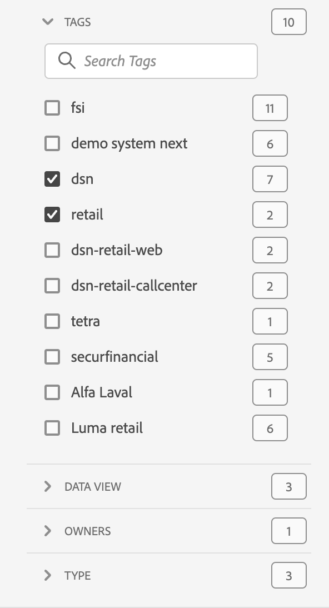

# Projektöversikt

Med Workspace-projekt kan du kombinera paneler, visualiseringar och komponenter för att skapa analyser och dela dem med vem som helst i organisationen. Innan du startar ditt första projekt bör du lära dig hur du får tillgång till, navigerar och hanterar dina projekt.

Om du vill få åtkomst till projekt i Adobe Analytics väljer du **[!UICONTROL Workspace]**.  **[!UICONTROL Projects]**-hanteraren visar alla projekt som du äger eller projekt som delas med dig. Projektledaren med projektlistan är också standardstartsida för Adobe Analytics, om du inte har konfigurerat något annat i Inställningar.

## Titelområde

I titelområdet ➊ kan du skapa ett projekt, skapa en mapp, redigera dina inställningar och visa eller dölja en panel med ytterligare paneler.

* Om du vill visa eller dölja en vänsterpanel där du kan välja mellan **[!UICONTROL Projects]** och **[!UICONTROL Learning]** väljer du .
* Titeln visar Projekt, eventuellt tillagda med en sökväg till den markerade mappen. Till exempel [!UICONTROL Projects] > **[!UICONTROL Company Folder]**. Du kan välja enskilda undermappsdelar för att gå direkt till den specifika mappen.
* Om du vill visa rutor för en [**[!UICONTROL Blank project]**](create-projects.md), [**[!UICONTROL Blank mobile scorecard]**](/help/analyze/mobile-app/create-scorecard.md), **[!UICONTROL Open the documentation]** och **[!UICONTROL Open release notes]** väljer du  **[!UICONTROL Show more]**. Om du vill dölja området med rutor väljer du  **[!UICONTROL Show less]**.
* Baserat på vad du väljer att visa kan du med [Visa väljare](#show-selector) redigera inställningar och utföra åtgärder i den aktuella mappen som visas i **[!UICONTROL Projects]**:

  | Åtgärd | Beskrivning |
  |---|---|
  | **[!UICONTROL Create project]** | Välj att [skapa ett nytt projekt](create-projects.md). |
  | **[!UICONTROL Create folder]** | Välj att [skapa en ny mapp](workspace-folders/create-folders.md). |
  |  **[!UICONTROL Edit preferences]** | [Redigera inställningar](/help/analyze/analysis-workspace/user-preferences.md) för alla dina projekt. När den synliga sökvägen resulterar i begränsat utrymme är den här åtgärden en del av undermenyn . |
  | **[!UICONTROL Add projects]** | Välj att [lägga till projekt](workspace-folders/add-projects.md) i den aktuella mappen. När den synliga sökvägen resulterar i begränsat utrymme är den här åtgärden en del av undermenyn . |
  | **[!UICONTROL Rename folder]** | [Byter namn på](workspace-folders/manage-folders.md#rename-folders) till den aktuella mappen. |
  | **[!UICONTROL Move folder]** | [Flyttar](workspace-folders/manage-folders.md#move-folders) den aktuella mappen. |
  | **[!UICONTROL Delete folder]** | [Tar bort](workspace-folders/manage-folders.md#delete-folders) den aktuella mappen. |

## Projektlista

Projektlistan ➋ visar alla projekt som du äger och som har delats med dig. Listan innehåller följande kolumner:

| Kolumn | Beskrivning |
| --- | --- |
|  | När ett eller flera projekt är markerade visas ett blått åtgärdsfält längst ned i projektgränssnittet. Mer information finns i [Åtgärder](#actions). |
|  | Välj om du vill gynna  eller  ett projekt. |
| **[!UICONTROL Title and description]** | Om du vill redigera projektet markerar du titellänken, som öppnar [Workspace-projektet](/help/analyze/analysis-workspace/home.md). Projekt som delas med dig markeras med . Välj  om du vill visa en snabbmeny med mer information om projektet. Välj  om du vill öppna en snabbmeny med åtgärder. Mer information finns i [Åtgärder](#actions). |
| **[!UICONTROL Type]** | Ett Workspace-projekt, en -mapp eller ett [Mobile Scorecard](/help/analyze/mobile-app/home.md). |
| **[!UICONTROL Tags]** | Vilka taggar som används i projektet. |
| **[!UICONTROL Scheduled]** | Anger om ett projekt är schemalagt att skickas med e-post till mottagarna. Alternativen är  **[!UICONTROL On]** eller  **[!UICONTROL Off]**. Se [Skicka projektdata till andra](/help/analyze/analysis-workspace/curate-share/t-schedule-report.md). |
| **[!UICONTROL Shared link (anyone)]** | Om ett projekt delas med någon, även med personer som inte har tillgång till Analysis Workspace. Alternativen är  **[!UICONTROL Active]** eller  **[!UICONTROL Inactive]**. Mer information finns i [Dela ett projekt med vem som helst (ingen inloggning krävs)](/help/analyze/analysis-workspace/curate-share/share-projects.md#share-a-project-with-anyone-no-login-required) i [Dela projekt](/help/analyze/analysis-workspace/curate-share/share-projects.md). |
| **[!UICONTROL Project Role]** | Din roll för projektet. Alternativen är: Redigera, Duplicera, Visa. Mer information finns i [Projektroller](/help/analyze/analysis-workspace/curate-share/curate.md). |
| **[!UICONTROL Report Suite]** | Rapportsviten som projektet är kopplat till. |
| **[!UICONTROL Owner]** | Den person som skapade det här projektet (antingen du eller någon som delade projektet med dig). |
| **[!UICONTROL Shared with]** | Användare som projektet har delats med. |
| **[!UICONTROL Last Modified]** | Datum och tid när projektet senast ändrades. |
| **[!UICONTROL Last Opened]** | Datum och tid när projektet senast öppnades. |
| **[!UICONTROL Component ID]** | Komponentens ID. |
| **[!UICONTROL Longest Date Range]** | Det längsta datumintervallet för någon av panelerna eller visualiseringarna i projektet. |
| **[!UICONTROL Number of Queries]** | Det totala antalet frågor i projektet. |
| **[!UICONTROL Location]** | Mappen där projektet finns. |

Håll pekaren över en kolumnrubrik om du vill visa  och välj på snabbmenyn:

* **[!UICONTROL Sort Ascending]**
* **[!UICONTROL Sort Descending]**
* **[!UICONTROL Resize column]**. En blå linje visas som gör det lättare att ändra storlek på kolumnen.

### Åtgärder

Du kan vidta åtgärder för ett eller flera projekt med snabbmenyn  eller det blå åtgärdsfältet.

| Ikon | Åtgärd | Beskrivning |
|:---:| ---|---|
|  | **[!UICONTROL *x *selected]** | Avmarkera de markerade projekten och mapparna och ta bort det blå åtgärdsfältet. |
|  | **[!UICONTROL Delete]** | Ta bort ett eller flera projekt eller mappar. Du uppmanas att bekräfta åtgärden. 
Projekt som du tar bort:
<ul><li>Kan inte återställas</li><li>Har tagits bort från projektlistan</li><li>Det går inte längre att komma åt med URL:en</li><li>Ingår inte längre i schemalagda leveranser (i fall där de tidigare konfigurerats för schemalagda leveranser) Mer information om schemalagda leveranser finns i [Schemalagda projekt](/help/components/scheduled-projects-manager.md).  
 |
|  | **[!UICONTROL Share]** | Dela ett projekt. Mer information finns i [Dela ett projekt](/help/analyze/analysis-workspace/curate-share/share-projects.md). |
|  | **[!UICONTROL Rename]** | Byt namn på ett projekt. Öppnar en **[!UICONTROL Rename: *projektnamnsdialogruta *]**. Ange ett nytt namn och välj **[!UICONTROL Save]**. |
|  | **[!UICONTROL Copy]** | Kopiera ett eller flera projekt. Projekt får inte samma namn och suffix `(Copy)`. |
|  | **[!UICONTROL Pin]** eller **[!UICONTROL Unpin]** | Fäst eller ta bort ett eller flera projekt eller mappar. Fastnålade projekt och mappar visas högst upp i listan och den sorteringsordning du anger ignoreras. |
|  | **[!UICONTROL Move up]** | Flytta ett fäst projekt eller en mapp uppåt i projektlistan. |
|  | **[!UICONTROL Move down]** | Flytta ett fäst projekt eller en mapp nedåt i projektlistan. |
|  | **[!UICONTROL Tag]** | Tagga ett eller flera projekt eller mappar. Dialogrutan **[!UICONTROL Tag Components]** visas och du kan välja en eller flera taggar. Välj **[!UICONTROL Save]** om du vill spara taggarna för de valda projekten eller mapparna. |
|  | **[!UICONTROL Approve]** eller **[!UICONTROL Unapprove]** | Godkänn eller avgodkänn ett projekt. Endast administratörer kan godkänna projekt. |
|  | **[!UICONTROL Export CSV]** | Exportera de markerade projekten till en CSV-fil med namnet `Project List.csv`. |
|  | **[!UICONTROL Add Projects]** | Lägg till ett eller flera projekt i en vald mapp. I **[!UICONTROL Add Projects]** kan du välja ett eller flera projekt. Välj **[!UICONTROL Add]** om du vill lägga till projekten i mappen. Mer information finns i [Lägg till projekt i mappar](workspace-folders/add-projects.md#from-inside-a-folder). |
|  | **[!UICONTROL Move to]** | Flytta ett eller flera markerade projekt till en mapp. I **[!UICONTROL Select Folder]** markerar du mappen som det markerade projektet ska flyttas till och väljer **[!UICONTROL Move]**. Mer information finns i [Lägg till projekt i mappar](workspace-folders/add-projects.md#from-the-project-list). |

## Visa väljare

Du kan ändra utseende och känsla för projektgränssnittet med hjälp av **[!UICONTROL Show]**-väljarna ➌. **[!UICONTROL Show]**-väljaren definierar vilka alternativ som är tillgängliga i [titelområdet](#title-area) och vilka kolumner som visas i [projektlistan](#project-list).

* Om du vill ändra tillgängliga alternativ för [titelområdet](#title-area) väljer du **[!UICONTROL Show]** **[!UICONTROL All projects]** eller **[!UICONTROL Show]** **[!UICONTROL Folders & Projects]**.

* Om du vill definiera vilka kolumner som ska visas för [projektlistan](#project-list) väljer du  och markerar eller avmarkerar kolumner i dialogrutan **[!UICONTROL Customize table]**. Välj **[!UICONTROL Apply]** om du vill använda anpassningen. Mer information om kolumnerna finns i [Projektlista](#project-list).

## Panelen Filter

Du kan filtrera projekt och mappar i [projektlistan](#project-list) med filterpanelen ➍. Om du vill visa eller dölja filterpanelen använder du .

Filterpanelen består av följande avsnitt.

### Taggar

| Taggar | Beskrivning |
|---|---|
| {width="300"} | I avsnittet **[!UICONTROL Tags]** kan du filtrera efter taggar. <ul><li>Du använder  *Sök efter taggar* för att söka efter taggar som du vill använda för att filtrera.</li><li>Du kan markera flera taggar. Vilka märkord som är tillgängliga beror på vilka markeringar du har gjort i andra avsnitt på filterpanelen.</li><li>Siffrorna anger:<ul><li>**2︎⃣**: Antalet taggar som är tillgängliga för projekten som är resultatet av det aktuella filtret.</li><li>7︎⃣: Antalet projekt som är associerade med den specifika taggen.</li></ul></li></ul> |

### Rapportsviter

| Rapportsviter | Beskrivning |
|---|---|
| {width="300"} | I avsnittet **[!UICONTROL Report Suites]** kan du filtrera efter rapportsviter. <ul><li>Du använder  *Sök i rapportsviter* för att söka efter rapportsviter som du vill använda för att filtrera.</li><li>Du kan välja mer än en rapportserie. Vilka rapportsviter som är tillgängliga beror på vad som har gjorts i andra avsnitt på filterpanelen.</li><li>Siffrorna anger:<ul><li>**3︎⃣**: Antalet rapportsviter som är tillgängliga för projekten som är ett resultat av det aktuella filtret.</li><li>4︎⃣: Antalet projekt som är associerade med den specifika rapportsviten.</li></ul></li></ul> |

### Ägare

| Ägare | Beskrivning |
|---|---|
| {width="300"} | I avsnittet **[!UICONTROL Owner]** kan du filtrera efter ägare. <ul><li>Du använder  *Sökägare* för att söka efter ägare som du vill använda för att filtrera.</li><li>Du kan välja mer än en ägare. Vilka ägare som är tillgängliga beror på vad som har gjorts i andra avsnitt på filterpanelen.</li><li>Siffrorna anger:<ul><li>**3︎⃣**: Antalet ägare som är tillgängliga för projekten som är ett resultat av det aktuella filtret.</li><li>4︎⃣: Antalet projekt som är associerade med den specifika ägaren.</li></ul></li></ul> |

### Typ

| Typ | Beskrivning |
|---|---|
| {width="300"} | I avsnittet **[!UICONTROL Type]** kan du filtrera efter typ av projekt eller mappar.<ul><li>Du kan välja ett eller flera av följande alternativ:<ul><li> **[!UICONTROL folder]**</li><li>**[!UICONTROL Workspace project]**</li><li>**[!UICONTROL Mobile scorecard]**</li></ul> <li>Du kan markera mer än ett annat filter. Vilka andra filter som är tillgängliga beror på vilka markeringar du har gjort i andra avsnitt på filterpanelen.</li><li>Siffrorna anger:<ul><li>**5︎⃣**: Antalet andra filter som är tillgängliga för projekten som är resultatet av det aktuella filtret.</li><li>4︎⃣: Antalet projekt som är associerade med det specifika andra filtret.</li></ul></li></ul> |

### Andra filter

| Andra filter | Beskrivning |
|---|---|
| {width="300"} | I avsnittet **[!UICONTROL Other filters]** kan du filtrera på andra fördefinierade filter.<ul><li>Du kan välja ett eller flera av följande alternativ:<ul><li> **[!UICONTROL Show all]**</li><li>**[!UICONTROL Shared with me]**</li><li>**[!UICONTROL Mine]**</li><li>**[!UICONTROL Approved]**</li><li>**[!UICONTROL Favorites]**</li></ul> Vad du kan välja beror på din roll och dina behörigheter.</li><li>Du kan markera mer än ett annat filter. Vilka andra filter som är tillgängliga beror på vilka markeringar du har gjort i andra avsnitt på filterpanelen.</li><li>Siffrorna anger:<ul><li>**5︎⃣**: Antalet andra filter som är tillgängliga för projekten som är resultatet av det aktuella filtret.</li><li>4︎⃣: Antalet projekt som är associerade med det specifika andra filtret.</li></ul></li></ul> |

## Sök

Du använder sökområdet ➎ för att söka efter projekt och mappar med hjälp av fältet . Börja skriva och [projektlistan](#project-list) filtrerar automatiskt dina sökindata.

I sökområdet visas även de filter som har använts på panelen Filter.

* Om du vill ta bort ett filter väljer du  i filtret.
* Om du vill ta bort alla filter väljer du Rensa alla.

Om utrymmet är begränsat för att visa de enskilda filtren visas **[!UICONTROL Segmenting by *x *filters]**.

* Ta bort ett filter:

   1. Använd **[!UICONTROL *x *filters]** överst för att öppna en snabbmeny med en lista över filtyperna och de enskilda filtren.
   1. Använd  för att ta bort ett filter.

