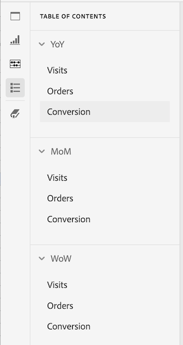

# Innehållsförteckning

Du kan visa en innehållsförteckning för ett projekt i Analysis Workspace, vilket gör att du snabbt kan växla mellan olika paneler och visualiseringar i projektet. Innehållsförteckningen är särskilt användbar när du visar större projekt som innehåller många paneler och visualiseringar.

>[!BEGINSHADEBOX]

Se  [Skapa en innehållsförteckning](https://video.tv.adobe.com/v/26990/?quality=12&learn=on){target="_blank"} för en demonstrationsvideo.

>[!ENDSHADEBOX]

>[!TIP]
>
>Du kan använda visualiseringen av avsnittshuvudet för att identifiera och föra fram ett avsnitt i en panel som innehåller många visualiseringar. De här avsnittsrubrikerna visas också som poster i innehållsförteckningen.
>

Så här visar du innehållsförteckningen i ett projekt:

1. I Analysis Workspace går du till det projekt där du vill visa innehållsförteckningen.

1. Välj  **[!UICONTROL Table of contents]** på knapppanelen. Mer information finns i [Analysis Workspace - översikt](/help/analyze/analysis-workspace/home.md). 

   **[!UICONTROL Table of contents]** för projektet visas och varje panel utökas som standard.

1. I **[!UICONTROL Table of contents]** väljer du en visualisering. 

   Den valda visualiseringen rullas automatiskt till och markeras kortfattat.

   

>[!MORELIKETHIS]
>
>* [Förenkla instrumentpanelsnavigeringen med den nya funktionen för innehållsförteckning i Adobe Analytics](https://experienceleaguecommunities.adobe.com/t5/adobe-analytics-blogs/simplify-dashboard-navigation-with-the-new-table-of-contents/ba-p/731284)

<!--
# Project table of contents

You can view a table of contents within each project in Analysis Workspace, allowing you to quickly move between any panels and visualizations that exist in the project. This is especially useful when viewing larger projects that contain many panels and visualizations.

>[!BEGINSHADEBOX]

See  [Table of contents](https://video.tv.adobe.com/v/26990?quality=12&learn=on){target="_blank"} for a demo video.

>[!ENDSHADEBOX]

To view the table of contents on a project:

1. In Analysis Workspace, go to the project where you want to view the table of contents.

1. In the left nav, select the table of contents icon . 

   The table of contents for the project is displayed, and each panel is expanded by default.

   

1. In the table of contents, select a visualization to go to it within the project.
-->