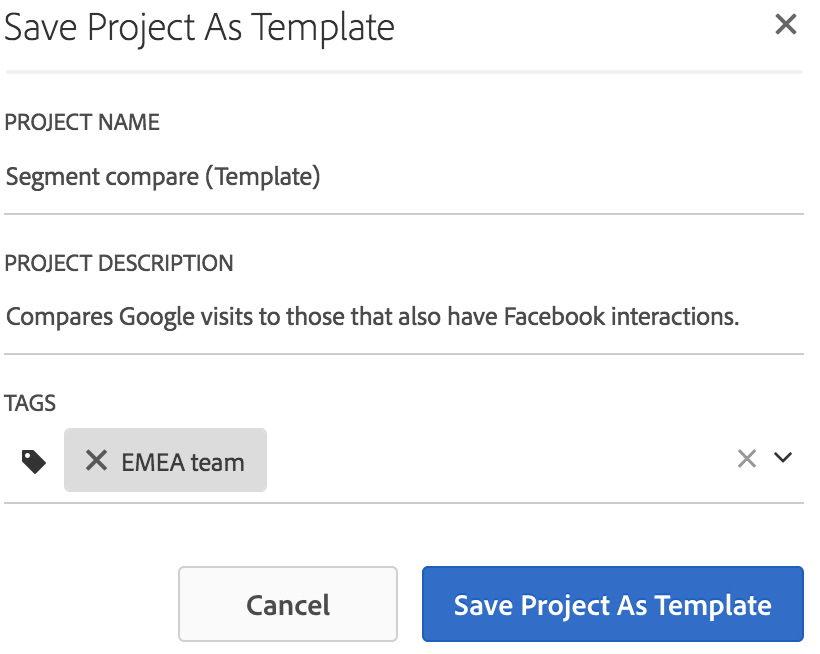

# Mallar

Du kan välja om du vill skapa ett projekt från:

* **Tomt projekt (standard)**: Instruktioner finns i [Skapa ett Analysis Workspace-projekt](/help/analyze/analysis-workspace/home.md).
* **Standardmall**: Mallarna skapas av Adobe och levereras med produkten.
* **Egen mall**: Mallarna kan skapas, delas eller tas bort av användare med administratörsbehörighet eller av icke-administratörer, förutsatt att de har tilldelats [!UICONTROL Analysis Workspace: Save as Template] tillstånd i Admin Console. [Läs mer …](https://experienceleague.adobe.com/docs/analytics/admin/admin-console/permissions/product-profile.html)

## Skapa en egen mall {#create-custom-template}

Användare med administratörsbehörighet kan omvandla projekt de skapar till en egen mall. Så här:

1. Öppna projektet.
1. Gå till **[!UICONTROL Project]** > **[!UICONTROL Save As Template]**.

   

   Projektet sparas under det aktuella projektnamnet, följt av ordet (mall) inom parentes. Administratörer kan ändra det här namnet genom att redigera mallen.

   >[!NOTE]
   >
   >Som standard är projektmallar synliga för alla i organisationen. Du kan ordna dem genom att använda taggar. (Gå till **[!UICONTROL Project]** > **[!UICONTROL Project Info & Settings]** för att redigera taggar och beskrivningar.)

Här är en video om hur du skapar och hanterar egna mallar:

>[!VIDEO](https://video.tv.adobe.com/v/23231/?quality=12)

### Åtgärder som du kan utföra på anpassade mallar

| Åtgärd | Beskrivning |
|--- |--- |
| Redigera mall | Låter en administratör redigera mallen genom att ändra dess datakälla, ändra komponenter, visualiseringar, datumintervall osv.  Om du vill redigera en anpassad mall, antingen<ul><li>Visa listan med egna mallar i Analysis Workspace, markera en och klicka sedan på Redigera mall, eller</li><li>Navigera till Komponenter > Projekt i Analytics och filtrera sedan efter Mallar. Klicka på namnet på mallen som du vill redigera.</li></ul>**Obs!** När du har redigerat en mall kan du välja mellan två alternativ: Spara, Spara som. Så här skiljer de sig:<ul><li>**Spara:** Uppdaterar den anpassade mallen för alla användare. När någon annan skapar ett projekt från den här anpassade mallen ser de ändringarna som du har gjort.</li><li>**Spara som:** Skapar en kopia av den anpassade mallen med dina ändringar. (Du ser att du är i redigeringsläge när menyalternativet Dela > Dela projekt är inaktiverat.)</li></ul> |
| Sök efter mallar | I dialogrutan Egna mallar klickar du på Sökmallar. |
| Sortera mallar | Du kan sortera mallar i bokstavsordning, efter relevans och efter skapandedatum.  I dialogrutan Egna mallar klickar du på Sortera:. |
| Använd taggar på mall | Öppna mallen och gå till Projekt > Projektinformation och inställningar. Klicka på Lägg till taggar. |
| Ändra mallbeskrivning | Öppna mallen och gå till Projekt > Projektinformation och inställningar. Dubbelklicka på beskrivningen och redigera den. |

## Standardmallar

När du först öppnar en arbetsyta är mallarna tillgängliga i den vänstra listen. Analysis Workspace-mallar täcker vanliga användningsområden. De grupperas efter de lodräta värden de tillhör och fylls i med olika dimensioner, segment, mätvärden och visualiseringar, beroende på vilken rapportserie du har valt.

Du kan använda de här förifyllda mallarna som de är eller anpassa dem efter dina behov (genom att till exempel lägga till eller ersätta mått eller visualiseringar) och spara dem under ett nytt namn.

Här är en videosjälvstudiekurs om [Standardmallar i Analysis Workspace](https://experienceleague.adobe.com/docs/analytics-learn/tutorials/analysis-workspace/analysis-workspace-basics/standard-templates-in-analysis-workspace.html) (2:46)

Här finns tillgängliga mallar och de frågor som varje mall kan besvara.

### Utbildning

Dessa standardmallar leder dig igenom vanliga termer och steg för att skapa din första analys i Workspace. De är tillgängliga som standardmallar i det nya projektet och ersätter det exempelprojekt som finns idag för nya användare som inte har andra projekt i listan.

* **Självstudiekurs - intern sökanalys**: Självstudiekursen för intern sökning hjälper dig att förstå vad besökarna letar efter på webbplatsen eller i appen, men inte att hitta. Genom att analysera den här typen av data kan ni identifiera möjligheter till innehållsoptimering.

* **Självstudiekurs - marknadsanalys**: Den här självstudiekursen visar hur ni sammanställer en marknadsföringsanalys för era chefer, inklusive vilka anpassade dimensioner och mätvärden som är viktiga.

Här är en video på [!UICONTROL Training Tutorial] mall:

>[!VIDEO](https://video.tv.adobe.com/v/33773/?quality=12)

### Reklam

>[!IMPORTANT]
>
>Annonsmallar är bara tillgängliga om rapportsviten är aktiverad för Advertising Cloud.

* **Betalsökmotorer**: Den här mallen bryter ned reklamtrender, annonsplattformar, nyckelord, konton, kampanjer med mera.

### Handel

* **Magento: Marknadsföring och handel**: Den här mallen bryter ned e-handelskonverteringen genom kanalattribuering, och ger insikt genom sökord, landningssida, geografisk plats med mera. En videoöversikt finns i:

>[!VIDEO](https://experienceleague.adobe.com/docs/analytics-learn/tutorials/integrations/magento/magento-analysis-workspace-template.html)

### Media

* **Ljudförbrukning**: Vilket innehåll konsumeras mest och engagerar användarna? Här är en video om mallen Ljudförbrukning:

   >[!VIDEO](https://video.tv.adobe.com/v/23901/?quality=12)

* **Nyhet - frekvens - lojalitet**: Vilka är mina lojala läsare?

### Mobil

>[!IMPORTANT]
>
>Mobilmallar är bara tillgängliga om rapportsviten är aktiverad för Mobile.

* **Meddelanden:** Fokuserar på prestanda i appen och push-meddelanden.
* **Plats:** Innehåller en karta som visar platsdata.
* **Nyckeltal:** Håll koll på nyckelmätningarna i appen.
* **Appanvändning:** Hur många appanvändare, starter och första starter hade appen och hur lång var den genomsnittliga sessionslängden?
* **Förvärv:** Se hur länkar till mobilförvärv fungerar.
* **Prestanda:** Hur fungerar appen och var har användarna problem?
* **Kvarhållning:** Vilka är mina lojala användare och vad gör de?
* **Resor:** Vilka är de framträdande användningsmönstren för min app?

### Detaljhandel

* **Kampanjprestanda:** Vilka kampanjer genererar störst intäkter?
* **Produkter:** Vilka produkter fungerar bäst?

### Webb

* **Förvärv:** Vilka är de viktigaste trafikdrivande faktorerna på min webbplats?
* **Innehållskonsumtion:** Vilka är de främsta platserna på min webbplats?
* **Kvarhållning:** Vilka typer av användare är sannolikt lojala användare på min webbplats?
* **Teknik:** Vilken teknik använder folk för att komma åt min webbplats?

### Personer

>[!NOTE]
>
>Mallen Personer och tillhörande personmått är bara tillgängliga för användning som en del av [Adobe Experience Cloud Device Co-op](https://experienceleague.adobe.com/docs/device-co-op/using/data/people.html).

Videoöversikt över personmallen:

>[!VIDEO](https://video.tv.adobe.com/v/24037/?quality=12)

Den här mallen baseras på personmåttet, som är en deduplicerad version av det unika besökarmåttet. Mätvärdet Personer är ett mått på hur ofta konsumenter som använder flera enheter interagerar med ert varumärke. Med mallen

* Segmentera era data för USA/Kanada jämfört med resten av världen. Device Co-op finns för närvarande endast i Nordamerika.
* Jämför mätvärden för personer och unika besökare sida vid sida.
* Se&quot;komprimeringsgraden&quot;, ett beräknat mått som beräknar hur mycket mindre personmätningen är som en procentandel av Unika besökare.
* Jämför de enhetstyper kunderna använder
* Se hur många enheter per person som används i genomsnitt.
* Upptäck hur du använder segmentstackning med personmåttet.
* Upptäck hur Experience Cloud-ID:t i din miljö förbättrar effektiviteten i personmätningen.

### Resa-IQ: Mall för enhetsövergripande analys

<!--This content is mirrored in the CDA doc.-->

Med den här mallen kan du se viktiga prestandadata för olika enheter. Det är bara tillgängligt för kunder som har tillgång till [Enhetsövergripande analys](https://experienceleague.adobe.com/docs/analytics/components/cda/overview.html?lang=en) (CDA).

* **Specialanteckning för medlemmar i Co-op Graph**: Visar vilken del av rapportsviten som innehåller besökare i regioner där koordinatdiagrammet stöds och regioner där det inte stöds.
* **Identifiering av användare**: Visar hur ofta besökare på er webbplats identifieras med hjälp av metoder som baseras på enhetsövergripande analys.
* **Mäta målgruppens storlek**: Visar en jämförelse mellan Unika enheter och Personer. Andelen av dessa två tal kallas för komprimering mellan enheter, ett beräknat mått som visas på den här panelen. Detta komprimeringsmått är beroende av ett stort antal faktorer:
   * **Använda Co-op-diagrammet eller det privata diagrammet**: I allmänhet tenderar organisationer som använder enhetskoordinaterna att se bättre komprimeringsgrader än organisationer som använder det privata diagrammet.
   * **Inloggningshastighet**: Ju fler användare som loggar in på er webbplats, desto mer kan Adobe identifiera och sätta ihop besökare på olika enheter. Platser med låg inloggningshastighet har också låg komprimeringshastighet.
   * **Experience Cloud ID-täckning**: Endast besökare med ett ECID kan sammanfogas. En lägre andel besökare på er webbplats som använder ett ECID-kort motsvarar lägre komprimeringsgrader.
   * **Användning av flera enheter**: Om besökarna på webbplatsen inte använder flera enheter kan du se lägre komprimeringsgrader.
   * **Rapportgranularitet**: Komprimering per dag är vanligtvis mindre än komprimering per månad eller år. Risken för att en individ ska använda flera enheter blir mindre inom en dag än under en hel månad. Segmentering, filtrering eller användning av nedbrytningsdimensioner kan också ge en lägre komprimeringsgrad.
* **Personbaserade segment**: Innehåller en segmentlistruta där du kan visa enhetsspecifika data. Den här panelen uppmuntrar till experimenterande med segment för att se hur rapporter påverkas om du inkluderar eller utesluter enhetstyper.
* **Analysera resan mellan olika enheter**: Tillhandahåller flödes- och utfallsrapporter baserat på enhetstyp.
* **Tilldelning över olika enheter**: Kombinera funktionerna i Journey IQ och Attribution IQ.
* **Andra tips och tricks**: Hjälpsamma ämnen kring CDA som gör att du kan få ut mer av att använda det.
