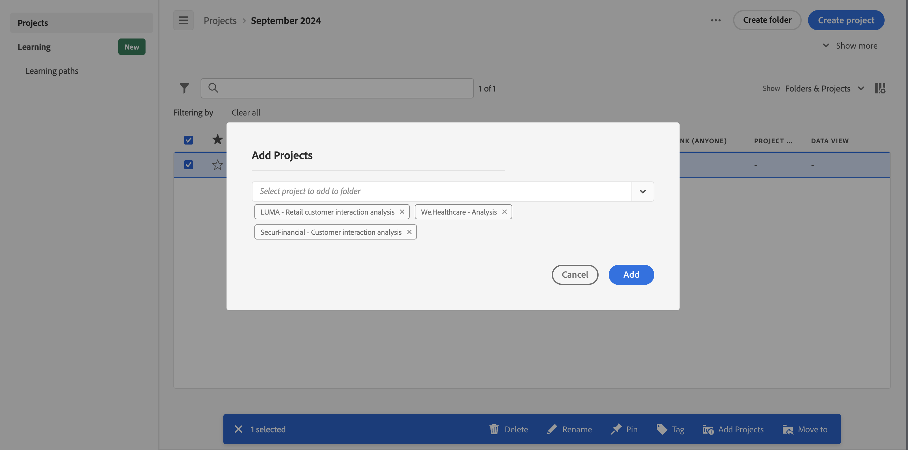

# Lägg till eller flytta projekt till mappar

Du kan lägga till eller flytta projekt till en mapp direkt från [projektlistan](/help/analyze/analysis-workspace/build-workspace-project/freeform-overview.md#project-list).

## Flytta projekt till en mapp

>[!NOTE]
>
>När en administratör flyttar ett projekt till företagsmappen delas mappen med alla, även om de befintliga delade behörigheterna är begränsade. När en administratör flyttar ett projekt från företagsmappen tillämpas de befintliga delade behörigheterna på nytt.
>

Så här flyttar du projekt till en mapp från [projektlistan](/help/analyze/analysis-workspace/build-workspace-project/freeform-overview.md#project-list):

1. Välj  för ett eller flera projekt som du vill flytta till en mapp.

1. Välj  **Flytta till** i listan över möjliga [åtgärder](/help/analyze/analysis-workspace/build-workspace-project/freeform-overview.md#actions). Dialogrutan **[!UICONTROL Select Folder]** visas.

1. Välj ett mappnamn i listrutan **[!UICONTROL Folder]**. Med listrutan kan du gå igenom mapphierarkin och välja en undermapp på valfri nivå.

   

1. Välj **[!UICONTROL Move]**.

   De markerade projekten läggs till i mappen.

## Lägga till projekt i en mapp

Så här lägger du till projekt i en mapp från [projektlistan](/help/analyze/analysis-workspace/build-workspace-project/freeform-overview.md#project-list):

1. Välj  den mapp som du vill lägga till projekt i.

1. Välj  **Add Projects** i listan över möjliga [åtgärder](/help/analyze/analysis-workspace/build-workspace-project/freeform-overview.md#actions). Dialogrutan **[!UICONTROL Select Folder]** visas.

1. Välj ett eller flera projekt från [!UICONTROL *Välj projekt att lägga till i mappen*].

   

1. Välj **[!UICONTROL Add]**.

>[!NOTE]
>
>Endast administratörer kan lägga till projekt i företagsmappen eller skapa ett nytt projekt och spara det i företagsmappen

<!--
# Add Projects to Folders

You can add projects to a folder in the table view or from within a folder.

>[!NOTE]
>
>Only Analytics administrators can add projects to the Company Folder or create a new project and save it to the Company Folder

## From the table view {#table-view}

Add projects to a folder from the table view on the home page.

1.  Select one or more projects that you want to add to a folder.

    

1.  Select **Move to**. 

    The Select Folder dialogue is displayed.

1.  In the drop-down menu, select the folder where you want to move the selected projects.

    

1.  Select **Move**.

    

    The selected projects are added to the folder.

    

    The Workspace landing page now shows the folder contains (3) projects.

    

## From inside a folder {#inside-folder}

You can also add projects from inside a folder using the ellipses link.

1.  Select and open a folder from the table view.

    

1.  Select the **...** ellipsis icon in the upper-right.
   
    

1.  Select **Add projects** and select the project that you want to add from the drop-down list.

    

    
1.  (Optional) Select additional projects from the drop-down list to add multiple projects.

    

1.  Select **Add** to add the projects to the folder.

    

-->