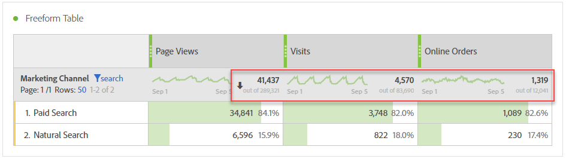

# Summor för arbetsyta

I frihandstabeller visas en summeringsrad på varje uppdelningsnivå och kan visa två summor:

* **[!UICONTROL Grand Total]** (grå &#39;av&#39;-tal) - denna summa representerar alla träffar som har samlats in, ibland kallat &#39;rapportsvitens totala&#39;. När ett segment används antingen på panelnivå eller i friformstabellen justeras det totala värdet så att alla träffar som matchar segmentvillkoren visas.
* **[!UICONTROL Table Total]** (svart tal) - den här summan är vanligtvis lika med eller en delmängd av [!UICONTROL Grand Total]. Alla tabellfilter som används i frihandstabellen visas, inklusive [!UICONTROL Include None] alternativet.

## Visa total inställning

Under **[!UICONTROL Column Settings]** finns alternativ för **[!UICONTROL Show Totals]** och **[!UICONTROL Show Grand Total]**. Om de här inställningarna inte är markerade tas summorna bort från tabellen. Detta kan vara önskvärt om summorna inte är rimliga, t.ex. i vissa [beräkningsscenarier](https://docs.adobe.com/content/help/en/analytics/components/calculated-metrics/calcmetrics-reference/cm-totals.html).

## Inställningar för totalt antal statiska rader

[Statiska radsummor](https://docs.adobe.com/content/help/en/analytics/analyze/analysis-workspace/build-workspace-project/column-row-settings/manual-vs-dynamic-rows.html) fungerar annorlunda och styrs under **[!UICONTROL Row Settings]**.

* **[!UICONTROL Show sum of current rows as the total]** - här visas en summa av raderna i tabellen på klientsidan, vilket innebär att summan **inte** kan deduplicera mått som besök eller besökare.
* **[!UICONTROL Show Grand Total]** - detta visar en summa på serversidan, vilket innebär att summan kommer att ta bort dubbletter av statistik som besök eller besökare.

## Frågor och svar

| Frågor | Svar |
|---|---|
| Vilken summa är procentsatserna för gråa kolumner baserade på? | Detta beror på **[!UICONTROL Percentages]** inställningen under **[!UICONTROL Row Settings]**:<ul><li>Beräkna procentandelar per kolumn - Det här är standardinställningen. Procentsatserna baseras på tabellsumman.</li><li>Beräkna procentandelar per rad - Procentsatserna baseras på totalsumman.</li></ul> |
| Hur påverkar **[!UICONTROL Include Unspecified (None)]** inställningen totalvärdet? | Om **[!UICONTROL Include Unspecified (None)]** inställningen inte är markerad tas raden Ingen/Ospecificerad bort från tabellen, Tabellsumma, och utförs i alla beräknade mått som använder måtten [&#39;Summa&#39;](https://docs.adobe.com/content/help/en/analytics/components/calculated-metrics/calcmetric-workflow/m-metric-type-alloc.html) |
| När anpassade tabellfilter tillämpas på en frihandstabell, gör jag då alla mina beräknade värden och villkorsstyrda formateringskonton för filtret? | Inte just nu. **[!UICONTROL Include Unspecified (None)]** tas med i beräkningen, men anpassade tabellfilter påverkar inte följande:<ul><li>Kolumnens max/min-intervall som villkorsstyrd formatering använder ser ut över alla data.</li><li>Beräknade mätvärden som utnyttjar **[!UICONTROL Grand Total]** mätningstyper.</li><li>Beräknade mätvärden med funktioner som beräknas över rader i en friformstabell, t.ex. kolumnsumma, kolumnmax, kolumnmin, antal, medel, medel, medel, percentil, kvartil, radantal, standardavvikelse, varians, ackumulerat, kumulativt genomsnitt, regressionsvarianter, T-poäng, T-test, Z-poäng, Z-test, Z-test.</li></ul> |
| I Beräknade mått, vad återspeglar **[!UICONTROL Grand Total]** mättypen? | **[!UICONTROL Grand Total]** fortsätter att referera till **[!UICONTROL Grand Total]** och reflekterar inte filter som används i en tabell eller i **[!UICONTROL Table Total]**. |
| Vilken summa visas när data kopieras och klistras in från en frihandstabell eller hämtas via CSV? | Den totala raden återspeglar den **[!UICONTROL Table Total]** enda raden och respekterar **[!UICONTROL Show Totals]** kolumninställningen. |

