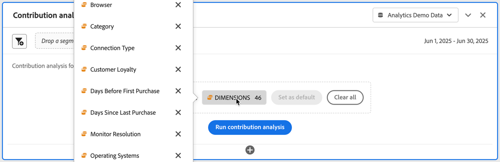

# Kör bidragsanalys

[Bidragsanalys](/help/analyze/analysis-workspace/c-anomaly-detection/anomaly-detection.md#contribution-analysis) är en intensiv maskininlärningsprocess som utformats för att identifiera medverkande till en iakttagen avvikelse i Adobe Analytics. Avsikten är att hjälpa användaren att hitta fokusområden eller möjligheter till ytterligare analys mycket snabbare än vad som annars skulle vara möjligt.

>[!NOTE]
>
>Bidragsanalys stöds bara för data med daglig granularitet.

Stegen för att köra bidragsanalys är:

1. Anropa bidragsanalys i ett projekt.

   

   1. I en linjevisualisering, som baseras på en frihandstabell med daglig granularitet, väljer du en avvikelsedatapunkt. Välj **[!UICONTROL Analyze]** på popup-menyn.
   1. I en frihandstabell med daglig granularitet väljer du **[!UICONTROL Run contribution analysis]** på snabbmenyn på valfri rad. Du kan till och med köra analysen på rader som inte uppvisar några avvikelser.
   1. I en frihandstabell med daglig granularitet, på en rad som anger en avvikelse:
      1. Välj indikatorn ◥.
      1. Välj Varning **[!UICONTROL Anomaly detected]** **[!UICONTROL Open Contribution Analysis]**.

1. (Valfritt) Du kan begränsa omfattningen av (och därmed snabba upp) analysen genom att [utesluta dimensioner](#exclude-dimensions).

   

1. Välj **[!UICONTROL Run contribution analysis]**.

1. Vänta medan bidragsanalysen bearbetas. Bearbetningen kan ta lång tid, beroende på rapportsvitens storlek och antalet dimensioner. Bidragsanalys utför analyser på de 50 000 främsta objekten per dimension. Du får också ett meddelande om hur många [avgiftsanalystoken](anomaly-detection.md#contribution-analysis-tokens) som återstår.

   

1. Analysis Workspace läser in en ny **[!UICONTROL Contribution analysis]**-panel direkt i det här projektet.

   

   * En [sammanfattning av &#x200B;](/help/analyze/analysis-workspace/visualizations/summary-number-change.md)-visualisering.
   * En månatlig [rad](/help/analyze/analysis-workspace/visualizations/line.md)-visualisering har trendats.
   * En **[!UICONTROL Top Items]** [friformstabell](/help/analyze/analysis-workspace/visualizations/freeform-table/freeform-table.md) som visar vilka av de översta objekten som bidrar till avvikelsen, sorterat efter [bidragspoäng](/help/analyze/analysis-workspace/c-anomaly-detection/anomaly-detection.md#contribution-analysis). De extra kolumnerna visar det aktuella måttet och ett **[!UICONTROL Unique Visitors]**-mått som anger kontext.

   * Tabellen **[!UICONTROL Generated Segments (Top Item Clusters)]** [friform](/help/analyze/analysis-workspace/visualizations/freeform-table/freeform-table.md) identifierar associationer av de översta objekten baserat på bidragspoäng, avvikelser och den totala procentandelen som bidrar till det avvikande måttet. Den här associationen fångas sedan in som ett målgruppssegment (bidragssegment 1, bidragssegment 2 osv.). Välj  om du vill visa segmentets definition, inklusive vilka översta objekt segmenten består av:

1. Eftersom bidragsanalysen nu ingår i Analysis Workspace kan du dra nytta av ett antal funktioner från en snabbmeny som kan användas på frihandsritbordet och göra analysen ännu mer meningsfull, till exempel:

   * [Dela upp varje dimensionsobjekt med en annan dimension](/help/analyze/analysis-workspace/components/dimensions/t-breakdown-fa.md)
   * [Trending one or more rows](/help/analyze/analysis-workspace/home.md#section_34930C967C104C2B9092BA8DCF2BF81A)
   * [Lägg till nya visualiseringar](/help/analyze/analysis-workspace/visualizations/freeform-analysis-visualizations.md)
   * [Skapa aviseringar](/help/components/alerts/alerts-overview.md)
   * [Skapa eller jämföra segment.](/help/analyze/analysis-workspace/c-panels/c-segment-comparison/segment-comparison.md)

>[!NOTE]
>
>Den avvikelse som analyseras markeras med en blå punkt i bidragsanalysen och de intelligenta aviseringsprojekt som är kopplade till den. Denna högdager ger en tydligare indikation på den avvikelse som analyseras.

## Uteslut dimensioner

Du kanske vill utesluta vissa dimensioner från bidragsanalysen. Du kanske inte bryr dig om webbläsar- eller maskinvarurelaterade dimensioner alls och du vill snabba upp analysen genom att ta bort dem.

Så här hanterar du den undantagna dimensionen:

* Dra oönskade mått till panelen **[!UICONTROL Excluded Dimensions]** och spara sedan listan genom att klicka på **[!UICONTROL Set as Default]**.

* Välj **[!UICONTROL Clear All]** om du vill börja om.

* Välj  om du vill visa en snabbmeny och använda  om du vill ta bort en valfri utesluten dimension från listan.

  

När du har ändrat de dimensioner som ska uteslutas väljer du **[!UICONTROL Run contribution analysis]** igen.

