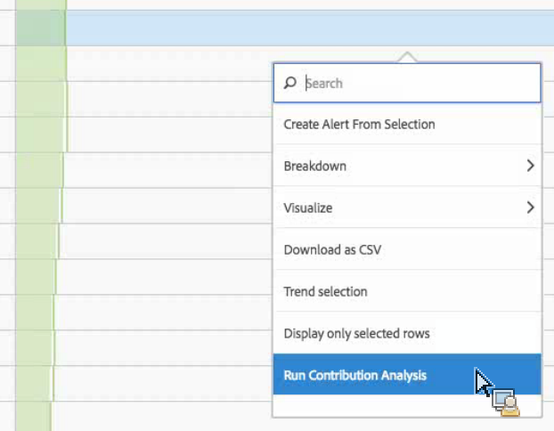

# Kör bidragsanalys

[Bidragsanalys](/help/analyze/analysis-workspace/c-anomaly-detection/anomaly-detection.md#contribution-analysis) är en intensiv maskininlärningsprocess som utformats för att identifiera medverkande till en iakttagen avvikelse i Adobe Analytics. Avsikten är att hjälpa användaren att hitta fokusområden eller möjligheter till ytterligare analys mycket snabbare än vad som annars skulle vara möjligt.

## Kör bidragsanalys {#run}

Det finns två sätt att anropa bidragsanalys i ett projekt:

* I en friformstabell med daglig granularitet högerklickar du på en rad och väljer **[!UICONTROL Run Contribution Analysis]**. Du kan till och med köra det på rader som inte visar några avvikelser.

  >[!NOTE]
  >
  >Vi stöder för närvarande endast bidragsanalys med daglig granularitet.

  

* Håll pekaren över en avvikande datapunkt i ett linjediagram. Klicka på länken **[!UICONTROL Analyze]** som visas.

  

1. (Valfritt) När du har klickat på **[!UICONTROL Run Contribution Analysis]** i antingen linjediagrammet eller en tabell kan du begränsa omfattningen av (och därmed öka) analysen genom att [utesluta dimensioner](#exclude).

1. Vänta medan din bidragsanalys läses in. Detta kan ta lång tid, beroende på rapportsvitens storlek och antalet dimensioner. Bidragsanalys utför analyser på de 50 000 främsta objekten per dimension.
1. Analysis Workspace läser sedan in en ny bidragsanalyspanel direkt i projektet.

   * En visualisering som visar antalet **besök** den dagen.
   * En månatlig **Besök trendlinje** för kontext.
   * **De översta objekten** som bidrog till avvikelsen, sorterat efter [bidragspoängen](/help/analyze/analysis-workspace/c-anomaly-detection/anomaly-detection.md#contribution-analysis), plus måttet i fråga och ett unikt besökarmått som sätter måttet i kontext från ett storleksperspektiv.

   * Tabellen [Genererade segment](https://experienceleague.adobe.com/docs/analytics/components/segmentation/segmentation-workflow/seg-build.html) (kluster för toppartikel) identifierar associationer av toppobjekt baserat på bidragspoäng, avvikelser och total procentandel som bidrar till det avvikande måttet. Detta registreras sedan som ett målgruppssegment (bidragssegment 1, bidragssegment 2 osv.). Om du klickar på knappen &quot;i&quot; (info) får du en översikt över varje segment, inklusive vilka av de översta objekten det består av:

     

1. Eftersom bidragsanalysen nu ingår i Analysis Workspace kan du dra nytta av ett antal funktioner från en tabells högerklicksmeny och göra analysen ännu mer meningsfull, som:

   * [Bryter ned varje dimensionsobjekt med en annan dimension.](/help/analyze/analysis-workspace/components/dimensions/t-breakdown-fa.md)
   * [En eller flera rader trendas.](/help/analyze/analysis-workspace/home.md#section_34930C967C104C2B9092BA8DCF2BF81A)
   * [Lägger till nya visualiseringar.](/help/analyze/analysis-workspace/visualizations/freeform-analysis-visualizations.md)
   * [Skapar aviseringar.](/help/components/c-alerts/intellligent-alerts.md)
   * [Skapa eller jämföra segment.](/help/analyze/analysis-workspace/c-panels/c-segment-comparison/segment-comparison.md)

>[!NOTE]
>
>Vi belyser den avvikelse som analyseras med en blå prick i bidragsanalysen och de intelligenta aviseringsprojekt som är kopplade till den. Detta ger en tydligare bild av den avvikelse som analyseras.

## Uteslut dimensioner från bidragsanalys {#exclude}

Det kan finnas tillfällen när du vill utesluta vissa dimensioner från bidragsanalysen. Du kanske inte bryr dig om webbläsar- eller maskinvarurelaterade dimensioner alls och du vill snabba upp analysen genom att ta bort dem.

1. När du har klickat på **[!UICONTROL Run Contribution Analysis]** (eller **[!UICONTROL Analyze]** i ett linjediagram) visas panelen **[!UICONTROL Excluded Dimensions]**.

1. Dra bara oönskade mått till panelen **[!UICONTROL Excluded Dimensions]** och spara sedan listan genom att klicka på **[!UICONTROL Set as Default]**. Du kan också klicka på **[!UICONTROL Clear All]** om du vill börja om med att välja dimensioner som ska uteslutas.

   

1. När du har lagt till dimensioner som ska uteslutas (eller valt att inte göra det) klickar du på **[!UICONTROL Run Contribution Analysis]** igen.
1. Om du någon gång behöver revidera listan över undantagna dimensioner dubbelklickar du bara på Dimensioner så visas listan över undantagna dimensioner:

   

1. Ta bara bort oönskade dimensioner genom att klicka på x:et bredvid dem och spara sedan listan genom att klicka på **[!UICONTROL Set as Default]**.
