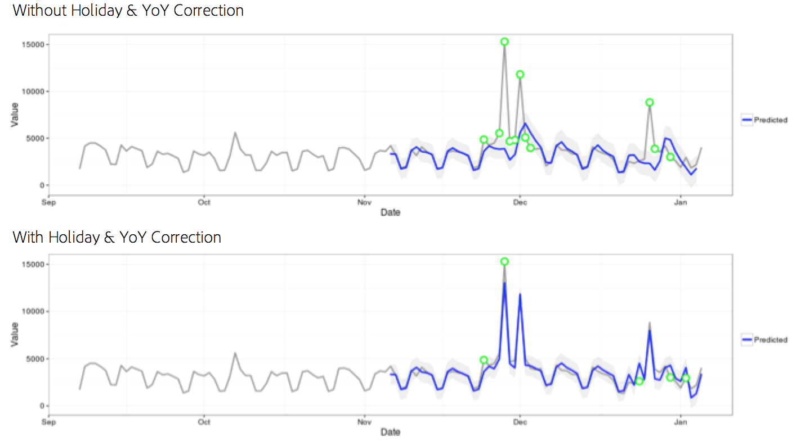

# Statistisk teknik

Anomaldetektering i Analysis Workspace använder en rad avancerade statistiska tekniker för att avgöra om en observation bör anses onormal eller inte.

Beroende på vilket datum som använts i rapporten används tre olika statistiska metoder - särskilt för att upptäcka avvikelser per timme, dag, vecka/månad. Varje statistisk metod beskrivs nedan.

## Analysidentifiering för daglig granularitet

För dagliga granularitetsrapporter anser algoritmen att flera viktiga faktorer är viktiga för att få bästa möjliga resultat. För det första avgör algoritmen vilken typ av modell som ska användas baserat på tillgängliga data som algoritmen väljer mellan en av två klasser - en tidsseriebaserad modell eller en modell för avdataidentifiering (kallas funktionell filtrering).

Urvalet av tidsseriemodell baseras på följande kombinationer för typ av fel, trend och säsongsberoende (ETS) enligt beskrivningen i [Hyndman et al. (2008)](https://link.springer.com/book/10.1007/978-3-540-71918-2). I algoritmen görs följande försök:

1. ANA (additivt fel, ingen trend, additiv säsongsvariation)
1. AAA (additivt fel, additiv trend, additiv säsongsvariation)
1. MNM (multiplikativt fel, ingen trend, multiplikativ säsongsvariation)
1. MNA (multiplikativt fel, ingen trend, additiv säsongsvariation)
1. AAN (additivt fel, additiv trend, ingen säsongsvariation)

Algoritmen testar lämpligheten hos var och en av kombinationerna genom att välja den som har det bästa genomsnittliga absoluta procentfelet (MAPE). Om MAPE för modellen med bästa tidsserie är större än 15 % används emellertid funktionell filtrering. Vanligtvis passar data med hög repetitionsgrad (till exempel vecka över vecka eller månad över månad) bäst för en tidsseriemodell.

Efter modellval justerar algoritmen sedan resultaten baserat på helger och årstidsberoende. För helger kontrollerar algoritmen om någon av följande helger finns i datumintervallet för rapportering:

* Minnesdag
* Juli 4
* Thanksgiving
* Black Friday
* Cyber Monday
* 24-26 december
* Januari 1
* December 31

Dessa helgdagar valdes ut baserat på omfattande statistisk analys av många kunddatapunkter för att identifiera helger som har störst betydelse för det högsta antalet kundtrender. Listan är visserligen inte fullständig för alla kunder eller affärscykler, men om du tillämpar dessa helger blir algoritmens prestanda avsevärt bättre för nästan alla kunders dataset.

När modellen har valts och helger har identifierats i rapportdatumintervallet utförs algoritmen på följande sätt:

1. Skapa avvikelsens referensperiod. Denna period omfattar upp till 35 dagar före rapporteringsdatumintervallet och ett matchande datumintervall på 1 år före. Räknar också med leap days när det behövs och inklusive eventuella helgdagar som kan ha inträffat på en annan kalenderdag föregående år.
1. Testa om helgdagar under den aktuella perioden (exklusive föregående år) är onormala baserat på de senaste uppgifterna.
1. Om semestern i det aktuella datumintervallet är onormal justerar du det förväntade värdet och konfidensintervallet för den aktuella semestern med hänsyn till föregående års semester (med hänsyn till två dagar före och efter). Korrigeringen för den aktuella ledigheten baseras på det lägsta genomsnittliga absoluta procentfelet för:

   1. Additiva effekter
   1. Multiplicerande effekter
   1. YoY-differens

Lägg märke till den dramatiska förbättringen av juldagen och nyårsdagen i följande exempel:

## Analysidentifiering för timgranularitet

Timdata bygger på samma algoritm för tidsserier som den dagliga granularitetsalgoritmen gör. Den är dock starkt beroende av två trendmönster: 24-timmarscykeln samt veckodagscykeln. För att fånga upp dessa två säsongseffekter konstruerar timalgoritmen två separata modeller för en helg och en veckodag med samma metod som beskrivs ovan.

Utbildningsfönstren för timtrender är beroende av ett 336-timmars uppslagsfönster.

## Analysidentifiering för varje vecka och månad

Trender för varje vecka och månad visar inte samma trender för varje vecka eller varje dag som finns på en daglig eller timbaserad noggrannhet, vilket innebär att en sådan separat algoritm används. För varje vecka och varje månad kallas en tvåstegsidentifiering för det allmänna GESD-testet (Extreme Studentized Deviate). I detta test beaktas det maximala antalet förväntade avvikelser i kombination med den justerade boxrumsmetoden (en icke-parametrisk metod för oulier-upptäckt) för att fastställa det maximala antalet avvikande värden. De två stegen är:

1. Justerad box-plot-funktion: Den här funktionen bestämmer det maximala antalet avvikelser som anges med indata.
1. GESD-funktion: Används på indata med utdata från steg 1.

Avvikelseavkänningssteget för semester och YY-säsongsavvikelser tar sedan bort förra årets data från årets data. Sedan itererar vi på data igen med tvåstegsprocessen ovan för att verifiera att avvikelser är säsongsmässigt lämpliga. Var och en av dessa datumgranulariteter använder en 15-periodsökning inklusive det valda datumintervallet för rapportering (antingen 15 månader eller 15 veckor) och ett motsvarande datumintervall för 1 år sedan för utbildning.

## Statistiska tekniker som används vid bidragsanalys

Bidragsanalys är en intensiv maskininlärningsprocess som utformats för att identifiera medverkande till en konstaterad avvikelse i Adobe Analytics. Avsikten är att hjälpa användaren att hitta fokusområden eller möjligheter till ytterligare analys mycket snabbare än vad som annars skulle vara möjligt.

Contribute Analysis utför en tvådelad algoritm för varje enskilt dimensionsobjekt som är tillgängligt för användarens Contribution Analysis-rapport. Algoritmen fungerar i följande ordning:

1. För varje dimension beräknas Cramers V-provningsvärde. I följande exempel kan du ta en beredskapstabell med sidvisningar per land under två tidsperioder:

   

   I tabell 1 kan Cramer&#39;s V användas för att mäta associationen mellan sidvisningar för länder för period 1 (till exempel historik) och period 2 (till exempel den dag avvikelsen inträffar). Ett lågt värde för Cramer&#39;s V innebär en låg associationsnivå. Cramerns V varierar från 0 (ingen association) till 1 (fullständig association). Cramerns V-statistik kan beräknas:

   

1. För varje dimensionspost används Pearsons residual (PR) för att mäta kopplingen mellan det avvikande mätvärdet och varje dimensionspost. PR följer en standardnormalfördelning, som gör det möjligt för algoritmen att jämföra PR för två slumpmässiga variabler även om avvikelserna inte är jämförbara. I praktiken är felet okänt och uppskattas med hjälp av en begränsad provkorrigering.

   I det föregående exemplet i tabell 1 ges PR, med en begränsad provkorrigering för land i och tidsperiod 2, av

   

   där

   

   (En liknande formel kan erhållas för tidsperioden 1.)

   För de slutliga resultaten vägs poängen för varje dimensionspost sedan med Cramer-objektets V-mått och skalas om till ett tal mellan 0 och 1 för att ge poäng.
