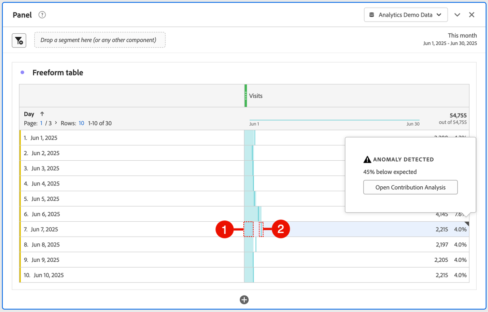
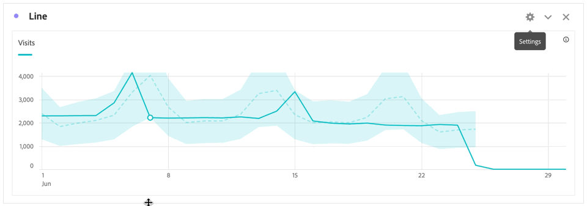

# Visa avvikelser i Analysis Workspace

Du kan visa avvikelser i en tabell eller i ett linjediagram.

## Visa avvikelser i en tabell {#section_869A87B92B574A38B017A980ED8A29C5}

Du kan visa avvikelser i en friformstabell i en tidsserie.

1. Välj  i kolumnrubriken och kontrollera sedan att alternativet **[!UICONTROL Anomalies]** är markerat i listan med alternativ. Mer information finns i [Kolumninställningar](/help/analyze/analysis-workspace/visualizations/freeform-table/column-row-settings/column-settings.md).

1. Anomalier visas i tabellen enligt följande:

   

   ◥ visas i det övre högra hörnet av varje rad där en dataavvikelse upptäcks.

   Den **färgade lodräta linjen** i varje rad ➋ anger det förväntade värdet. Det **färgade skuggade området** i varje rad ➊ anger det faktiska värdet. Hur raden (förväntat värde) jämförs med det skuggade området (faktiskt värde) avgör om det finns någon avvikelse. (En observation anses vara onormal baserat på de avancerade statistiska tekniker som beskrivs i [Statistiska tekniker som används vid avvikelseidentifiering](/help/analyze/analysis-workspace/c-anomaly-detection/statistics-anomaly-detection.md).)

1. Välj ◥ i det övre högra hörnet av en rad om du vill visa information om avvikelsen. Detta visar i vilken utsträckning (i procent) det faktiska värdet avviker antingen över eller under det förväntade värdet.

## Visa avvikelser i ett linjediagram

Linjediagram är den enda visualisering som gör att du kan se avvikelser.

Så här visar du avvikelser i ett linjediagram:

1. Välj  i visualiseringshuvudet och kontrollera sedan att alternativet [!UICONTROL **Visa avvikelser**] är markerat i listan med alternativ. Mer information finns i [Rad](/help/analyze/analysis-workspace/visualizations/line.md).

1. (Valfritt) Om du vill tillåta konfidensintervallet att skala diagrammet väljer du  i visualiseringshuvudet och sedan alternativet **[!UICONTROL Allow anomalies to Scale Y-axis]**.

   Det här alternativet är inte markerat som standard eftersom det ibland kan göra diagrammet mindre läsbart.

   Anomalier visas i linjediagrammet enligt följande:

   

   En **vit punkt** visas på raden där en dataavvikelse upptäcks. (En observation anses vara onormal baserat på de avancerade statistiska tekniker som beskrivs i [Statistiska tekniker som används vid avvikelseidentifiering](/help/analyze/analysis-workspace/c-anomaly-detection/statistics-anomaly-detection.md).)

   Det **ljusa skuggade området** är konfidensintervallet, eller det förväntade intervallet, där värden ska förekomma. Alla värden som ligger utanför det förväntade intervallet är en avvikelse.

   Om du har flera mätvärden i linjediagrammet visas bara avvikelserna, och du måste hålla muspekaren över varje avvikelse för att se konfidensintervallet för det måttet.

   Den **prickade linjen** är det exakta förväntade värdet.

1. Markera en avvikelse (vit punkt) om du vill visa följande information:

   * Datumet då avvikelsen inträffade.

   * Avvikelsens råvärde.

   * Procentvärdet över eller under det förväntade värdet, som representeras av den helgröna linjen.

   * Länken **[!UICONTROL Analyze]** som startar bidragsanalys

