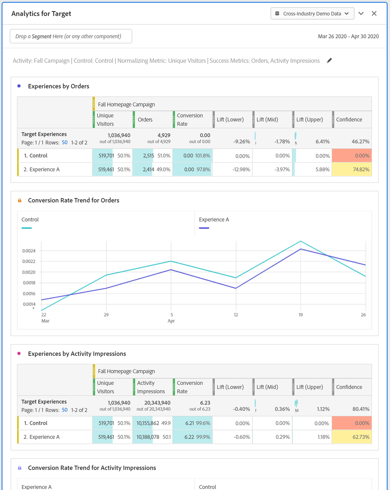

# Analyser för målpanelen (A4T)

Med Analytics for Target-panelen (A4T) kan du analysera dina Adobe Target-aktiviteter och -upplevelser i Analysis Workspace. Det gör det också möjligt för er att se hur ni lyfter och litar på upp till tre framgångsvärden. Om du vill komma åt A4T-panelen går du till en rapportsvit där A4T-komponenter är aktiverade. Klicka sedan på panelikonen längst till vänster och dra Analytics for Target-panelen till ditt Analysis Workspace-projekt.

## Panelindata {#Input}

Du kan konfigurera A4T-panelen med följande indatainställningar:

| Inställning | Beskrivning |
|---|---|
| Verksamhetens syfte? | Välj i en lista över målaktiviteter eller dra och släpp en aktivitet från den vänstra listen. Obs! Listan innehåller de senaste sex månaderna av aktiviteter som hade minst en träff. Om du inte ser någon aktivitet i listan kan den vara äldre än 6 månader. Den kan fortfarande läggas till från den vänstra listen, som har en summeringstid på upp till 18 månader. |
| Kontrollupplevelse | Välj din kontrollupplevelse. Du kan ändra den om det behövs i listrutan. |
| Normaliserar mätvärden | Välj bland unika besökare, besök eller aktivitetsexponeringar. Unika besökare rekommenderas för de flesta användningsfall för analyser. Detta mätvärde (även kallat beräkningsmetoden) blir nämnaren för beräkningen av lyft. Det påverkar också hur data aggregeras innan konfidensberäkningen tillämpas. |
| Framgångsmått | Välj upp till tre standardhändelser (ej beräknade) från listrutorna, eller dra och släpp mätvärden från den vänstra listen. Varje mätvärde har en dedikerad tabell och visualisering på den renderade panelen. |
| Kalenderdatumintervall | Detta fylls i automatiskt baserat på aktivitetsdatumintervallet från Adobe Target. Du kan ändra den om det behövs. |

## Panelutdata {#Output}

Analytics for Target-panelen returnerar en mängd data och visualiseringar som hjälper er att bättre förstå hur Adobe Target aktiviteter och upplevelser fungerar. Längst upp på panelen finns en sammanfattningsrad som påminner om de panelinställningar du har valt. Du kan när som helst redigera panelen genom att klicka på redigeringspennan i det övre högra hörnet.

För varje framgångsmått du valt visas en frihandstabell och en konverteringsgrad:

I varje frihandstabell visas följande måttkolumner:

| Mått | Beskrivning |
|---|---|
| Normaliserar mätvärden | Unika besökare, besök eller aktivitetsexponeringar. |
| Resultatmått | Det mått som valts i verktyget |
| Konverteringsgrad | Resultatmått/normaliseringsmått |
| Lyft | Jämför konverteringsgraden för varje upplevelse med kontrollupplevelsen. Obs! Lyft är ett&quot;låst mätvärde&quot; för Target Experiences. den inte kan brytas ned eller användas med andra dimensioner. |
| Lyft (nedre) | Representerar det värsta klippet en variantupplevelse kan ha över kontrollen, med ett 95% konfidensintervall. Beräkning: (x/y ± 1.96 std_err(x,y)) / (x_control/y_control ∓ 1.96 std_err(x_control,y_control)). Här är std_err(x,y) sqrt(xx/y - (x/y)^2), där xx anger summan av fyrkanterna. |
| Lyft (mitten) | Representerar mittpunktshöjningen som en variantupplevelse kan ha över kontrollen, med ett 95% konfidensintervall. Det här är&quot;Lyft&quot; i rapporter och analyser. Beräkning: (x/y)/(x_control/y_control) - 1 |
| Lyft (övre) | Representerar den bästa lyften en variantupplevelse kan ha över kontrollen, med ett 95% konfidensintervall. Beräkning: Se Lyft (nedre). |
| Förtroende | Studenterna som ska testas beräknar konfidensnivån, vilket anger sannolikheten för att resultatet skulle dupliceras om testet kördes igen. Ett fast villkorsstyrt formateringsintervall på 75 %/85 %/95 % har tillämpats på måttet. Den här formateringen kan anpassas om det behövs under Kolumninställningar. Obs! Förtroende är ett&quot;låst mått&quot; för Target Experiences. den inte kan brytas ned eller användas med andra dimensioner. Beräkning: Använd ett tvådelat t-test med y+y_control-2 frihetsgrader för att hitta p-värdet om x/y är lika med x_control/y_control. Beräkna t-score, där stdern är sqrt( (xx/y-(x/y)^2)/y + (xx_control/y_control-(x_control/y_control)^2)/y_control). Returnera 1-p som tryggheten att de är olika. |

Precis som med andra paneler i Analysis Workspace kan du fortsätta med analysen genom att lägga till ytterligare tabeller och [visualiseringar](https://experienceleague.adobe.com/docs/analytics/analyze/analysis-workspace/visualizations/freeform-analysis-visualizations.html) som hjälper dig att analysera dina Adobe Target-aktiviteter. Du kan också använda ett segment på panelnivå eller i frihandstabellen. Observera, att om du lägger till den i frihandstabellen måste du täcka över hela tabellen för att lyftnings- och förtroendeberäkningarna ska bevaras. För närvarande stöds inte kolumnnivåsegment.

## Vanliga frågor {#FAQ}

| Fråga | Svar |
|---|---|
| Vilka aktivitetstyper stöds i A4T? | [Läs ](https://experienceleague.adobe.com/docs/target/using/integrate/a4t/a4t-faq/a4t-faq-activity-setup.html) mer om vilka aktivitetstyper som stöds. |
| Stöds beräknade mätvärden vid lyftnings- och förtroendeberäkningar? | Nej. [Läs ](https://experienceleague.adobe.com/docs/target/using/integrate/a4t/a4t-faq/a4t-faq-lift-and-confidence.html) mer om varför beräknade mätvärden inte stöds i lyft och självförtroende. Beräknade värden kan dock användas i A4T-rapporter utanför dessa mått. |
| Varför varierar unika besökare mellan Target och Analytics? | [Läs ](https://experienceleague.adobe.com/docs/target/using/integrate/a4t/a4t-faq/a4t-faq-viewing-reports.html) mer om varianter av unika besökare mellan produkter. |
| När jag använder ett träffsegment för en viss Target-aktivitet i min analys, varför ser jag då orelaterade upplevelser returneras? | A4T-dimensionen är en listvariabel, vilket betyder att den kan innehålla många aktiviteter (och upplevelser) samtidigt. [Läs mer](https://experienceleague.adobe.com/docs/target/using/integrate/a4t/a4t-faq/a4t-faq-viewing-reports.html) |
| Betyder konfidensmätningen extrema order eller används en Bonferroni-korrigering för flera erbjudanden? | Nej. [Läs ](https://experienceleague.adobe.com/docs/target/using/integrate/a4t/a4t-faq/a4t-faq-lift-and-confidence.html) mer om hur Analytics beräknar förtroendet. |
| Kan lyftnings- och tillförlitlighetsvärden användas med andra dimensioner eller uppdelningar? | Lyft och självförtroende är&quot;låsta mätvärden&quot; för Target Experiences-dimensionen eftersom de kräver en kontroll och variant som kan beräknas över. De kan därför inte delas upp eller användas med andra dimensioner. |
| När beräknas lyft och självförtroende om? | Lyft och beräkna tryggheten när panelen körs (eller körs om), när panelens datumintervall ändras eller när ett segment tillämpas på panelen eller tabellen. När du använder ett segmentfilter på frihandstabellen måste det användas på alla kolumner eller lyft och förtroendet uppdateras inte korrekt. Segment på kolumnnivå stöds inte för närvarande. |

Mer information om Analytics för Target-rapportering finns på [A4T reporting](https://experienceleague.adobe.com/docs/target/using/integrate/a4t/reporting.html)
