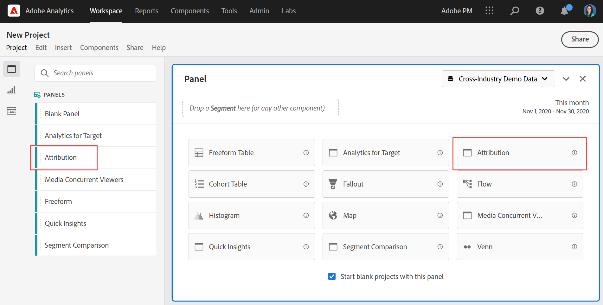

# Attributionspanelen {#attribution-panel}

<!-- markdownlint-disable MD034 -->

>[!CONTEXTUALHELP]
>id="workspace_attribution_button"
>title="Tillskrivning"
>abstract="Jämför och visualisera snabbt valfritt antal attribueringsmodeller med alla mått och konverteringsmått"
>additional-url="https://www.youtube.com/watch?v=Yu0hy2klzA0" text="Panelen Attribution IQ"

>[!CONTEXTUALHELP]
>id="workspace_attribution_panel"
>title="Attributionspanelen"
>abstract="Jämför och visualisera snabbt valfritt antal attribueringsmodeller med alla mått och konverteringsvärden.  **Parametrar &#x200B;** **Kanal**  Dimensionen som ska attribut mot. Denna dimension kan vara marknadsföringskanaler, kampanjer eller andra dimensioner. **Modeller**  Modellen avgör hur krediter tilldelas till kontaktytor. **Fönstret för bakåtsökning**  Den här inställningen bestämmer fönstret för dataattribuering som gäller för varje konvertering."
>additional-url="https://www.youtube.com/watch?v=Yu0hy2klzA0" text="Panelen Attribution IQ"

<!-- markdownlint-enable MD034 -->

>[!BEGINSHADEBOX]

_Den här artikeln dokumenterar panelen Attribution i_  _&#x200B;**Adobe Analytics**._ _Se [Attribution panel](https://experienceleague.adobe.com/en/docs/analytics-platform/using/cja-workspace/panels/attribution) för_  _&#x200B;**Customer Journey Analytics**-versionen av den här artikeln._

>[!ENDSHADEBOX]

Panelen **[!UICONTROL Attribution]** är ett enkelt sätt att skapa en analys som jämför olika attribueringsmodeller. Panelen innehåller en dedikerad arbetsyta för att använda och jämföra attribueringsmodeller.

Adobe Analytics förbättrar attribueringen eftersom ni kan:

* Definiera attribuering bortom betalda medier: Alla dimensioner, mätvärden, kanaler eller händelser kan tillämpas på modeller (till exempel intern sökning), inte bara marknadsföringskampanjer.
* Använd obegränsad jämförelse av attribueringsmodell: jämför dynamiskt så många modeller du vill.
* Undvik implementeringsändringar: Med rapporttidsbearbetning och sammanhangsberoende sessioner kan kundens reskontext byggas in och tillämpas vid körning.
* Skapa den session som bäst matchar attribueringsscenariot.
* Dela upp attribuering efter segment: Jämför enkelt resultatet i era marknadsföringskanaler i alla viktiga segment (till exempel New vs. Repeat customers, Product X vs. Product Y, Loyalty level eller CLV).
* Granska analyser av kontaktytor och kanalbyten: använd venndiagram och histogram samt trendattribuering.
* Analysera viktiga marknadsföringssekvenser visuellt: utforska vägar som leder till konvertering visuellt med flernodsflöde och bortfallsvisualisering.
* Skapa beräknade värden: använd valfria metoder för attribueringstilldelning.

## Använd

Så här använder du en **[!UICONTROL Attribution]**-panel:

1. Skapa en **[!UICONTROL Attribution]**-panel. Mer information om hur du skapar en panel finns i [Skapa en panel](panels.md#create-a-panel).

1. Ange [indata](#panel-input) för panelen.

1. Observera [utdata](#panel-output) för panelen.

### Panelindata

Du kan konfigurera panelen Attribution med följande indatainställningar:

1. Lägg till en **[!UICONTROL Success metric]** och en dimension från **[!UICONTROL Channel]** som du vill attributera mot. Exempel är marknadskanaler eller anpassade dimensioner, som interna kampanjer.

   

1. Välj en eller flera [attribueringsmodeller](#attribution-models) från **[!UICONTROL Included models]**, [behållaren](#container) från **[!UICONTROL Container]** och ett [uppslagsfönster](#lookback-window) från **[!UICONTROL Lookback window]** som du vill använda för jämförelse.

1. Välj **[!UICONTROL Build]** om du vill skapa visualiseringar i panelen.

### Panelutdata

Panelen **[!UICONTROL Attribution]** returnerar en mängd data och visualiseringar som jämför attribuering för den valda dimensionen och måttet.

### Attributvisualiseringar

Följande visualisering är en del av panelutdata.

* **Totalt mått**: Det totala antalet konverteringar som inträffade under rapporttidsperioden och som är kopplade till den dimension som du valde.
* **Attribution Comparison Bar**: Jämför de tilldelade konverteringarna visuellt för alla dimensionsobjekt från den valda dimensionen. Varje stapelfärg representerar en distinkt attribueringsmodell.
* **Attributjämförelsetabell**: Visar samma data som stapeldiagrammet, representerat som en tabell. Om du markerar olika kolumner eller rader i den här tabellen filtreras stapeldiagrammet och flera andra visualiseringar i panelen. Den här tabellen fungerar på ungefär samma sätt som andra frihandstabeller i Workspace, vilket gör att du kan lägga till komponenter som mått, segment och uppdelningar.
* **Överlappningsdiagram**: En Vennvisualisering som visar de tre viktigaste dimensionsobjekten och hur ofta de deltar tillsammans i en konvertering. Storleken på bubbelöverlappningen anger till exempel hur ofta konverteringar inträffade när en person exponerades för båda dimensionsobjekten. Om du markerar andra rader i den angränsande friformstabellen uppdateras visualiseringen så att den återspeglar din markering.
* **Prestandainformation**: En spridningsvisualisering för att jämföra upp till tre attribueringsmodeller visuellt.
* **Trended Performance**: Visar trenden för konverteringar av attribut för den översta dimensionsobjektet. Om du markerar andra rader i den angränsande friformstabellen uppdateras visualiseringen så att den återspeglar din markering.
* **Flöde**: Gör att du kan se vilka kanaler som interagerar mest och i vilken ordning de interagerar under en persons resa.

## Attributionsmodell

{{attribution-models-details}}

## Behållare

{{attribution-container}}

## Fönstret Lookback

{{attribution-lookback-window}}

## Exempel

{{attribution-example}}

>[!MORELIKETHIS]
>
> [Skapa en panel](/help/analyze/analysis-workspace/c-panels/panels.md#create-a-panel)
>

<!--
# Attribution panel

The [!UICONTROL Attribution] panel is an easy way to build an analysis comparing various attribution models. It is a feature in [Attribution](/help/analyze/analysis-workspace/attribution/overview.md) that gives you a dedicated workspace to use and compare attribution models.

>[!VIDEO](https://video.tv.adobe.com/v/23139/?quality=12)

## Create an attribution panel

1. Click the panel icon on the left.
1. Drag the [!UICONTROL Attribution] panel into your Analysis Workspace Project.

   

1. Add a metric that you want to attribute and add any dimension to attribute against. Examples include Marketing Channels or custom dimensions, such as internal promotions.

   

1. Select the [attribution models and lookback window](../attribution/models.md) you want to compare.

1. The Attribution panel returns a rich set of data and visualizations that compare attribution for the selected dimension and metric.

   

## Attribution visualizations

* **Total metric**: The total number of conversions that occurred over the reporting time window. These are the conversions that are attributed across the dimension that you selected.
* **Attribution Comparison Bar**: Visually compares the attributed conversions across each of the dimension items from your selected dimension. Each bar color represents a distinct attribution model.
* **Attribution Comparison Table**: Shows the same data as the bar chart, represented as a table. Selecting different columns or rows in this table filters the bar chart as well as several of the other visualizations in the panel. This table acts similar to any other Freeform Table in Workspace - allowing you to add components such as metrics, segments, or breakdowns.
* **Overlap Diagram**: A Venn Diagram showing the top three dimension items and how often they participate jointly in a conversion. For example, the size of the bubble overlap indicates how often conversions occurred when a visitor was exposed to both dimension items. Selecting other rows in the adjacent Freeform table updates the visualization to reflect your selection.
* **Performance Detail**: Lets you to compare up to three attribution models visually using a scatter plot.
* **Trended Performance**: By default, shows the conversion performance trend by attribution model for the first dimension listed in the adjacent Freeform table. You can select different dimension rows in the Freeform table to show the trend for the selected dimensions (such as Total Revenue for each attribution model for Social Campaigns and Paid Search). Alternately, you can select cells in the columns for any metric and attribution type combinations in the Freeform table to see the trended performance by dimension value for the specified attribution models (such as Total Revenue by Marketing Channel using Last Touch and First Touch attribution).
* **Flow**: Lets you see which channels are interacted with most commonly, and in what order across a visitor's journey.

-->