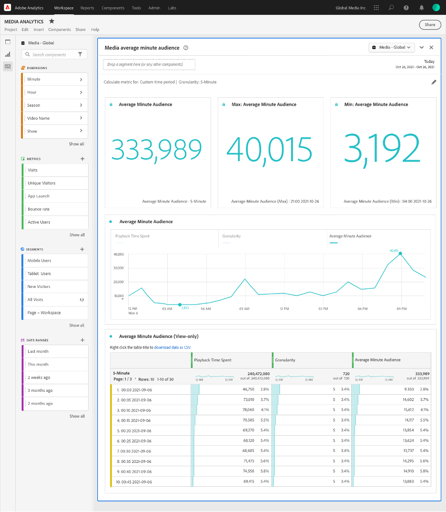

# Panelen Mediegenomsnitt för miniatyrmålgrupp

Media Analytics-kunder kan använda den genomsnittliga minuten-målgruppspanelen för att bättre förstå den genomsnittliga förbrukningen av deras innehåll. Den genomsnittliga minuten-målgruppen möjliggör jämförelser av programmering oavsett längd eller genre. Dessutom kan kunderna jämföra eller lägga till den digitala genomsnittliga minuten-publiken med den linjära minuten-mätningen för tv. Panelen ger större flexibilitet för att mäta den genomsnittliga publiken för anpassade tidsperioder samt när tidsklassificeringen har uppdaterats efter detta. Det aktuella genomsnittliga minutvärdet för målgruppssiffran fungerar bara om varaktigheten är tillgänglig vid bearbetningstiden.

I Analysis Workspace är den genomsnittliga minuten den tid som går åt till att visa medieströmmen dividerat med längden på innehållet eller det totala urvalet av period och vald granularitet.

Panelen Mediets genomsnittliga minutmålgrupp ger en genomsnittlig minutvis målgruppsanalys utifrån det specifika innehåll som valts om varaktigheten görs tillgänglig med hjälp av klassificeringar.
Panelen Minut-målgrupp innehåller även analyser under en viss tidsperiod som kan filtreras efter visst innehåll, oavsett om varaktigheten är tillgänglig med hjälp av klassificeringar eller inte. Navigera till en rapportsserie med Media Analytics-komponenter aktiverade för att få tillgång till panelen Mediemådets genomsnittliga målgrupp. Klicka sedan på panelikonen längst till vänster och dra panelen till ditt Analysis Workspace-projekt.

<!-- For more information, see the Media Average Minute Audience introduction video:
<< replace with AMA video when available from Doug >> -->

<!-- >[!VIDEO](https://video.tv.adobe.com/v/330177/?quality=12) -->

## Panelindata {#Input}

Du kan konfigurera panelen Media Average Minute Audience med följande indatainställningar:

| Inställning | Beskrivning |
|---------|------------|
| Panelens datumintervall | Panelens datumintervall är som standard Idag. Du kan redigera den för att visa en enstaka dag eller flera månader i taget.    Den här visualiseringen är begränsad till 1 440 datarader (till exempel 24 timmar vid granularitet på minutnivå). Om ett datumintervall och en granularitetskombination resulterar i mer än 1 440 rader uppdateras granulariteten automatiskt för att passa det fullständiga datumintervallet. |
| Dra ett segment här (eller andra komponenter) | Precis som andra paneler filtrerar den här inställningen dina markeringar baserat på segment som du har skapat. Detta är ett bra sätt att se på specifika plattformar, liveströmmar eller andra vanliga mediesegment. |
| Beräkna mått för | Med den här inställningen kan du välja om du vill se den genomsnittliga minuten-publiken för en viss del av innehållet genom att välja *specifikt innehåll* eller om du vill se den genomsnittliga minuten-publiken för en viss tidsperiod genom att välja *anpassad tidsperiod*.   Specifikt innehåll fungerar bara om längden har uppdaterats med hjälp av klassificeringar. Om längden inte är tillgänglig, eller om du vill visa den genomsnittliga minuten-publiken för en tidsserie med flera innehållsdelar eller innehåll utan en viss tilldelad varaktighet (som under en liveström eller händelse), bör du välja en anpassad tidsperiod. Den här inställningen ändrar arbetsflödet och rapportutdata. |

### Speciellt innehåll

| Inställning | Beskrivning |
|---------|------------|
| Rapporteringsdimensioner | När du väljer specifikt innehåll kan du välja rapportutdata och använda antingen video- eller innehålls-ID-fälten för att visa innehållet och dess associerade genomsnittliga minutmålgrupp under den valda tidsperioden. |
| Filtrera innehåll efter (valfritt) | Du kan filtrera innehållet beroende på vilken vy du vill ha eller hur data är strukturerade. |
| Visa, säsong, avsnitt | Om du väljer &quot;Visa, säsong, avsnitt&quot; visas dina tillgängliga program i listrutan, som du kan filtrera med hjälp av en sökning (eller genom att dra och släppa visningsnamnet från den vänstra kolumnen). Du kan avsluta markeringen där för att se alla årstiderna i programmet eller filtrera efter enskilda årstider och sedan efter enskilda avsnitt. Den här inställningen visar data för dessa program, säsonger eller avsnitt för den valda tidsperioden. |
| Anpassad dimension | Om ditt visningsnamn finns under en anpassad dimension kan du hitta det antingen genom att söka i den nedrullningsbara menyn för dimension (valfritt) eller genom att använda den vänstra kolumnsökningen. Dimensionsobjektet fylls automatiskt baserat på det urvalet och behandlas som ett avsnitt. |
| Ingen | Du kan välja *Ingen* om du vill visa alla videonamn som har genomsnittliga minutdata för det valda urvalet. |

### Avancerade inställningar för specifikt innehåll

| Inställning | Beskrivning |
|---------|------------|
| Tabellinställningar | Standardinställningen visar beräkningsvärdena i tabellen, som visar täljaren och nämnaren för den genomsnittliga minutmålgruppen som de föregående kolumnerna i tabellen. Om du avmarkerar det här alternativet tas dessa två kolumner bort, så att endast den genomsnittliga minuten-publiken visas bredvid videonamnet eller innehålls-ID:t. |
| Tidsåtgång för mått | Du kan välja hur lång tid som ska användas som standard, vilket endast inkluderar innehållstid, eller så kan du välja att använda den medietid som har använts, vilket inkluderar innehåll och annonstid tillsammans som täljarberäkning för den genomsnittliga minuten-målgruppen. |

### Anpassad tidsperiod

| Inställning | Beskrivning |
|---------|------------|
| Kornighet | Standardgranulariteten är 5 minuter, men du kan välja någon av de granulariteter som används som nämnare för tidsserien inom den övergripande tidsperiodmarkeringen som görs i kalendervalet. Om du till exempel väljer 12:00 till 12:30 med 5 minuters granularitet returneras den genomsnittliga minuten-publiken över hela halvtimmen samt sex rader med den genomsnittliga minuten-publiken för varje femminutersperiod. Dessa rader används som datapunkter för tidsseriediagrammet. |
| Filtrera innehåll efter (valfritt) | Du kan filtrera innehållet beroende på vilken vy du vill ha eller hur data är strukturerade. |
| Visa, säsong, avsnitt | Markera *Visa, säsong, avsnitt* visar dina tillgängliga bildspel i listrutan, som du kan filtrera med hjälp av sökning (eller genom att dra och släppa bildspelsnamnet från den vänstra kolumnen). Du kan avsluta markeringen där för att se alla årstiderna i programmet eller filtrera efter enskilda årstider och sedan efter enskilda avsnitt. Den här inställningen visar data för dessa program, säsonger eller avsnitt för den valda tidsperioden. |
| Anpassad dimension | Om ditt visningsnamn finns under en anpassad dimension kan du hitta det antingen genom att söka i den nedrullningsbara menyn för dimension (valfritt) eller genom att använda den vänstra kolumnsökningen. Dimensionsobjektet fylls automatiskt baserat på det urvalet och behandlas som ett avsnitt. |
| Ingen | Du kan välja *Ingen* om du vill visa alla videonamn under den tidsperiod som du har valt. |

### Avancerade inställningar för anpassad tidsperiod

| Inställning | Beskrivning |
|---------|------------|
| Tabellinställningar | Standardinställningen visar beräkningsvärdena i tabellen, som visar täljaren och nämnaren för den genomsnittliga minutmålgruppen som de föregående kolumnerna i tabellen. Om du avmarkerar det här alternativet tas de två kolumnerna bort, så att bara den genomsnittliga minuten-målgruppen visas intill tidsperioden. |

## Utdata för specifik innehållspanel

Panelen Mediets genomsnittliga minutvolym för målgrupp returnerar följande:

* Total genomsnittlig minutmålstid för hela urvalet
* Filter och genomsnittlig minimal publik för de enskilda videoklipp som visas i en tabell
* Innehållstid och videolängd (längd) om den avancerade inställningen har valts

Om du vill redigera och återskapa panelen klickar du på redigeringspennan längst upp till höger.

### Datakälla för specifikt innehåll

Det enda mätvärdet som kan användas i den här panelen är Average Minute Audience.

| Mått | Beskrivning |
|--------|-------------|
| Genomsnittlig målgrupp i minuter | Den tid som har använts för att visa medieströmmen dividerat med videolängden (längden) som levereras via klassificeringar. |

## Utdata för anpassad tidsperiod {#custom-time-period-output}

Panelen Mediets genomsnittliga minutmålgrupp returnerar den totala genomsnittliga minutmålgruppen för hela markeringen, den maximala och lägsta genomsnittliga minutmålgruppen samt linjeseriediagrammet som visar den genomsnittliga minutmålgruppen för hela markeringen. Tabellen nedan visar filtren och den genomsnittliga minuten-publiken för detaljerna, samt den innehållstid och granularitet som använts för varje tidsperiod om den avancerade inställningen har valts.

Om du vill redigera och återskapa panelen klickar du på redigeringspennan längst upp till höger.

### Datakälla för anpassad tidsperiod

Det enda mätvärdet som kan användas i den här panelen är Average Minute Audience:

| Mått | Beskrivning |
|---|---|
| Genomsnittlig målgrupp i minuter | Den tid det tar att visa medieströmmen dividerat med det totala urvalet eller den valda granulariteten i minuter. |

<!-- For more information about Media Average Minute Audience, visit [MA doc page]( https://url). -->
