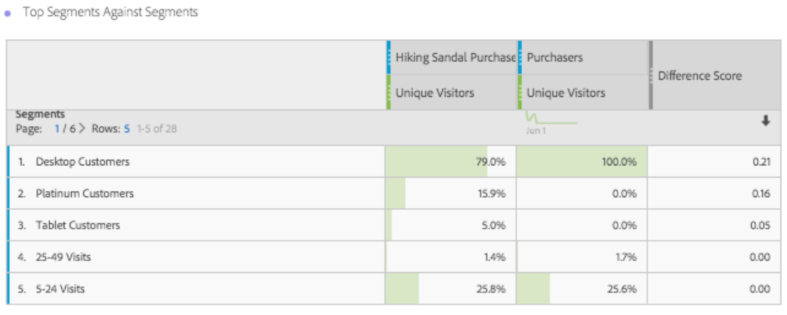
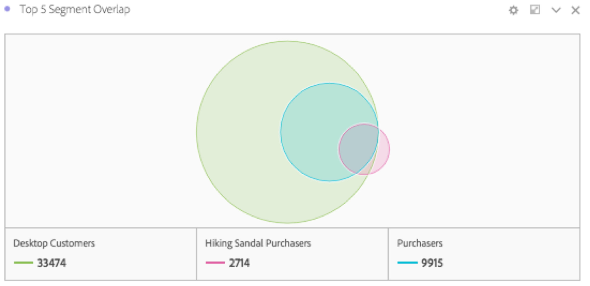

# Översikt över panelen Segmentjämförelse {#segment-comparison-overview}

<!-- markdownlint-disable MD034 -->

>[!CONTEXTUALHELP]
>id="workspace_segmentcomparison_button"
>title="Segmentjämförelse"
>abstract="Jämför snabbt två segment över alla datapunkter för att hitta relevanta skillnader automatiskt."

<!-- markdownlint-enable MD034 -->

<!-- markdownlint-disable MD034 -->

>[!CONTEXTUALHELP]
>id="workspace_segmentcomparison_panel"
>title="Panelen Segmentjämförelse"
>abstract="Jämför snabbt två segment över alla datapunkter för att hitta relevanta skillnader automatiskt.  **Parametrar &#x200B;** **Lägg till ett segment**: Det första segment som du vill analysera. **Jämför med**: Det andra segmentet som du vill jämföra med, som automatiskt fylls i med *Alla andra* (inverterat för det första segmentet). Du kan ersätta *Alla andra* med ett annat segment om du vill. **Avancerade inställningar**: Möjligheten att utesluta komponenter från analysen i segmentjämförelsen."
<!-- markdownlint-enable MD034 -->

>[!BEGINSHADEBOX]

_I den här artikeln beskrivs panelen Segmentjämförelse i_  _&#x200B;**Adobe Analytics**._ _Det finns ingen motsvarande panel i_  _&#x200B;**Customer Journey Analytics**._

>[!ENDSHADEBOX]

Panelen Segmentjämförelse visar de mest statistiskt signifikanta skillnaderna mellan ett obegränsat antal segment. Funktionen itererar genom en automatisk analys av alla dimensioner och mätvärden som du har tillgång till. Jämförelsen identifierar automatiskt de viktigaste egenskaperna hos de målgruppssegment som driver företagets nyckeltal och låter er se hur många segment som överlappar varandra.

>[!BEGINSHADEBOX]

Se  [Segmentjämförelse](https://video.tv.adobe.com/v/23976?quality=12&learn=on){target="_blank"} för en demonstrationsvideo.

>[!ENDSHADEBOX]

## Använd

Så här använder du en **[!UICONTROL Segment comparison]**-panel:

1. Skapa en **[!UICONTROL Segment comparison]**-panel. Mer information om hur du skapar en panel finns i [Skapa en panel](../panels.md#create-a-panel).

1. Ange [indata](#panel-input) för panelen.

1. Observera [utdata](#panel-output) för panelen.

### Panelindata

Du kan konfigurera panelen [!UICONTROL Segment comparison] med följande indatainställningar:

| Indata | Beskrivning |
| --- | --- |
| **[!UICONTROL Add a segment]** | Välj den dimension som du vill jämföra med. |
| **[!UICONTROL Compare against]** | Välj den dimension som du vill använda för att jämföra det ursprungliga markerade segmentet. Om du inte markerar ett visst segment används standardsegmentet **[!UICONTROL Everyone else]**. |
| **[!UICONTROL Show / hide advanced settings]** | Välj **[!UICONTROL Show advanced settings]** om du vill konfigurera **[!UICONTROL Excluded components]**, välj **[!UICONTROL Hide advanced settings]** om du vill dölja **[!UICONTROL Excluded components]**. |
| **[!UICONTROL Excluded components]** | Komponenter som du kan ange, t.ex. **[!UICONTROL Dimensions]**, **[!UICONTROL Metrics]** eller **[!UICONTROL Segments]** för undantag. <ul><li>Dra och släpp en eller flera dimensioner, mått eller segment från behållarna till behållaren **[!UICONTROL Excluded components]**.</li><li>Om du vill ta bort en komponent markerar du typen (**[!UICONTROL Dimension]** **[!UICONTROL Metrics]** eller **[!UICONTROL Segments]**) och väljer  för att ta bort en komponent. Om du vill ta bort alla komponenter väljer du **[!UICONTROL Clear all]**.</li><li>Välj **[!UICONTROL Set as default]** om du vill ange det aktuella urvalet av mått, mått och segment som standard.</li></ul> |

Välj **[!UICONTROL Build]** om du vill skapa panelen.

### Panelutdata

När Adobe Analytics har analyserat de två önskade segmenten visar utdatapanelerna resultatet genom flera visualiseringar:

| Visualisering | Beskrivning |
|---|---|
| **[!UICONTROL Size and overlap]** | Illustrerar med en [Vennn](/help/analyze/analysis-workspace/visualizations/venn.md)-visualisering de jämförande storlekarna för varje markerat segment och hur mycket de överlappar varandra. |
| **[!UICONTROL Unique visitors for 1st segment]** | En [sammanfattningsbild](/help/analyze/analysis-workspace/visualizations/summary-number-change.md) som visar unika besökare för det första segmentet (i exemplet med enkelsidiga besök) |
| **[!UICONTROL Unique visitors for 2nd segment]** | En [sammanfattningsbild](/help/analyze/analysis-workspace/visualizations/summary-number-change.md) som visar unika besökare för det andra segmentet (i exemplet med förstagångsbesök) |
| **[!UICONTROL Top metrics against Segments]** | En [friformstabell](/help/analyze/analysis-workspace/visualizations/freeform-table/freeform-table.md) som visar toppstatistik för de valda segmenten. |
| **[!UICONTROL Metric over time by Segment]** | En [Line](/help/analyze/analysis-workspace/visualizations/line.md)-visualisering som visar mätvärden över tid för de valda segmenten. |
| **[!UICONTROL Top dimension items against Segments]** | En [friformstabell](/help/analyze/analysis-workspace/visualizations/freeform-table/freeform-table.md) som visar de blandade dimensionsobjekten för de valda segmenten. |
| **[!UICONTROL Dimension items by Segments]** | En [vågrät fältvisualisering](/help/analyze/analysis-workspace/visualizations/horizontal-bar.md) som visar dimensionsobjekten efter segment. |
| **[!UICONTROL Top segments against Segments]** | En [friformstabell](/help/analyze/analysis-workspace/visualizations/freeform-table/freeform-table.md) som visar de översta segmenten mot segment. |
| **[!UICONTROL Segment overlap]** | En [Vennn](/help/analyze/analysis-workspace/visualizations/venn.md)-visualisering som visar segmentöverlappningen. |

Använd  för att konfigurera om och återskapa panelen.

<!--
#### Size and overlap

Illustrates the comparative sizes of each selected segment and how much they overlap with each other using a venn diagram. You can hover over the visual to see how many visitors were in each overlapping or non-overlapping section. You can also right click on the overlap to create a brand new segment for further analysis. If the two segments are mutually exclusive, no overlap is shown between the two circles (typically seen with segments using a hit container).

#### Population summaries

To the right of the Size and Overlap visualization, the total unique visitor count in each segment and overlap is shown.

#### Top metrics

Displays the most statistically significant metrics between the two segments. Each row in this table represents a differentiating metric, ranked by how different it is between each segment. A difference score of 1 means it is statistically significant, while a difference score of 0 means there is no statistical significance.

This visualization is similar to freeform tables in Analysis Workspace. If deeper analysis on a specific metric is desired, hover over a line item and click 'Create visual'. A new table is created to analyze that specific metric. If a metric is irrelevant to your analysis, hover over the line item and click the 'X' to remove it.

>[!NOTE]
>
>Metrics added to this table after the segment comparison has finished do not receive a Difference Score.

#### Metric over time by segment

To the right of the metrics table is a linked visualization. You can click a line item in the table on the left, and this visualization updates to show that metric trended over time.

#### Top dimensions

Shows the most statistically significant dimension items across all of your dimensions. Each row shows the percentage of each segment exhibiting this dimension item. For example, this table might reveal that 100% of visitors in 'Segment A' had the dimension item 'Browser Type: Google', whereas only 19.6% of 'Segment B' had this dimension item. A difference score of 1 means it is statistically significant, while a difference score of 0 means there is no statistical significance.

This visualization is similar to freeform tables in Analysis Workspace. If deeper analysis on a specific dimension item is desired, hover over a line item and click 'Create visual'. A new table is created to analyze that specific dimension item. If a dimension item is irrelevant to your analysis, hover over the line item and click the 'X' to remove it.

>[!NOTE]
>
>Dimension items added to this table after the segment comparison has finished do not receive a Difference Score.

#### Dimension items by segment

To the right of the dimensions table is a linked bar chart visualization. It shows all displayed dimension items in a bar chart. Clicking a line item in the table on the left updates the visualization on the right.

#### Top segments

Shows which other segments (other than the two segments selected for comparison) have statistically significant overlap. For example, this table can show that a third segment, 'Repeat Visitors', overlaps highly with 'Segment A' but does not overlap with 'Segment B'. A difference score of 1 means it is statistically significant, while a difference score of 0 means there is no statistical significance.

This visualization is similar to freeform tables in Analysis Workspace. If deeper analysis on a specific segment is desired, hover over a line item and click 'Create visual'. A new table is created to analyze that specific segment. If a segment is irrelevant to your analysis, hover over the line item and click the 'X' to remove it.

>[!NOTE]
>
>Segments added to this table after the segment comparison has finished do not receive a Difference Score.

#### Segment overlap

To the right of the segments table is a linked venn diagram visualization. It shows the most statistically significant segment applied to your compared segments. For example, 'Segment A' + 'Statistically significant segment' vs. 'Segment B' + 'Statistically significant segment'. Clicking a segment line item in the table on the left updates the venn diagram on the right.

-->
