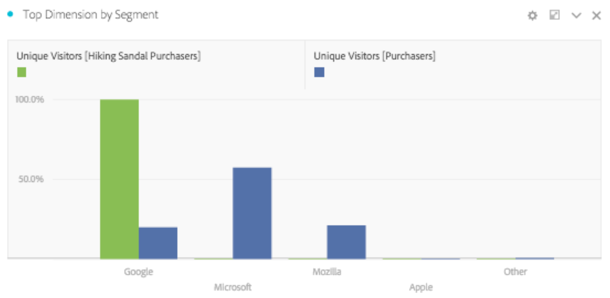

# Översikt över panelen Segmentjämförelse

Panelen Segmentjämförelse är en verktygsdel av [Segmentanalys](../../segment-iq.md) som identifierar de mest statistiskt signifikanta skillnaderna mellan ett obegränsat antal segment. Funktionen itererar genom en automatisk analys av alla dimensioner och mätvärden som du har tillgång till. Den identifierar automatiskt de viktigaste egenskaperna hos de målgruppssegment som driver företagets nyckeltal och låter er se hur mycket som överlappar alla segment.

Här är en videofilm om segmentjämförelse:

>[!VIDEO](https://video.tv.adobe.com/v/23976/?quality=12)

## Skapa en segmentjämförelsepanel

1. Logga in på [experiencecloud.adobe.com](https://experiencecloud.adobe.com) med inloggningsuppgifterna för ditt Adobe ID.
1. Klicka på ikonen med nio kvadrater i det övre högra hörnet och klicka sedan på den färgade Analytics-logotypen.
1. Klicka på Workspace i det övre navigeringsfältet.
1. Klicka på knappen Skapa nytt projekt.
1. Kontrollera att Tomt projekt är markerat i det modala popup-fönstret och klicka sedan på Skapa.
1. Klicka på panelknappen till vänster och dra sedan segmentjämförelsepanelen ovanför eller nedanför den automatiskt skapade friformstabellpanelen.

   

1. Markera segment som ska jämföras och släpp dem på panelen.

   

   När du har dragit ett segment till panelen skapas automatiskt ett [!UICONTROL 'Everyone Else']-segment som innehåller alla NOT i det valda segmentet. Det är ett segment som används ofta på jämförelsepanelen, men du kan ta bort det och jämföra ett annat urvalssegment.

   

1. När du har fastställt vilka två segment som ska jämföras klickar du på [!UICONTROL Build].

   Den här åtgärden startar en backend-process som letar efter statistiska skillnader mellan de två valda segmenten och alla dimensioner, mått och andra segment. En förloppsindikator högst upp på panelen anger återstående tid tills alla mått och mått analyseras. De mest använda mätvärdena, dimensionerna och segmenten prioriteras så att de mest relevanta resultaten returneras i tid.

## Uteslut komponenter från jämförelse

Ibland är det önskvärt att utesluta vissa dimensioner, mätvärden eller segment från segmentjämförelser. Du kan till exempel jämföra segmentet&quot;Användare av mobilenheter i USA&quot; med&quot;Användare av mobilenheter i Tyskland&quot;. Att inkludera geografiskt orienteringsrelaterade dimensioner skulle inte vara rimligt eftersom dessa segment redan antyder dessa skillnader.

1. Klicka på [!UICONTROL 'Show Advanced Options'] när de önskade två segmenten finns på panelen.
1. Dra och släpp komponenter som du vill utesluta till panelen [!UICONTROL Excluded Components].

   

Klicka på [!UICONTROL 'Set as default'] för att automatiskt exkludera dina aktuella komponenter i alla framtida segmentjämförelser. Om du vill redigera uteslutna komponenter klickar du på en komponenttyp och sedan på X bredvid en komponent för att ta med den i analysen. Klicka på Rensa alla om du vill ta med alla komponenter i segmentjämförelsen.

## Visa en segmentjämförelse

När Adobe har analyserat de två önskade segmenten visas resultatet i flera visualiseringar:

### Storlek och överlappning

Illustrerar de jämförande storlekarna för varje markerat segment och hur mycket de överlappar varandra med hjälp av ett venndiagram. Du kan hovra över det visuella objektet för att se hur många besökare som fanns i varje överlappande eller icke-överlappande avsnitt. Du kan också högerklicka på överlappningen för att skapa ett helt nytt segment för ytterligare analys. Om de två segmenten utesluter varandra visas ingen överlappning mellan de två cirklarna (visas vanligtvis med segment som använder en träffbehållare).

### Populationssammanfattningar

Till höger om visualisering av storlek och överlappning visas det totala antalet unika besökare i varje segment och överlappning.

### De viktigaste mätvärdena

Visar de mest statistiskt signifikanta mätvärdena mellan de två segmenten. Varje rad i den här tabellen representerar ett differentierande mått, som rangordnas efter hur olika det är mellan varje segment. Skillnaden på 1 betyder att den är statistiskt signifikant, medan differensvärdet 0 betyder att det inte finns någon statistisk signifikans.

Den här visualiseringen liknar frihandstabeller i Analysis Workspace. Om du vill ha mer detaljerad analys av ett visst mått för du muspekaren över ett radobjekt och klickar på Skapa visuellt. En ny tabell skapas för att analysera det specifika måttet. Om ett mätvärde inte är relevant för din analys håller du pekaren över radobjektet och klickar på X för att ta bort det.

>[!NOTE]
>
>Mätvärden som läggs till i den här tabellen efter att segmentjämförelsen har slutförts får inte en Differenspoäng.

### Mått över tid efter segment

Till höger om måtttabellen finns en länkad visualisering. Du kan klicka på ett radobjekt i tabellen till vänster och den här visualiseringen uppdateras för att visa att mätningen trender över tiden.

### Övre dimensioner

Visar de mest statistiskt signifikanta dimensionsobjekten i alla dimensioner. Varje rad visar procentandelen för varje segment som har denna dimensionspost. Den här tabellen kan till exempel visa att 100 % av besökarna i segment A hade dimensionsobjektet Browser Type: Google, medan endast 19,6 % av Segment B hade detta dimensionsobjekt. Skillnaden på 1 betyder att den är statistiskt signifikant, medan differensvärdet 0 betyder att det inte finns någon statistisk signifikans.

Den här visualiseringen liknar frihandstabeller i Analysis Workspace. Om du vill göra en djupgående analys av ett visst dimensionsobjekt håller du pekaren över ett radobjekt och klickar på Skapa visuellt. En ny tabell skapas för att analysera den specifika dimensionsobjektet. Om en dimensionspost inte är relevant för din analys håller du pekaren över radobjektet och klickar på X för att ta bort den.

>[!NOTE]
>
>Dimensioner som läggs till i den här tabellen efter att segmentjämförelsen har slutförts får inte en Differenspoäng.

### Dimension objekt efter segment

Till höger om dimensionstabellen finns en länkad stapeldiagramvisualisering. Den visar alla visade dimensionsobjekt i ett stapeldiagram. Om du klickar på ett radobjekt i tabellen till vänster uppdateras visualiseringen till höger.

### De vanligaste segmenten

Visar vilka andra segment (utöver de två segment som valts för jämförelse) som överlappar varandra statistiskt. Den här tabellen kan till exempel visa att ett tredje segment, &#39;Upprepa besökare&#39;, överlappar mycket med &#39;Segment A&#39; men inte överlappar &#39;Segment B&#39;. Skillnaden på 1 betyder att den är statistiskt signifikant, medan differensvärdet 0 betyder att det inte finns någon statistisk signifikans.

Den här visualiseringen liknar frihandstabeller i Analysis Workspace. Om du vill ha mer detaljerad analys för ett visst segment håller du pekaren över ett radobjekt och klickar på Skapa visuellt. En ny tabell skapas för att analysera det specifika segmentet. Om ett segment inte är relevant för din analys håller du pekaren över radobjektet och klickar på X för att ta bort det.

>[!NOTE]
>
>Segment som läggs till i den här tabellen efter att segmentjämförelsen har slutförts får inte en Differenspoäng.

### Segmentöverlappning

Till höger om segmenttabellen finns en länkad vinjettvisualisering. Här visas det segment som är mest statistiskt signifikant för dina jämförda segment. Exempel:&quot;Segment A&quot; +&quot;Statistiskt signifikant segment&quot; jämfört med&quot;segment B&quot; +&quot;Statistiskt signifikant segment&quot;. Om du klickar på ett segmentradsobjekt i tabellen till vänster uppdateras venndiagrammet till höger.

