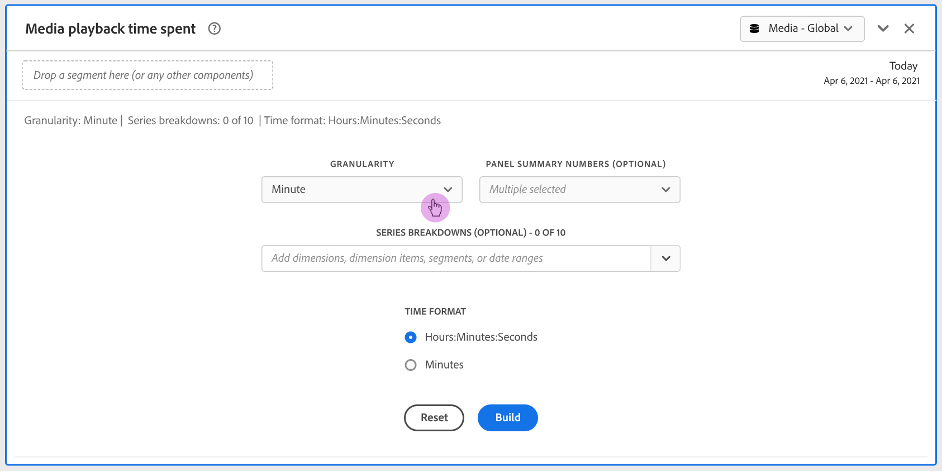

# Medieuppspelningstid spenderad panel

I Analysis Workspace är uppspelningstid den tid som du har lagt på att visa medieströmmar vid en viss tidpunkt. Den innehåller paus, buffert och tid att starta.

Med panelen Medieuppspelningstid för spenderad kan du analysera uppspelningen över tid, med detaljer om maximal samtidighet och möjlighet att bryta ned och jämföra.

Kunder som har köpt tillägget Streaming Media Collection kan analysera den uppspelningstid som spenderas för att få värdefulla insikter om innehållets och tittarens kvalitet och för att hjälpa till vid felsökning eller planering av volym eller skala.

Den uppspelningstid du tillbringar kan hjälpa dig att förstå:

* Där maximal samtidighet inträffade

* Var bortfall inträffade

Här följer en videoöversikt av den här panelen:

>[!VIDEO](https://video.tv.adobe.com/v/338699)

## Använda panelen Medieuppspelningstid för spenderad tid

1. Gå till en rapportsvit med aktiverade mediekomponenter för direktuppspelning.
1. Välj panelikonen längst till vänster och dra sedan panelen till ditt Analysis Workspace-projekt.
1. Fortsätt med följande avsnitt för att anpassa panelen Medieuppspelningstid för spenderad tid

   * [Panelindata](#panel-inputs)
   * [Panelutdata](#panel-output)

## Panelindata {#Input}

Du kan konfigurera panelen Tid för uppspelning av media med följande indatainställningar:

| Inställning | Beskrivning |
|---|---|
| Panelens datumintervall | Panelens datumintervall är som standard Idag. Du kan redigera den för att visa en enstaka dag eller flera månader i taget. Den här visualiseringen är begränsad till 1 440 datarader (till exempel 24 timmar vid granularitet på minutnivå). Om ett datumintervall och en granularitetskombination resulterar i mer än 1 440 rader uppdateras granulariteten automatiskt för att passa det fullständiga datumintervallet. |
| Kornighet | Granularitetsstandardvärdet är Minut. Den här visualiseringen är begränsad till 1 440 datarader (till exempel 24 timmar vid granularitet på minutnivå). Om ett datumintervall och en granularitetskombination resulterar i mer än 1 440 rader uppdateras granulariteten automatiskt för att passa det fullständiga datumintervallet. |
| Sammanfattningsnummer för panel | Om du vill visa datum- eller tidsinformation för uppspelningstid finns ett sammanfattningsnummer. Maximal visar detaljer för maximal samtidighet. Minimivärdet visar information om dalvärdet. Summan lägger ihop den totala uppspelningstiden för markeringen. Panelens standardinställning visar bara Maximum, men du kan ändra den till Minimal, Summa eller valfri kombination av de tre. Om du använder uppdelningar visas ett summeringsnummer för varje. |
| Uppdelning efter serie | Du kan även dela upp visualiseringen efter segment, dimensioner, dimensionsobjekt eller datumintervall.
- Du kan visa upp till 10 rader i taget. Uppdelningarna begränsas till en enda nivå.

- När du drar en dimension markeras de översta dimensionsobjekten automatiskt baserat på det valda panelens datumintervall.
- Om du vill jämföra datumintervall drar du 2 eller fler datumintervall till serieuppdelningsfiltret. |
| Tidsformat | Du kan visa uppspelningstiden i antingen `Hours:Minutes:Seconds` (standard) eller `Minutes` (som visas i heltal, avrundat uppåt till 0,5). |
| Visning av datumsekvens | Om du har placerat minst två datumintervallsegment som serieuppdelningar visas alternativet att välja antingen övertäckning (standard) eller sekventiell. Med Övertäckning visas raderna med en gemensam x-axelstart så att de körs parallellt, medan linjer visas sekventiellt med den specifika x-axelstarten. Om dataraderna är i linje (t.ex. segment 1 slutar vid 20:44 och segment 2 börjar vid 20:45) visas raderna i följd. |

## Standardvy

## Panelutdata {#Output}

På panelen Medieuppspelningstid för spenderad tid returneras ett linjediagram och sammanfattningsnummer som innehåller information om den maximala, minimala och/eller sammanlagda uppspelningstiden. Längst upp på panelen finns en sammanfattningsrad som påminner om de panelinställningar du har valt.

Du kan när som helst redigera och återskapa panelen genom att klicka på redigeringspennan längst upp till höger.

Om du har valt seriebrytning visas en rad i linjediagrammet och ett sammanfattningsnummer för varje rad:

### Data Source

Det enda mätvärdet som kan användas i den här panelen är Använd uppspelningstid.

| Mått | Beskrivning |
|---|---|
| Antal uppspelningstider | Totalt `hours:minutes:seconds` (eller `minutes`) av innehåll som visas under den valda granulariteten, inklusive paus, buffert och tid till start. |

## Vanliga frågor

| Fråga | Svar |
|---|---|
| Var är friformsregistret? Hur ser jag datakällan? | Frihandsregistret är inte tillgängligt i den här vyn. Du kan hämta datakällan genom att högerklicka på linjediagrammet och hämta CSV-filen. |
| Varför ändrades min granularitet? | Den här visualiseringen är begränsad till 1 440 datarader (till exempel 24 timmar vid granularitet på minutnivå). Om ett datumintervall och en granularitetskombination resulterar i mer än 1 440 rader uppdateras granulariteten automatiskt för att passa det fullständiga datumintervallet. 
Om du ändrar från ett större datumintervall till ett mindre kommer granulariteten att uppdateras till den lägsta detaljnivån som tillåts när datumintervallet ändras. Om du vill visa en högre granularitet redigerar du panelen och återskapar den.
 |
| Hur jämför jag videonamn, segment, innehållstyper osv.? | Om du vill jämföra dessa i en enda visualisering drar du segment, dimensioner eller specifika dimensionsobjekt i serieuppdelningsfiltret. Vyn är begränsad till tio uppdelningar. Om du vill visa mer än 10 måste du använda flera paneler. |
| Hur jämför jag datumintervall? | Om du vill jämföra datumintervall i en enda visualisering använder du serieuppdelningarna genom att dra två eller flera datumintervall. Dessa datumintervall åsidosätter panelens datumintervall. |
| Hur ändrar jag visualiseringstypen? | På den här panelen kan du endast använda linjevisualisering för tidsserien. |
| Kan jag köra avvikelseidentifiering? | Nej. Anomalsidentifiering är inte tillgängligt för den här panelen. |
