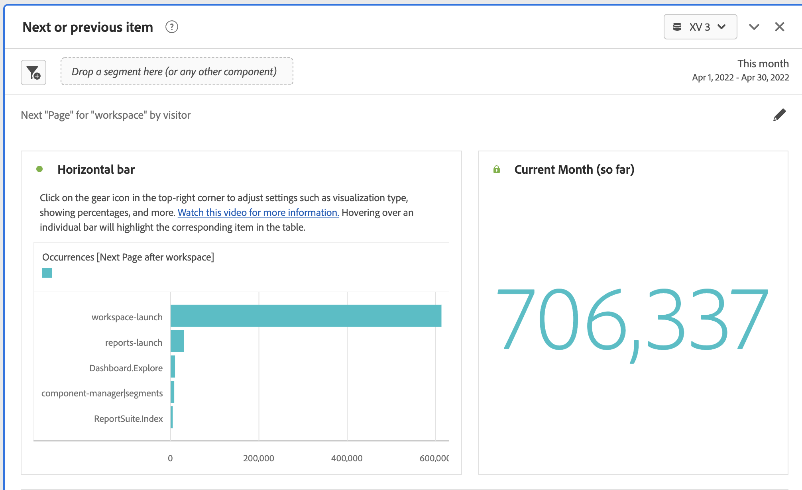

# Panelen Nästa eller föregående objekt {#next-or-previous-item-panel}

<!-- markdownlint-disable MD034 -->

>[!CONTEXTUALHELP]
>id="workspace_nextorpreviousitem_button"
>title="Nästa eller föregående objekt"
>abstract="Skapa en panel för att förstå de tidigare dimensioner som personer kommer från eller nästa dimension kommer till."

<!-- markdownlint-disable MD034 -->

<!-- markdownlint-disable MD034 -->

>[!CONTEXTUALHELP]
>id="workspace_nextorpreviousitem_panel"
>title="Kapsla eller föregående objekt"
>abstract="Analysera de vanligaste platserna som besökare tidigare kom från eller kom till nästa.  **Dimension**: Välj en dimension. Till exempel **Sida**. **Dimension-objekt**: Välj en specifik dimensionsobjekt. Exempel: **Hemsida**. **Riktning**: Välj **Nästa** om du vill visa dimensionsobjekten direkt efter den valda dimensionsobjektet. Välj **Föregående** om du vill se dimensionsobjekten som leder upp till den valda dimensionsposten. **Behållare**: Välj **Session** om du vill visa nästa/föregående dimensionsobjekt i samma session, eller välj **Person** om du vill visa nästa/föregående dimensionsobjekt för samma person."

<!-- markdownlint-enable MD034 -->

>[!BEGINSHADEBOX]

_I den här artikeln dokumenteras panelen Nästa eller Föregående objekt i_  _**Adobe Analytics**._ _Se [Nästa eller föregående objektpanel](https://experienceleague.adobe.com/en/docs/analytics/analyze/analysis-workspace/panels/next-previous)) för_  _**Customer Journey Analytics**-versionen av den här artikeln._

>[!ENDSHADEBOX]

Panelen **[!UICONTROL Next or previous item]** innehåller ett antal tabeller och visualiseringar för att identifiera nästa eller föregående dimensionsobjekt för en viss dimension. Du kanske till exempel vill utforska vilka sidor kunderna besöker oftast efter att de besökt hemsidan.

## Använd

Så här använder du en **[!UICONTROL Next or previous item]**-panel:

1. Skapa en **[!UICONTROL Next or previous item]**-panel. Mer information om hur du skapar en panel finns i [Skapa en panel](panels.md#create-a-panel).

1. Ange [indata](#panel-input) för panelen.

1. Observera [utdata](#panel-output) för panelen.

### Panelindata

Du kan konfigurera panelen [!UICONTROL Next or previous item] med följande indatainställningar:

| Indata | Beskrivning |
| --- | --- |
| **[!UICONTROL Dimension]** | Välj dimensionen som du vill utforska nästa eller föregående objekt för. |
| **[!UICONTROL Dimension item]** | Välj den specifika dimensionsobjektet i mitten av nästa/föregående fråga. |
| **[!UICONTROL Direction]** | Ange om du letar efter dimensionsobjektet [!UICONTROL Next] eller [!UICONTROL Previous]. |
| **[!UICONTROL Container]** | Välj behållaren [!UICONTROL Session] eller [!UICONTROL Person] (standard) för att fastställa omfattningen för din fråga. |

{style="table-layout:auto"}

Välj **[!UICONTROL Build]** om du vill skapa panelen.

### Panelutdata

Panelen [!UICONTROL Next or previous item] returnerar en mängd data och visualiseringar som hjälper dig att förstå vilka förekomster som följer eller föregår specifika dimensionsobjekt.

| Visualisering | Beskrivning |
| --- | --- |
| **[!UICONTROL Horizontal bar]** | Visar nästa (eller föregående) objekt baserat på den dimensionspost du väljer. Om du placerar pekaren över ett enskilt fält markeras motsvarande objekt i tabellen Frihand. |
| **[!UICONTROL Summary number]** | Sammanfattningsnummer på hög nivå för alla förekomster av nästa eller föregående dimensionsobjekt för den aktuella månaden (hittills). |
| **[!UICONTROL Freeform table]** | Visar nästa (eller föregående) objekt baserat på den dimensionspost som du väljer, i ett tabellformat. Det var till exempel de mest populära sidorna (av händelser) som folk gick till efter (eller före) hemsidan eller arbetsytesidan. |

{style="table-layout:auto"}

>[!MORELIKETHIS]
>
>[Skapa en panel](/help//analyze/analysis-workspace/c-panels/panels.md#create-a-panel)
>

<!--
# Next or previous item panel

This panel contains a number of tables and visualizations to easily identify the next or previous dimension item for a specific dimension. For example, you might want to explore which pages customers went to most often after they visited the Home page.

## Access the panel

You can access the panel from within [!UICONTROL Reports] or within [!UICONTROL Workspace].

| Access point | Description |
| --- | --- |
| [!UICONTROL Reports] | <ul><li>The panel is already dropped into a project.</li><li>The left rail is collapsed.</li><li>If you selected [!UICONTROL Next page], default settings have already been applied, such as [!UICONTROL Page] for [!UICONTROL Dimension], and the top page as the [!UICONTROL Dimension Item], [!UICONTROL Next] for [!UICONTROL Direction] and [!UICONTROL Visit] for [!UICONTROL Container]. You can modify all these settings.</li></ul>|
| Workspace | Create a new project and select the Panel icon in the left rail. Then drag the [!UICONTROL Next or previous item] panel above the Freeform table. Notice that the [!UICONTROL Dimension] and [!UICONTROL Dimension Item] fields are left blank. Select a dimension from the drop-down list. [!UICONTROL Dimension items] are populated based on the [!UICONTROL dimension] you chose. The top dimension item gets added, but you can select a different item. The defaults are Next and Visitor. Again, you can modify these as well.
 |

{style="table-layout:auto"}

## Panel Inputs {#Input}

You can configure the [!UICONTROL Next or previous item] panel panel using these input settings:

| Setting | Description |
| --- | --- |
| Segment (or other component) drop zone | You can drag and drop segments or other components to further filter your panel results. |
| Dimension | The dimension for which you want to explore next or previous items. |
| Dimension Item | The specific item at the center of your next/previous inquiry. |
| Direction | Specify whether you are looking for the [!UICONTROL Next] or the [!UICONTROL Previous] dimension item. |
| Container | [!UICONTROL Visit] or [!UICONTROL Visitor] (default) determine the scope of your inquiry. |

{style="table-layout:auto"}

Click **[!UICONTROL Build]** to build the panel.

## Panel output {#output}

The [!UICONTROL Next or previous item] panel returns a rich set of data and visualizations to help you better understand what occurrences follow or precede specific dimension items.

| Visualization | Description |
| --- | --- |
| Horizontal bar | Lists the next (or previous) items based on the dimension item you chose. Hovering over an individual bar highlights the corresponding item in the Freeform table. |
| Summary number | High-level summary number of all next or previous dimension item occurrences for the current month (so far.) |
| Freeform table | Lists the next (or previous) items based on the dimension item you chose, in a table format. For example, which were the most popular pages (by occurrences) that people went to after (or before) the home page or the workspace page. |

{style="table-layout:auto"}

-->