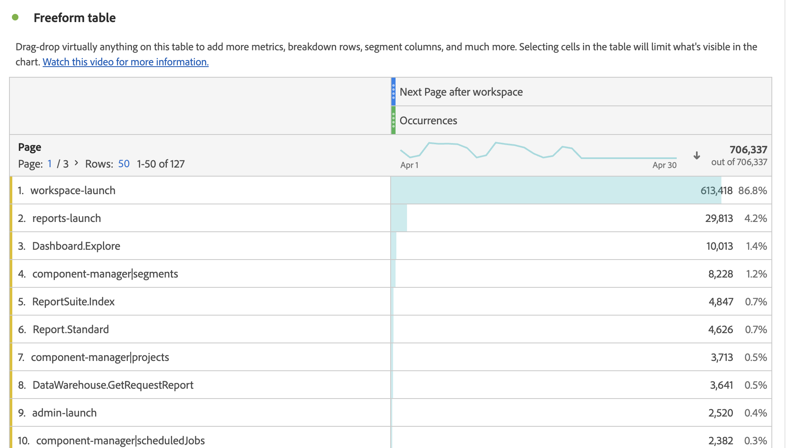

# Panelen Nästa eller Föregående objekt

The [!UICONTROL Next or previous item] som startats som en rapport i Rapporter och analyser, under [!UICONTROL Reports] > [!UICONTROL Most popular] > [!UICONTROL Next page/Previous page]. Panelen Arbetsyta innehåller ett antal tabeller och visualiseringar som gör det enkelt att identifiera nästa eller föregående dimensionsobjekt för en viss dimension. Du kanske till exempel vill utforska vilka sidor kunderna besöker oftast efter att de besökt hemsidan.

## Öppna panelen

Du kommer åt panelen inifrån [!UICONTROL Reports] eller inom [!UICONTROL Workspace].

| Åtkomstpunkt | Beskrivning |
| --- | --- |
| [!UICONTROL Reports] | <ul><li>Panelen har redan släppts i ett projekt.</li><li>Den vänstra listen är komprimerad.</li><li>Om du valde [!UICONTROL Next page]har standardinställningar redan tillämpats, till exempel [!UICONTROL Page] for [!UICONTROL Dimension]och den översta sidan som [!UICONTROL Dimension Item], [!UICONTROL Next] for [!UICONTROL Direction] och [!UICONTROL Visit] for [!UICONTROL Container]. Du kan ändra alla dessa inställningar.</li></ul> |
| Arbetsyta | Skapa ett nytt projekt och välj panelikonen i den vänstra listen. Dra sedan [!UICONTROL Next or previous item] ovanför friformstabellen. Observera att [!UICONTROL Dimension] och [!UICONTROL Dimension Item] fält lämnas tomma. Välj en dimension i listrutan. [!UICONTROL Dimension items] fylls i baserat på [!UICONTROL dimension] du valde. Den översta dimensionsobjektet läggs till, men du kan välja en annan artikel. Standardvärdena är Nästa och Besökare. Även här kan du ändra dem.
 |

{style=&quot;table-layout:auto&quot;}

## Panelindata {#Input}

Du kan konfigurera [!UICONTROL Next or previous item] Panelen med dessa indatainställningar:

| Inställning | Beskrivning |
| --- | --- |
| Släppzon för segment (eller annan komponent) | Du kan dra och släppa segment eller andra komponenter för att ytterligare filtrera panelresultaten. |
| Dimension | Dimensionen som du vill utforska nästa eller föregående objekt för. |
| Dimension | Det specifika objektet i mitten av nästa/föregående fråga. |
| Riktning | Ange om du letar efter [!UICONTROL Next] eller [!UICONTROL Previous] dimensionsobjekt. |
| Behållare | [!UICONTROL Visit] eller [!UICONTROL Visitor] (standard) avgör omfattningen av din förfrågan. |

{style=&quot;table-layout:auto&quot;}

Klicka **[!UICONTROL Build]** för att skapa panelen.

## Panelutdata {#output}

The [!UICONTROL Next or previous item] panelen returnerar en mängd data och visualiseringar som hjälper dig att förstå vad som händer efter eller före specifika dimensionsobjekt.

| Visualisering | Beskrivning |
| --- | --- |
| Vågrätt fält | Visar nästa (eller föregående) objekt baserat på den dimensionspost du valde. Om du placerar pekaren över ett enskilt fält markeras motsvarande objekt i tabellen Frihand. |
| Sammanfattningsnummer | Sammanfattningsnummer på hög nivå för alla förekomster av nästa eller föregående dimensionsobjekt för den aktuella månaden (hittills). |
| Frihandstabell | Visar nästa (eller föregående) objekt baserat på den dimensionspost som du har valt i ett tabellformat. Det var till exempel de mest populära sidorna (av händelser) som folk gick till efter (eller före) hemsidan eller arbetsytesidan. |

{style=&quot;table-layout:auto&quot;}
